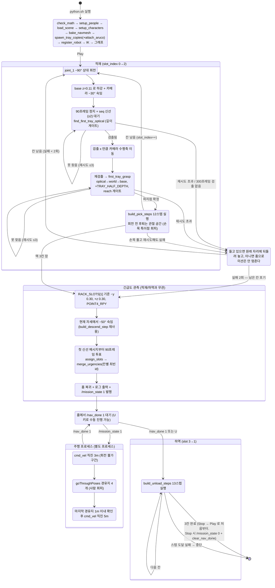
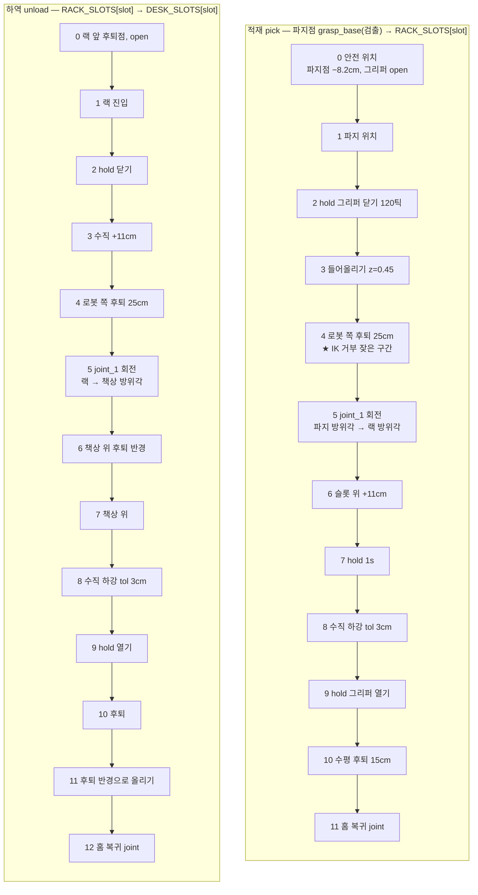
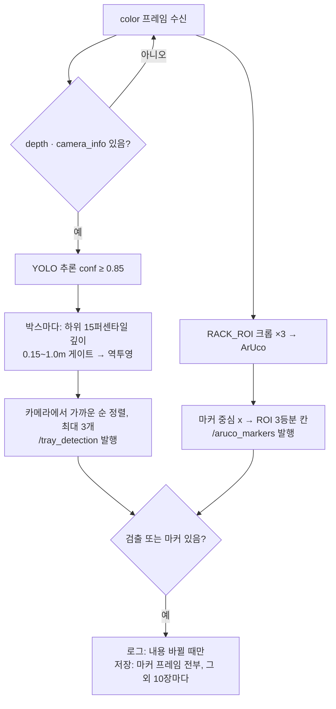

# 트레이 Pick & Place + 긴급도 관측 — 전체 알고리즘 구조도

작성 2026-09-22. 상세 설명·좌표계·튜닝값은 `HANDOFF_tray_detection.md`.

## 1. 프로세스 / 통신

```mermaid
flowchart LR
    subgraph ISAAC["Isaac Sim (python.sh · Py3.11)  pick_and_place_detection.py"]
        CAM[손목 카메라<br/>Camera_OmniVision_OV9782_Color<br/>640x480, frameSkip 4]
        SM[상태기계 main loop<br/>world.step → sync_base_pose → 상태 → sequence.tick]
        IK[Lula IK (base_link 기준)<br/>+ SingularityGuardedIK]
        SEQ[PickPlaceSequence<br/>pose/hold/joint 스텝 실행기<br/>+ 도달 확인]
        SM --> SEQ --> IK
    end
    subgraph NAV["주행 (Jazzy rclpy)  nav2_human_test.launch.py + through_pose_human_test.py"]
        N2[Nav2 스택<br/>map_server · AMCL · planner/controller<br/>pointcloud_to_laserscan → /scan]
        MIS[주행 미션<br/>undock 3m → goThroughPoses 4점 → dock 5m<br/>StraightDriver = cmd_vel 직진]
        N2 --- MIS
    end
    subgraph ADMIN["관제 PC (~/yolo-venv · Py3.12)  detect_node.py"]
        YOLO[YOLO26s best.pt<br/>conf ≥ 0.85]
        DEPTH[박스 깊이<br/>하위 15퍼센타일<br/>게이트 0.15~1.0m]
        ARUCO[ArUco DICT_4X4_50<br/>RACK_ROI 크롭 ×3 확대<br/>칸 = ROI 가로 3등분]
        SAVE[(~/tray_detections/*.png<br/>마커 프레임 전부 + 10장마다 1장)]
        YOLO --> DEPTH
    end
    CAM -- "/wrist_camera/color/image_raw (rgb8)" --> YOLO
    CAM -- "/wrist_camera/depth/image_raw (32FC1 m)" --> DEPTH
    CAM -- "/wrist_camera/color/camera_info" --> DEPTH
    CAM -- color --> ARUCO
    DEPTH -- "/tray_detection<br/>[seq, n, x,y,z,conf …] 광학 프레임, 가까운 순" --> SM
    ARUCO -- "/aruco_markers<br/>[seq, n, id,slot …]" --> SM
    YOLO --> SAVE
    ARUCO --> SAVE
    SM -- "/mission_state<br/>1 = 적재+관측 완료, 출발해도 된다" --> MIS
    MIS -- "/nav_done<br/>1 = 도킹 완료, 하역해도 된다 (5초간 반복)" --> SM
```

주행 프로세스가 따로인 이유는 검출과 같다 — Isaac 번들 파이썬(3.11)에서 rclpy 를 못 쓴다.
Isaac 쪽 핸드셰이크는 검출과 같은 제네릭 ROS2 노드(`pub_mission` / `sub_nav`)다.

## 2. Isaac 상태기계



## 3. 적재 시퀀스 (build_pick_steps) / 하역 시퀀스 (build_unload_steps)



## 4. 스텝 실행기 (PickPlaceSequence.tick)

```mermaid
flowchart TB
    T0[tick] --> T1{스텝 시작?}
    T1 -- 예 --> T2[_enter_step: 현재 플랜지 실측 → start<br/>n_steps = 거리/속도]
    T1 -- 아니오 --> T3
    T2 --> T3{타입}
    T3 -- pose/hold --> T4[코사인 S-커브 보간<br/>tcp_to_flange → IK]
    T4 --> T5{IK solved?}
    T5 -- 예 --> T6[apply_action]
    T5 -- 아니오<br/>특이점 가드/도달불가 --> T7[지령 없음, step_rejects++]
    T3 -- joint --> T8[관절각 보간 → apply_action]
    T6 --> T9
    T7 --> T9
    T8 --> T9
    T9[그리퍼 지령] --> T10{step_tick ≥ n_steps?}
    T10 -- 아니오 --> T0
    T10 -- 예, pose --> T11{TCP 오차 ≤ tol?<br/>1cm / 5° (접촉 스텝 3cm)}
    T10 -- 예, hold/joint --> T13
    T11 -- 예 --> T13[다음 스텝]
    T11 -- 아니오, 추가 120틱 이내 --> T12[목표 계속 지령] --> T0
    T11 -- 아니오, 초과 --> T14[failed 사유 기록 → 시퀀스 종료<br/>main 이 pick_state=None 으로 중단]
    T13 --> T15{마지막 스텝?}
    T15 -- 예 --> T16[done]
    T15 -- 아니오 --> T0
```

## 5. 관제 PC 프레임 처리 (detect_node._on_color)


