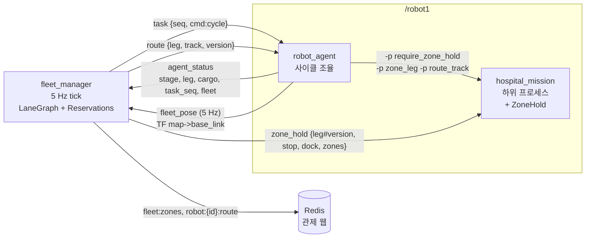
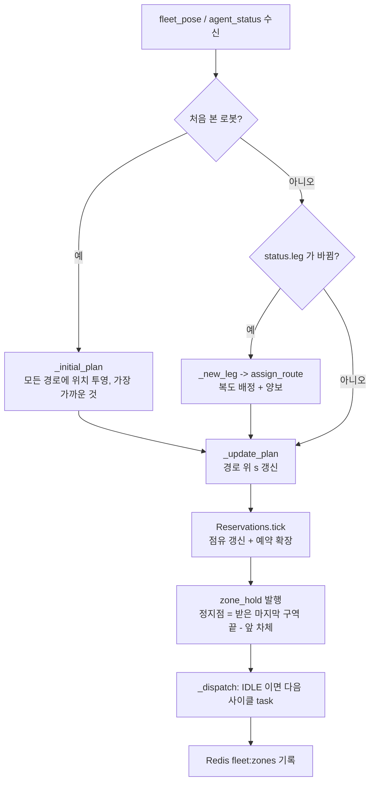

# 관제(fleet_manager) 알고리즘 — 현재 구현

작성 2026-09-29. 대상 코드: `src/hospital_system/hospital_system/{fleet_manager,lane_graph,priority,stations}.py`,
정지점 준수 쪽은 `src/nova_carter/nav_to_goal/nav_to_goal/hospital_zone_hold.py`.
설계 배경은 `docs/SYSTEM_INTEGRATION_PLAN.md` §3.2·§3.3, 실행 방법은 `docs/SYSTEM_RUN_GUIDE.md`.

한 줄 요약: **철도 폐색(block signal)**. 관제가 차선을 구역으로 쪼개 앞 구역만 예약해 주고, 로봇은
받은 구역 끝을 넘지 않는다. 로봇끼리 센서로 서로 못 봐도(다른 PC 의 Isaac) 충돌하지 않는다.

## 1. 프로세스와 토픽



- 토픽은 모두 `std_msgs/String` JSON, 로봇 네임스페이스 `/robotN` 아래.
- `task` / `route` / `zone_hold` 는 **latched**(RELIABLE + TRANSIENT_LOCAL) — 주행 하위 프로세스가 새로 떠도
  마지막 허가를 바로 받는다.
- 로봇은 `-p fleet:=true` 일 때만 관제 지시를 기다린다(그 전엔 스스로 사이클을 돌린다).

## 2. 차선 그래프 (`lane_graph.LaneGraph`)

기하는 주행 코드(`nav_to_goal.hospital_lanes`)의 정의를 **그대로 import** 한다 — 관제용 지도를 따로 두지 않는다.
`lane_graph` 자체는 순수 파이썬이라 로봇·ROS 없이 시험한다(`src/hospital_system/test/test_lane_graph.py`).

| 구분 | 간선 | 방향 |
|---|---|---|
| 방(채취실 East) | `collection_out`, `collection_in`, `collection_dock_in` | 한 방향 |
| 방(분석실 West) | `analysis_out`, `analysis_in`, `analysis_dock_in` | 한 방향 |
| 복도 | `upper`, `upper_reserve`, `lower`, `lower_reserve` | 양방향 (`t>E`, `t>W` 간선 2개) |

- 노드: 책상 도킹 자세, 정류장, 문 바깥 분기점 `east_junction`(10, 12.5) / `west_junction`(−34.8, 12.5).
- 간선의 `line`/`arc` 원소를 0.25 m 간격으로 샘플링(`_sample`)해 누적거리 `s` 를 만든다.
- **구역 분할**: 간선을 `ZONE_M = 3.0` m 이하로 고르게 나눈다(footprint 1.86 m + 제동). 도킹 직선 2.5 m 는 1구역.
- **물리 구역(phys)**: 양방향 복도는 방향별 간선이 둘이지만 물리적으로 같은 길이다. `upper:k` 처럼 서→동 기준으로
  번호를 통일해, 동→서 간선의 k 번째 = 서→동의 n−1−k 번째가 같은 구역을 가리킨다. **예약은 물리 구역 단위**다.
- **충돌 구역**: 서로 다른 차선의 구역 중심선이 `CONFLICT_M = 1.6` m(차폭 1.0 + 0.6) 안으로 가까우면 동시 점유 금지.
  단 같은 복도 안끼리, 그리고 경로상 `NEIGHBOR_M = 6.0` m 안의 앞뒤 구역은 제외(차간 규칙이 따로 지킨다).
  실제로 걸리는 곳은 두 문(x≈11, x≈−35.9) — 방 출입 두 방향이 같은 줄(y=12.5)을 쓰고 분기점에서 복도 4개가 갈라진다.

## 3. tick 한 번 (5 Hz)



### 3.1 위치 추적 (`_update_plan`)

- `fleet_pose`(TF `map`→`base_link`, 5 Hz)를 지금 경로 구역열에 투영해 경로 위 거리 `s` 를 얻는다.
  `/amcl_pose` 는 멈추면 갱신이 끊겨 도킹 뒤 0.5 m 전 값이 남았기 때문에 TF 를 쓴다(P5).
- 투영은 직전 `s` 근처 창(−1.5 m ~ +6.0 m)에서만 찾고, 진행 방향과 90° 넘게 다른 점은 버린다 —
  동쪽 문처럼 두 차선이 겹치는 곳에서 반대 차선으로 튀지 않게.
- 횡오차 3.0 m 까지 허용한다(사람을 피해 2.8 m 까지 비켜 간다). `s` 는 `max(s_prev − 0.5, s)` 로 뒤로 튀지 않게 한다.
- 위치가 `POSE_TIMEOUT_S = 3` s 끊기면 **경고만** 한다 — 어디 있는지 모르니 예약은 풀지 않는다.

### 3.2 예약 (`Reservations.tick`)

1. **점유는 위치가 먼저**: 차체(뒤 `REAR_M` 1.38 m, 앞 `FRONT_M` 0.48 m, 여유 0.3 m)가 걸친 구역은 그 로봇 것으로
   잡고, 뒤로 완전히 벗어난 구역은 푼다. 남의 구역에 차체가 들어가면 `intrusions` 에 남겨 관제가 ERROR 로그를 찍는다.
2. **우선순위 순서로 앞 구역 확장**: 차체 앞 `LOOKAHEAD_M = 6.0` m 까지. 한 구역을 주는 조건
   - 다른 로봇이 그 물리 구역을 잡고 있지 않다,
   - 그 구역의 충돌 구역도 다른 로봇 것이 아니다,
   - 복도면 반대 방향 로봇이 그 복도를 잡고 있지 않다(방향 잠금),
   - **그 다음 구역도** 다른 로봇 것이 아니다 → 앞 로봇과 최소 1구역 간격.
     도착 도킹 구역은 경로의 끝이라 '다음'이 없지만, 도킹 자세의 앞 차체(0.48 m)가 나가는 간선 첫 구역
     (`*_out:0`)으로 튀어나오므로 그 구역을 '다음'으로 본다(`LaneGraph.continuation`) — 앞 로봇이 책상을 떠나
     그 구역을 벗어날 때까지 뒤 로봇은 정류장에서 기다린다.
   충돌 구역이 연속되면 빠져나간 다음 구역까지 한꺼번에 주거나 아예 안 준다 — **문 안에서 서지 않는다**.
3. **정지점** = 받은 마지막 구역 끝 − (앞 차체 + 여유). 목적지 도킹 구역까지 받았으면 정지점 없음(`stop: null`, `dock: true`).
4. **이미 준 구역은 뺏지 않는다** — 교착 방지 규칙이 우선순위보다 앞선다.
   같은 점수면 먼저 막혀 기다린 로봇(`since`)부터.

로봇이 제동하며 정지점을 넘어 안 받은 구역에 들어가도 안전하다: 그 구역은 1번에서 점유로 잡혀 다른 로봇을 막고,
앞으로 더는 주지 않으므로 그 자리에 선다.

## 4. 우선순위 (`priority.py`)

- ArUco 판독 긴급도 상=3 / 중=2 / 하=1 / 미검출=1.
- 점수 = `(3 개수, 2 개수, 1 개수)` 사전식 비교, 클수록 먼저. `[3,1,1] > [2,2,2]`, `[3,3,1] > [3,2,2]`.
- 트레이를 싣지 않은 로봇은 `(0,0,0)` — 실은 로봇이 문·합류 구역을 먼저 지난다.
- 관제는 `agent_status.cargo`(`loaded[]`, `urgency[]`)에서 **실린 칸만** 세어 점수를 만든다(`loaded_score`).

## 5. 복도 배정과 양보 (`choose_route` / `assign_route`)

로봇이 새 구간(leg = `"<cycle>:<route_id>"`)을 시작하면(DELIVERING / RETURNING) 관제가 복도를 하나 골라 준다.
구간 방향은 `stations.ROUTE_LEG`: `lab_to_specimen`→`to_analysis`(동→서), `specimen_to_lab`→`to_collection`(서→동).

1. 가능한 경로를 **짧은 순**으로 본다(`graph.routes`, 분기점에서 되돌아가는 연결은 제외).
   upper < upper_reserve(+4 m) < lower(+20 m) < lower_reserve(+24 m).
2. **1차 — 빈 복도**: 아무도 잡지 않은 복도면 그 경로를 쓴다. 잡은 로봇이 **모두 반대 방향이고, 긴급도가 낮고,
   아직 그 복도에 안 들어갔으면**(`entered` = 그 복도 구역을 이미 받았는지) 그 복도를 가져오고, 그 로봇들에게
   다른 경로를 준다(점수 `(-1,)` 로 다시 골라 남의 복도를 또 뺏지 않게).
3. **2차 — 뒤따르기**: 빈 복도가 없을 때만 같은 방향 로봇 뒤를 따른다. 앞차가 서면(사람 양보, 도킹 대기) 뒤차도
   줄줄이 서기 때문에 조금 멀어도 빈 복도를 먼저 준다(2026-09-29). 로봇 3대·복도 4개면 보통 모두 다른 복도다.
4. 모든 복도가 막히면 가장 짧은 길을 잡고 입구에서 기다린다(로봇 3대면 생기지 않는다).

양보받은 로봇은 `route` 의 **version 이 올라간다**. 주행 중이던 로봇은 미션을 멈추고(`REROUTED`)
**현재 위치에서** 새 경로로 이어 간다(`resume=true`). 경로를 바꿀 때 앞부분(지난 구간 구역 + 출발 방)은 같아서
이미 받은 구역은 그대로 유지된다(`reroute` 의 assert 로 보장).

`set_plan` 은 구간이 바뀔 때 이전 경로에서 아직 차체가 걸친 구역(도킹 구역 등)을 새 경로 앞에 `prefix` 로 붙여
계속 잡고 있다가 차체가 벗어나면 푼다.

### 처음 본 로봇 (`_initial_plan`)

모든 구간 × 모든 경로에 현재 위치를 투영해 **가장 가까운 것**을 고른다(보통 채취실 도킹 = 운송 구간 시작).
1.5 m 보다 멀면 "차선 위에 없다" 경고만 하고 다음 tick 에 다시 본다.
구간 시작에서 2 m 안이면(도킹 자세) 뒤 차체가 걸친 앞 간선의 마지막 구역도 같이 잡는다.

## 6. 배차 (`_dispatch`)

- 조건: `fleet=true`, `stage == "IDLE"`, `task_seq >= 보낸 번호`(앞 작업을 끝냈다) → `task {seq, cmd:"cycle"}`.
  로봇은 채취실 도킹 상태로 IDLE 이 되므로 사이클 = 적재 → 운송 → 하역 → 복귀.
- `cycles` 파라미터(0 = 계속)만큼 보내고, 모든 로봇의 `task_seq` 가 그 수에 닿으면 관제가 종료한다.
- 종료 시 `fleet:zones` 를 지운다 — 관제 웹이 남은 예약을 계속 그리지 않게.

## 7. 정지점 준수 — 주행 쪽 (`hospital_zone_hold.ZoneHold`)

- `zone_hold` 의 `leg` 는 `"<cycle>:<route_id>#<version>"`. 미션은 **자기 구간 메시지만** 쓴다 —
  이전 구간 끝의 "다 받음(`stop: null`)" 을 새 구간이 써 버리면 허가 없이 출발한다.
- `stop` = 차선 중심선 위 `[x, y, yaw]`. 기준 경로에서 그 점을 찾아(0.35 m 이내, 방향 일치) 남은 경로 거리가
  `HOLD_DISTANCE_M = 0.8` m 이하면 선다(0.6 m/s 제동 0.3 m + 반응). 2 m 뒤까지 되짚어 찾아 조금 지나친 경우도 다룬다.
- `dock: true` 여야 정류장에서 책상 도킹을 시작한다.
- `required=true`(관제 모드)면 **첫 메시지 전에는 출발하지 않는다**.
- 이 대기는 사람 양보(YIELDING) 15 s 예산에 **넣지 않는다** — 앞 로봇이 하역하는 동안 1분 넘게 설 수 있다.

## 8. Redis 기록 (관제 웹)

| 키 | 내용 | 쓰는 곳 |
|---|---|---|
| `fleet:zones` | 구역 → 로봇 이름 (해시, 바뀔 때만 파이프라인으로 교체) | `_record_zones` |
| `robot:{id}:route` | 지금 구간 경로를 1 m 간격 점으로 | `_record_route`(경로가 정해질 때) |
| `robot:{id}:state` / `:heartbeat` | 단계·위치·task_id / 1 s TTL 3 s | `robot_agent`(`records.py`) |

DB 기록 실패는 경고만 남긴다 — 기록 때문에 관제가 멈추지 않는다. `-p use_db:=false` 로 완전히 끌 수 있다.

## 9. 파라미터

```bash
ros2 run hospital_system fleet_manager --ros-args -p robots:="['robot1','robot2']" -p cycles:=2
```

| 이름 | 기본 | 뜻 |
|---|---|---|
| `robots` | `['robot1']` | 관제할 로봇 네임스페이스 |
| `cycles` | 0 | 로봇마다 지시할 사이클 수 (0 = 계속) |
| `tick_hz` | 5.0 | 예약/정지점 갱신 주기 |
| `use_db` | true | Redis 기록 |

튜닝 상수는 `lane_graph.py` 상단: `ZONE_M 3.0`, `CONFLICT_M 1.6`, `NEIGHBOR_M 6.0`, `LOOKAHEAD_M 6.0`,
`FRONT_M 0.48`, `REAR_M 1.38`, `BODY_MARGIN_M 0.3`, `SAMPLE_M 0.25`.

## 10. 한계 / 아직 안 한 것

- 책상 앞 **대기 칸(queue)** 은 없다 — 앞 로봇이 도킹·하역하는 동안 뒤 로봇은 차선에서 정지점에 선다.
- 정적 장애물 신고로 간선 비용을 올려 우회하는 것은 미구현(경로 선택은 길이 + 복도 방향 잠금만 본다).
- 예약을 뺏지 않으므로 우선순위는 ① 확장 순서 ② 복도 배정(아직 안 들어간 로봇에게서만 양보) 두 곳에만 반영된다.
- 위치가 끊긴 로봇의 예약은 계속 잡혀 있다(경고만) — 사람이 정리해야 한다.
