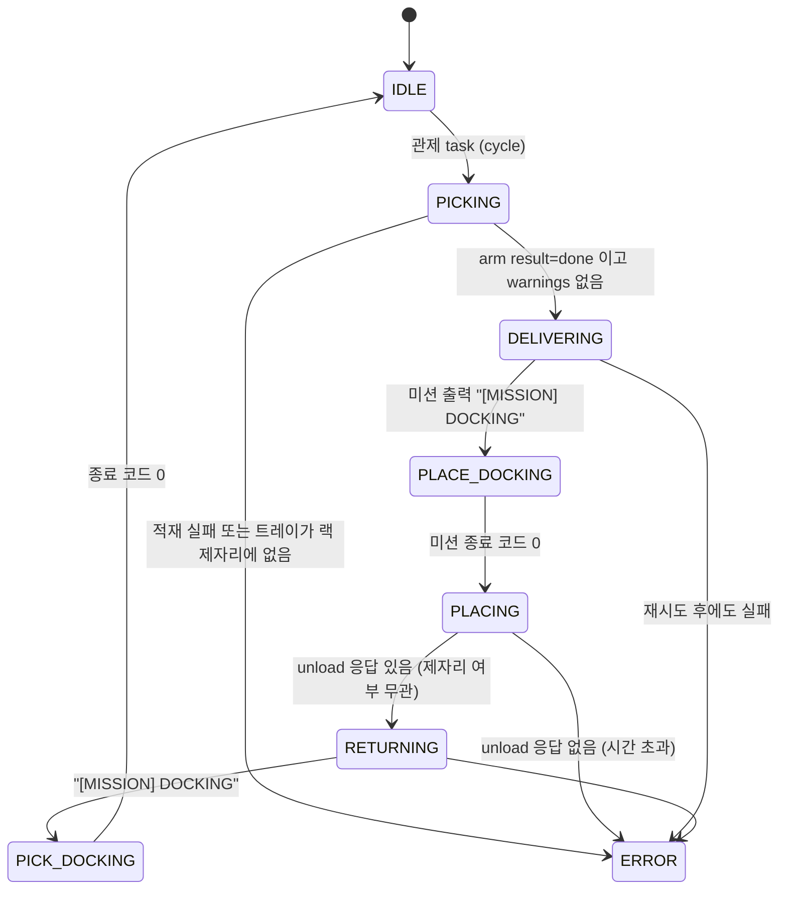
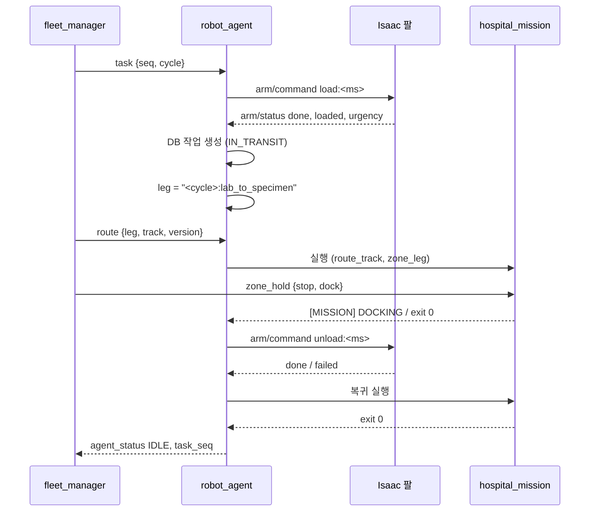

# 01. 운송 사이클 — `robot_agent`

로봇 한 대가 **적재 → 운송 → 하역 → 복귀**를 순서대로 조율한다. 팔은 Isaac(토픽), 주행은 `hospital_mission` 하위 프로세스,
기록은 DB로 보낸다. 코드: `src/hospital_system/hospital_system/robot_agent.py`.

## 1.1 사이클 상태기계



| 단계 | 동작 | 근거 |
|---|---|---|
| `PICKING` | `arm("load")` → 결과의 `loaded[]`, `urgency[]` 저장. `warnings`가 있으면 **주행하지 않는다**(트레이가 테두리에 걸렸거나 그리퍼에 매달렸을 수 있음) | `robot_agent.py:365-372` |
| 작업 생성 | 적재·긴급도 판독이 끝난 뒤 트레이 1~3개로 `transport_task` 1건 생성 | `robot_agent.py:374-377` |
| `DELIVERING` | `drive(collection → analysis)` | `robot_agent.py:381-384` |
| `PLACING` | `arm("unload")`. 제자리에 못 놓아도 로봇은 돌아가고 작업은 `FAILED`로 남겨 관제가 확인 | `robot_agent.py:388-401` |
| `RETURNING` | `drive(analysis → collection)` | `robot_agent.py:403-406` |

단계 이름은 DB `robot_state_history.status` 와 같다 (`robot_agent.py:12-13`, `DB_container/hospital_amr_db_v5_schema.sql:166`).

## 1.2 팔 명령 — 확인 응답이 있는 메시지 전송

Isaac(OmniGraph) 쪽 구독자는 늦게 붙거나 첫 메시지를 잃을 수 있다. 그래서:

1. 구독자가 붙을 때까지 최대 60 s 기다린다 (`robot_agent.py:213-217`).
   - 프로젝트 근거: "Nav2가 같이 뜨는 동안은 DDS 발견이 20 s 넘게 걸린 적이 있다" (`robot_agent.py:213-214`).
2. 명령 문자열에 밀리초 시각을 붙여(`load:1727...`) 고유하게 만들고, `arm/status.cmd_text`가 그 값으로 바뀔 때까지 1 s마다 재전송한다 (`robot_agent.py:212, 219-229`).
3. 받은 뒤에는 `result ∈ {done, failed, stopped}`까지 기다린다 (`robot_agent.py:233-240`).

일반적인 **요청 ID + 응답 확인(ack)** 방식이다. ROS 액션 대신 String 토픽을 쓴 이유는 Isaac 번들 파이썬(3.11)에서 rclpy를 못 쓰고 OmniGraph ROS 노드로 주고받기 때문이다 (`HANDOFF_tray_detection.md` 1절, `isaacpjt/system/run_fleet_sim.py:11-13`).

## 1.3 주행 — 검증된 미션을 하위 프로세스로

```text
ros2 run nav_to_goal hospital_mission --ros-args -p route_id:=lab_to_specimen -p resume:=false
    [-p route_track:=upper] [-r __ns:=/robot2 -r /tf:=tf -r /tf_static:=tf_static]
    [-p require_zone_hold:=true -p zone_leg:=<cycle>:<route>#<version> -r zone_hold:=/robot2/zone_hold]
```
(`robot_agent.py:281-295`)

- **왜 하위 프로세스인가** (프로젝트 근거): 미션이 "성공 0 / 실패 1 / 잘못된 route 2"로 끝나게 만들어져 있어 그대로 이어 붙일 수 있고, **검증된 주행 코드를 건드리지 않는다** (`robot_agent.py:19-20`).
- 미션 stdout을 줄 단위로 읽어 `[MISSION] DOCKING` 이 보이면 단계를 `PLACE_DOCKING`/`PICK_DOCKING` 으로 바꾼다. 버퍼링 때문에 `PYTHONUNBUFFERED=1` (`robot_agent.py:297-306, 320-323`).
- 종료 처리: 시간 초과·Ctrl-C면 프로세스 **그룹째** SIGINT → 10 s 뒤 SIGKILL. 프로젝트 근거: "p7b 에서 로봇이 계속 달렸다" (`robot_agent.py:326-335`).

### 이어 가기 (resume)

| 상황 | 처리 | 근거 |
|---|---|---|
| 미션 종료 코드 1 (대개 사람 앞 양보 15 s 초과) | 5 s 쉬고 **현재 위치에서** 같은 경로를 이어 간다, 최대 3회 | `robot_agent.py:264-279` |
| 관제가 같은 구간에 새 `route.version` 을 보냄 (복도 양보) | 미션을 멈추고(`REROUTED`) 새 복도로 현재 위치에서 재시작. 실패 재시도 횟수와 따로 센다 | `robot_agent.py:248-262, 316-319` |

처음부터 다시 할 수 없는 이유: 미션은 시작할 때 "도킹 자세에서 출발하는지" 검사한다 (`hospital_mission.py:578-586`).
이어 가기는 `resume_stages()` 가 현재 위치를 경로에 투영해(거리 ≤ 1 m, 진행 방향 ±60° 이내) 그 뒤만 남긴다 (`src/nova_carter/nav_to_goal/nav_to_goal/hospital_mission.py:495-517`).

## 1.4 위치 보고

TF `map → base_link` 를 5 Hz로 읽어 `fleet_pose` 로 보낸다 (`robot_agent.py:130-144`).
프로젝트 근거: "`/amcl_pose` 는 움직일 때만 갱신돼 도킹 뒤 0.5 m 전 값이 남았다" (`robot_agent.py:131`).

## 1.5 관제 모드와 시작 위치

- `-p fleet:=true` 면 스스로 사이클을 돌지 않고 `task {"seq": n, "cmd": "cycle"}` 를 기다린다 (`robot_agent.py:432-437`).
- `start:=return` 이면 복귀 차선 위(빈 랙)에서 시작해 먼저 채취실로 간다 (`robot_agent.py:338-348`).
- DB가 꺼져 있으면 **기록 없이 로봇을 움직이지 않는다** — 시작 시 연결 확인 실패면 종료 (`robot_agent.py:419-422`, `records.py:27-30`).
  단, 도중에 기록이 실패하면 경고만 하고 계속한다 (`records.py:42-47`).

## 1.6 단계 → 시스템 호출 요약



## 출처

- 프로젝트 코드만 근거로 했다 (외부 기술 없음).
