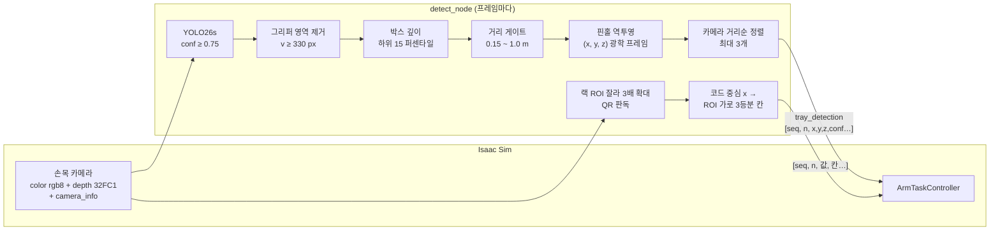

# 02. 인식 — 트레이 검출 · 긴급도(QR) 판독

손목 RGB-D 카메라(RealSense D455 모델) 영상으로 **(1) 책상 위 트레이 3D 위치**를 구해 팔에 주고,
적재가 끝나면 **(2) 랙 위 QR 코드로 칸별 긴급도**를 읽는다.
코드: `admin_ws/src/tray_detector/tray_detector/detect_node.py` (관제/GPU PC, `~/yolo-venv`), Isaac 쪽 수신은 `isaacpjt/system/arm/`.

## 2.1 학습 데이터 — Isaac Replicator 합성 데이터

| 항목 | 값 | 근거 |
|---|---|---|
| 생성기 | NVIDIA 공식 `object_based_sdg.py` 예제 + 패치 3곳 | `HANDOFF_tray_detection.md` 파일 지도, `isaacpjt/sdg/object_based_sdg.py` |
| 이미지 수 | 2000 캡처 × 카메라 2대 = 4000장, 640×640 | `isaacpjt/sdg/tray_sdg.yaml:14-17` |
| 트레이 | 4개, **무중력으로 계속 회전**(최대 180°/s) → 전방위 자세, 크기 ±10% | `tray_sdg.yaml:30, 38-43` |
| 카메라 | 대상까지 0.2~0.7 m, 시선 중심 ±4 cm 흔들기 | `tray_sdg.yaml:26-27` |
| 방해물 | 도형 120개(0.01~0.08) + 창고·사무실·병원 소품 메시 25개 | `tray_sdg.yaml:45-58` |
| 라벨 | Replicator `bounding_box_2d_tight` → YOLO txt. 90% 넘게 가려진 박스는 버림, 10장 중 1장 검증 | `isaacpjt/sdg/to_yolo.py` `MAX_OCCLUSION`, `VAL_EVERY` |

- **프로젝트 근거**: 조명·배경·카메라 각도 무작위화를 Replicator 단계에서 끝냈기 때문에 학습 증강은 ultralytics 기본값을 그대로 쓴다 (`isaacpjt/sdg/train_yolo.py:5-6`). 라벨이 렌더러에서 자동으로 나오므로 수작업 라벨링이 없다.
- **일반 근거**: *Domain randomization* — 시뮬레이터 렌더링을 충분히 무작위화하면 모델에게 실제 세계는 "또 하나의 변형"으로 보인다 (Tobin et al., IROS 2017) [S1].

## 2.2 검출 모델 — YOLO26s

| 항목 | 값 | 근거 |
|---|---|---|
| 모델 | `yolo26s.pt` 에서 미세조정, 클래스 1개(`tray`) | `train_yolo.py:16`, `runs/detect/isaacpjt/sdg/runs/tray-2/args.yaml` |
| 학습 | 150 epoch, imgsz 640, batch 32, patience 30 | `train_yolo.py:17-22` |
| 옵티마이저 | **AdamW, lr0 0.002 고정** | `train_yolo.py:23-28` |
| 결과 (epoch 150, 합성 검증셋) | precision 0.908 · recall 0.736 · mAP50 0.805 · mAP50-95 0.678 | `runs/detect/isaacpjt/sdg/runs/tray-2/results.csv` 마지막 행 |

- **옵티마이저를 고정한 이유** (프로젝트 근거): `optimizer=auto` 는 반복 수가 10000을 넘으면 AdamW@0.002 에서 MuSGD@0.01 로 바뀐다. 데이터·에폭을 늘려도 학습률이 바뀌지 않게 auto가 고르던 값을 고정했다 (`train_yolo.py:23-25`).
- **YOLO26을 고른 이유**: 프로젝트 기록에 없다 — **근거 미확인**.
  일반 근거: YOLO26은 NMS 없이 끝까지 추론하는(end-to-end) 엣지 지향 설계로, CPU 추론이 최대 43% 빠르다고 발표됐다 [S2][S3].
- 추론은 Isaac(파이썬 3.11, numpy 1.26)과 **다른 프로세스**다. ultralytics를 Isaac에 설치하면 numpy 2.x가 덮여 Isaac이 깨진다 (`HANDOFF_tray_detection.md` 1절).

## 2.3 검출 후처리 — 2D 박스를 3D 파지점으로

| 순서 | 처리 | 왜 (프로젝트 근거) | 근거 |
|---|---|---|---|
| 1 | 신뢰도 `conf ≥ 0.75` | 0.85에서는 검출이 덜 잡혀 낮췄다 | `admin_ws/src/tray_detector/tray_detector/detect_node.py:45` |
| 2 | 박스 중심 `v ≥ 330 px` 버림 | 그리퍼는 손목에 고정돼 화면에서 항상 같은 자리다. 60장 실측에서 그리퍼 최상단 y = 345 → 15 px 여유. 깊이로 거르면 새는 경우가 있었다 | `admin_ws/src/tray_detector/tray_detector/detect_node.py:47-58, 199-201` |
| 3 | **박스 전체 유효 깊이의 하위 15 퍼센타일**(표본 ≥ 20) | 트레이는 손잡이·랙·시험관이 붙은 비대칭 조립체라 박스 중앙이 빈틈에 떨어져 배경 깊이가 잡힌다. "물체가 배경보다 항상 가깝다"는 사실만으로 배경이 절반 넘게 섞여도 물체 깊이를 고른다 | `admin_ws/src/tray_detector/tray_detector/detect_node.py:60-66, 106-117` |
| 4 | 깊이 0.15~1.0 m 만 | 0.15 m보다 가까우면 그리퍼, 1.0 m보다 멀면 팔이 닿지 않는다(1.1 m대 벽 오검출 차단) | `admin_ws/src/tray_detector/tray_detector/detect_node.py:50, 59, 206-208` |
| 5 | 핀홀 역투영 `X=(u−cx)Z/fx, Y=(v−cy)Z/fy` | Isaac depth는 광축 방향 Z(DistanceToImagePlane)라 이 식이 그대로 맞다 | `admin_ws/src/tray_detector/tray_detector/detect_node.py:144-149` |
| 6 | 카메라 원점까지 거리순 정렬, 최대 3개 | 왼쪽부터 집을 때 앞의 오른쪽 트레이를 건드렸다. 광축 z만 보지 않는 이유는 카메라가 아래로 기울어 양옆 트레이의 실제 거리가 다르기 때문 | `admin_ws/src/tray_detector/tray_detector/detect_node.py:12-13, 136-141, 214-215` |
| 7 | 발행 카운터 `seq` | 메시지에 타임스탬프가 없어 Isaac이 "관측 자세로 옮긴 **뒤에** 새로 찍은 값인지"를 seq 증가로 판단 | `admin_ws/src/tray_detector/tray_detector/detect_node.py:9-11`, `isaacpjt/system/arm/controller.py:396-402` |

- 컬러와 깊이는 같은 render product에서 나와 **픽셀 정합이 따로 필요 없다** (`admin_ws/src/tray_detector/tray_detector/detect_node.py:21-22`).
- 광학 프레임 → 월드 변환 (Isaac 쪽): ROS 광학 규약(x 우, y 하, z 전방)과 USD 카메라(x 우, y 상, −z 전방)는 y·z 부호가 반대라 `(x, −y, −z)` 로 바꾼 뒤 카메라 월드 행렬을 곱한다 (`isaacpjt/system/arm/motion.py:42-51`).
- 두 번 검출: 첫 검출로 카메라를 트레이 위 **수평 중앙**으로 옮긴 뒤(03 문서 3.3) 다시 검출해 최종 파지점을 정한다. 두 번째에는 화면 중앙에서 8 cm 넘게 벗어난 후보를 버린다 (`isaacpjt/system/arm/controller.py:313-322`, `config.py:223`).

## 2.4 긴급도 판독 — 랙 QR 코드

적재가 끝나면 팔이 **고정 관측 자세**로 가서 랙 3칸을 위에서 내려다본다. 트레이 손잡이 윗판의 QR 코드 값이 긴급도다.

| 순서 | 처리 | 왜 (프로젝트 근거) | 근거 |
|---|---|---|---|
| 1 | 랙이 보이는 영역 `RACK_ROI = (165, 175, 510, 255)` 만 잘라 **3배 확대(INTER_CUBIC)** 후 판독 | 코드가 원본에서 약 28 px(셀당 4 px)이라 그대로는 못 읽는다 | `admin_ws/src/tray_detector/tray_detector/detect_node.py:73-82, 120-127` |
| 2 | 코드 중심 x → ROI를 **가로 3등분한 칸** 0/1/2 | 코드를 3D로 옮겨 칸까지 거리를 재던 방식은 깊이 오차로 양옆 칸이 버려졌다(실측 `[0, 11, 2]`). 실측 코드 중심 x = 225/338/451 이 3등분 중앙에 오도록 ROI를 맞췄다 | `admin_ws/src/tray_detector/tray_detector/detect_node.py:17-18, 76-80, 130-133`, `isaacpjt/system/arm/geometry.py:243-252` |
| 3 | **90 프레임(약 1.5 s) 누적, 칸별 최빈값** | 판독이 프레임마다 깜빡인다(0~2개) | `isaacpjt/system/arm/controller.py:373-394`, `geometry.py:255-261`, `config.py:144-145` |
| 4 | 값 → 긴급도: 하 0→**1**, 중 1→**2**, 상 2→**3**, 미검출→**1** | 3이 가장 급하다. DB `tray.priority` 에 그대로 저장 | `geometry.py:270-274`, `docs/SYSTEM_INTEGRATION_PLAN.md:213` |

- 판독 결과는 `arm/status.urgency[]` 로 에이전트에게, 관제 우선순위 점수(06 문서)와 DB로 이어진다.
- 새 트레이가 공급될 때마다 긴급도 코드를 무작위로 다시 뽑아 매 사이클 다른 긴급도를 만든다 (`isaacpjt/system/arm/trays.py:174-209`).
- **QR 코드를 쓴 이유**: 설계 요구사항은 "랙 코드로 긴급도(3 = 긴급) 판독"이다 (`README.md` 구성). 코드 방식을 고른 이유는 프로젝트 기록에 없다 — **근거 미확인**.
  일반 근거: QR 코드(ISO/IEC 18004)는 기계가 읽는 데이터를 담고, Reed-Solomon 오류 정정으로 L/M/Q/H 단계별 약 7/15/25/30% 손상까지 복원한다 [S4]. 긴급도뿐 아니라 트레이 ID 같은 데이터도 같은 코드에 넣을 수 있다.
- 트레이 ID는 지금 판독하지 않고 `TR{YYYYMMDD}-{task_id}-S{slot}` 으로 만든다 (`docs/SYSTEM_INTEGRATION_PLAN.md:214`, `src/hospital_system/hospital_system/db.py` `tray_id_for`).

## 2.5 디버그 이미지

검출 프레임은 10장마다, 0개인 프레임은 30장마다, 코드가 보인 프레임은 전부 `~/tray_detections/<robot>/` 에 저장한다.
프로젝트 근거: 예전에는 0개인 프레임을 하나도 남기지 않아 "정렬 이동 뒤 검출 0개" 실패를 분석할 자료가 없었다 (`admin_ws/src/tray_detector/tray_detector/detect_node.py:67-70, 231-240`).

## 한계

- 검증 지표는 **합성 검증셋** 기준이다. 실물 카메라 데이터로는 시험하지 않았다.
- 그리퍼 영역·ROI·깊이 게이트는 이 카메라 장착 자세에 맞춘 픽셀·거리 상수다. 관측 자세를 바꾸면 `RACK_ROI` 를 다시 맞춰야 한다 (`admin_ws/src/tray_detector/tray_detector/detect_node.py:73-76`).

## 출처

- [S1] J. Tobin et al., "Domain Randomization for Transferring Deep Neural Networks from Simulation to the Real World," IROS 2017. <https://arxiv.org/abs/1703.06907>
- [S2] "Ultralytics YOLO Evolution: An Overview of YOLO26, YOLO11, YOLOv8, and YOLOv5 Object Detectors," arXiv:2510.09653. <https://arxiv.org/abs/2510.09653>
- [S3] Ultralytics v8.4.0 릴리스 (YOLO26, NMS-free end-to-end). <https://community.ultralytics.com/t/new-release-ultralytics-v8-4-0/1747>
- [S4] QR 코드 오류 정정 단계 L/M/Q/H (ISO/IEC 18004, Reed-Solomon). 예: iText `ErrorCorrectionLevel` API 문서 <https://api.itextpdf.com/iText/java/7.1.7/com/itextpdf/barcodes/qrcode/ErrorCorrectionLevel.html>
