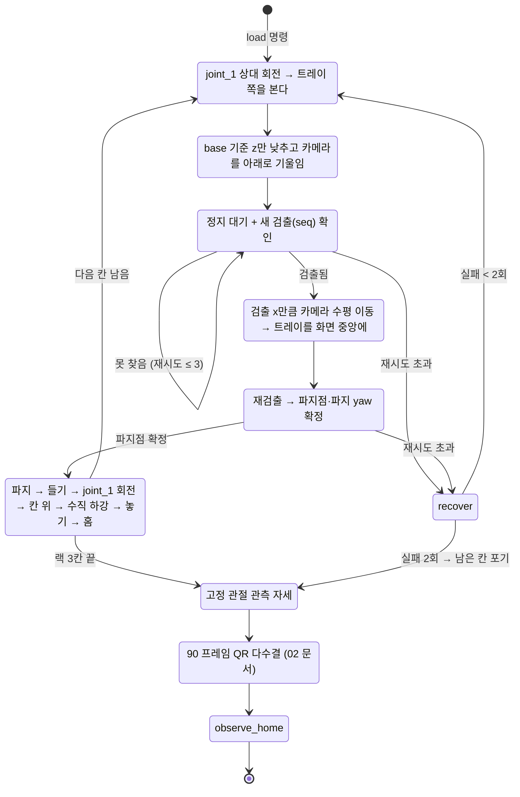

# 03. 매니퓰레이션 — M0609 적재 · 하역

Isaac Sim 안에서 로봇마다 `ArmTaskController` 하나가 **60 Hz 물리 콜백마다 한 틱**씩 팔을 움직인다.
명령은 `arm/command`(`load` / `unload` / `stop`), 결과는 `arm/status` JSON.
코드: `isaacpjt/system/arm/{controller,motion,geometry,config,trays}.py`.

## 3.1 적재 상태기계 (`load`)

근거: `isaacpjt/system/arm/controller.py:357-525`.

- 하역(`unload`)은 **랙 3번 → 1번** 순서로, 칸마다 같은 번호의 책상 자리에 놓는다 (`controller.py:227-246`).
- 놓은 뒤 가장 가까운 트레이 원점이 목표에서 수평 8 cm, 높이 2 cm 안인지 확인해 `loaded[]`/`unloaded[]` 에 올린다.
  프로젝트 근거: "시퀀스가 끝났다고 트레이가 제자리에 있는 건 아니다 — 물린 채 기울면 랙 테두리에 걸리거나 떨어진다(2026-09-25 실측)" (`controller.py:248-269`, `config.py:325-326`).

## 3.2 역기구학 — Lula Kinematics Solver

| 항목 | 값 | 근거 |
|---|---|---|
| 솔버 | `LulaKinematicsSolver`(URDF + 로봇 description YAML) → `ArticulationKinematicsSolver` 로 감쌈 | `controller.py:135-144`, `config.py:11-13` |
| 기준 프레임 | 팔 `base_link` 의 **현재 월드 자세**를 매 틱 솔버에 넘긴다 (팔이 움직이는 AMR 위에 있다) | `controller.py:164-169, 362` |
| 허용 오차 | 위치 3 mm, 자세 0.1222 rad (7°) | `config.py:45-49` |
| TCP | link_6 +Z 로 0.21671 m (손가락 패드 끝, 실측) | `config.py:40-41` |

- **프로젝트 근거 (자세 허용 오차)**: Lula는 축별 구속을 못 해 이 값이 x/y/z 에 똑같이 걸린다. 키우면 특이점 근처에서 해를 찾을 여지가 생기지만 트레이가 그만큼 기운 채 "성공"이 난다. 0.02 → 0.1 → 10° → **7°** 로 조정 (`config.py:46-49`).
- **Lula를 고른 이유**: 프로젝트 기록에 없다 — **근거 미확인**. 일반 근거: Isaac Sim이 제공하는 매니퓰레이터 IK 솔버로 URDF와 description YAML 두 파일로 설정하며, 순환 좌표 하강(CCD)과 BFGS 기반 IK 파라미터를 가진다 [S1][S2]. (Isaac Sim 6.0부터 deprecated [S2])
- 카터와 팔이 **하나의 아티큘레이션**(dof 19개)이라 등록은 `chassis_link`, IK 기준은 팔 `base_link` 로 나눠 쓴다. 홈 자세로 돌릴 때 전체 관절을 덮으면 바퀴까지 리셋돼 로봇이 튀므로 팔 관절만 덮는다 (`HANDOFF_tray_detection.md` 2.2절, `controller.py:148-162`).

### 손목 특이점 대응

M0609 는 `joint_5 ≈ 0` 이면 joint_4 와 joint_6 축이 일직선이 되어 자코비안이 퇴화한다. IK 해가 한 프레임에 다른 해로 튄다 (`motion.py:54-61`).

| 대응 | 동작 | 근거 |
|---|---|---|
| 파지 전 IK 사전 검사 | 후보 yaw 로 IK 를 미리 풀어 `abs(joint_5) ≥ 8°` 인 것만 채택 | `motion.py:15-39`, `config.py:292` |
| 튐 감시 | 한 틱에 관절 변화 > 20° 면 경고 (**현재는 막지 않고 통과**) | `motion.py:54-97`, `config.py:281` |
| 손목 풀기 재시도 | 스텝 도달 실패 시 joint_5 를 15° 띄우고 joint_3 로 같은 양을 되돌려(도구 기울기 유지) 실패 스텝부터 1회 재시도 | `motion.py:242-252`, `controller.py:442-451`, `config.py:275-276` |
| 관절 공간 이동 | 트레이를 든 채 큰 회전은 IK 보간 대신 목표 IK 1회 + 관절 보간 (`joint_ik`) | `motion.py:318-325, 449-466` |

- 튐 감시를 막지 않게 바꾼 이유 (프로젝트 근거): 예전에는 그런 프레임을 미해결로 돌려보냈는데 지령이 안 나가 팔이 제자리에 서면서 스텝이 통째로 실패했다 (`motion.py:58-61`). `config.py:279-280` 주석은 아직 "걸러서 미해결 처리"라고 적혀 있다 — 실제 동작은 `motion.py` 가 맞다.
- `joint_ik` 를 쓴 이유 (프로젝트 근거): joint_1 회전 뒤 IK 로 보간하며 돌리면 손목이 특이점 근처(joint_5 −12 ~ −30°)라 joint_4 가 한 틱에 20° 넘게 튀어 물린 트레이가 흔들렸다(2026-09-25 3번 칸 걸림). 오프라인 IK 재생 33경로에서 틱당 최악 11.6° → 1.9° (`motion.py:318-322`).

## 3.3 파지 계획

1. **수평 중앙 정렬**: 첫 검출의 광학 x(= 그 깊이에서 광축으로부터의 실제 거리, m)만큼 카메라 오른쪽 축으로 TCP 를 옮긴다. 카메라가 TCP 에 강체로 붙어 있어 픽셀 계산 없이 중앙에 온다 (`motion.py:171-194`).
2. **재검출 → 파지점**: 검출점(월드) → 팔 base 좌표 → 접근 방향으로 트레이 반 깊이만큼 밀고 높이 보정 (`geometry.py:181-191`).
3. **파지 yaw 스냅** (`square_grasp_yaw`): base→트레이 방위각을 **트레이 축(스폰 yaw + k·90°)** 에 맞춘다 (`geometry.py:194-207`).
   - 프로젝트 근거: 트레이가 가로 한 줄로 ±25 cm 흩어져 방위각이 −71 ~ −103° 로 퍼진다. 방위각으로 물면 최대 19° 비스듬히 물어, 칸 폭 15.4 cm 에 9.1×14 cm 트레이가 13.2 cm 폭이 되고 여유 1 cm → 칸막이에 얹혀 40° 기울었다. 축에 맞추면 여유 3 cm 유지 (`geometry.py:197-203`).
4. **도달 거리 게이트**: 파지점이 base 에서 0.25~1.12 m 밖이면 다음 후보 (`controller.py:326-330`, `config.py:231-232`).

## 3.4 동작 시퀀스와 보간

적재 스텝 (`build_pick_steps`, `motion.py:276-339`):

| # | 스텝 | 타입 | 속도 |
|---|---|---|---|
| 0 | 파지 전 안전 위치 (접근 방향 뒤) | pose | 기본 |
| 1 | 파지 위치 | pose | slow |
| 2 | 그리퍼 닫기 (120 틱 ≈ 2 s) | hold | — |
| 3 | 들어올리기 | pose | slow |
| 4 | joint_1 회전 (파지 방향 → 칸 방향 차이를 **계산**) | joint | carry, ease 2 |
| 5 | 칸 위 +18 cm 경유점 (0.11 + 0.07) | joint_ik | carry, ease 2 |
| 6 | 칸 위 +11 cm | pose | carry, ease 2 |
| 7 | 하강 전 대기 — 트레이 각속도 < 0.1 rad/s, 기울기 < 5° 면 조기 종료 (최소 1 s) | hold | — |
| 8 | 칸으로 **수직 하강** (도달 허용 3 cm) | pose | slow |
| 9 | 그리퍼 열기 | hold | — |
| 10 | 후퇴 | pose | slow |
| 11 | 홈 | joint | 기본 |

- **pose 스텝**: TCP 위치는 선형, 자세는 쿼터니언 SLERP 로 보간해 매 틱 IK (`motion.py:506-514`). **joint 스텝**: 관절각 선형 보간 (`motion.py:515-519`).
- **스텝 수 = 이동량 / 속도 등급**: 기본 1 cm·1.25°/틱, carry 0.6 cm·0.75°, slow 0.4 cm·0.5° (`geometry.py:226-240`, `config.py:147-167`).
  프로젝트 근거: carry 는 트레이를 들고 joint_1 을 최대 86° 돌릴 때 2.5배 속도면 트레이가 흔들려서, slow 는 접촉 순간 빠르면 트레이를 치거나 놓쳐서 (`config.py:159-162`).
- **코사인 S-커브**: `f(u) = 0.5 − 0.5·cos(πu)`, `ease 2` 는 `f(f(u))` 로 **도착 가속도까지 0** (`geometry.py:210-223`).
  프로젝트 근거: 1번만 쓰면 양끝 속도는 0이지만 가속도가 최대(π²/2)라 도착 순간 감속 충격으로 트레이가 흔들렸다 (`geometry.py:213-215`).
- **수직 하강**: 대각선으로 들어가면 트레이가 랙 테두리에 걸린다 → 칸 바로 위로 먼저 가서 수직으로만 내린다 (`config.py:177-180`, `motion.py:314-316`).
- **도달 확인**: pose 스텝이 끝나면 위치 1 cm·자세 12° 이내인지 보고, 아니면 120 틱 더 목표를 주고, 그래도 안 되면 실패 (`motion.py:533-541`, `config.py:282-291`).
  프로젝트 근거: 틱 수만 세고 넘기면 IK 가 거부된 스텝에서 팔이 제자리인데 다음 회전이 시작됐다 ("올린 뒤 후퇴 없이 회전") (`config.py:282-284`).
- **실패 복구**: 들고 있으면 집었던 자리에 되돌려 놓고 홈, 아니면 홈. 적재 실패가 2회면 남은 칸을 포기하고 관측으로 넘어간다 — 미션을 멈추지 않는다 (`controller.py:336-346, 479-485`, `motion.py:255-273`).

## 3.5 시뮬레이션 전제 (발표 때 밝힐 것)

| 항목 | 내용 | 근거 |
|---|---|---|
| 랙 정렬 가이드 | 칸 바닥에 반듯이 앉은 트레이(기울기 ≤ 10°)는 놓은 직후 **트레이 자세를 칸 중앙·칸 방향으로 직접 맞춘다**. "랙 칸에 정렬 가이드(자석)가 있다는 설정" | `trays.py:341-388`, `config.py:115, 330` |
| 트레이 재공급 | 채취실 책상이 비면 보관소(또는 하역 끝난) 트레이를 스폰 자리로 옮기고 긴급도 코드를 새로 뽑는다 | `trays.py:174-209` |
| 분석실 비우기 | 하역 전에 지난번 하역한 트레이를 보관소로 옮긴다 ("분석실이 가져간 것으로 친다") | `trays.py:157-172` |

## 출처

- [S1] NVIDIA Isaac Sim, "Lula Kinematics Solver". <https://docs.isaacsim.omniverse.nvidia.com/5.1.0/manipulators/manipulators_lula_kinematics.html>
- [S2] NVIDIA Isaac Sim, "isaacsim.robot_motion.lula — Python API" (CCD IK, deprecated since 6.0.0). <https://docs.isaacsim.omniverse.nvidia.com/latest/py/source/deprecated/isaacsim.robot_motion.lula/docs/index.html>
