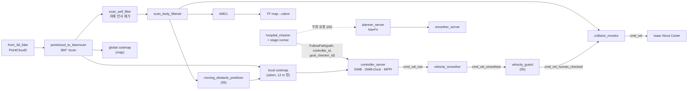

# 04. 주행 — Nav2 스택 · 고정 차선 · FollowPath 컨트롤러

로봇마다 `/robotN` 네임스페이스에 Nav2 한 벌과 병원 전용 노드 4개가 뜬다.
미션(`hospital_mission`)은 **플래너로 길을 찾지 않는다**. 미리 정한 차선(직선+원호)을 `nav_msgs/Path` 로 만들어
controller_server 의 **FollowPath 액션**에 구간별로 넘기고, 구간마다 컨트롤러를 바꾼다.

코드: `src/nova_carter/carter_navigation/{launch/hospital_navigation.launch.py, params/hospital_navigation_params.yaml}`,
`src/nova_carter/nav_to_goal/nav_to_goal/{hospital_mission,hospital_lanes,hospital_stage_runner}.py`.
(아래에서 `params.yaml` = `hospital_navigation_params.yaml`)

## 4.1 구성과 데이터 흐름



| 노드 | 역할 | 근거 |
|---|---|---|
| Nav2 `bringup_launch.py` | map_server, AMCL, planner/controller/smoother/behavior server, velocity_smoother, collision_monitor | `hospital_navigation.launch.py:66-75` |
| `pointcloud_to_laserscan` | 3D 라이다를 360° LaserScan 으로 압축 (라이다 기준 높이 −0.8 ~ 3.0 m) | `hospital_navigation.launch.py:90-116` |
| `hospital_scan_self_filter` | base_link 기준 `[-1.38, 0.48] × [-0.5, 0.5]` 안의 반사를 NaN 으로 | `scan_self_filter.py:1-5, 40-63` |
| `hospital_amcl_initial_pose` | Isaac 이 쓴 시작 자세 파일로 AMCL 을 **한 번** 초기화 (map→odom 은 발행하지 않음) | `amcl_initial_pose.py:1`, `hospital_navigation.launch.py:78-89` |
| `hospital_moving_obstacle_predictor`, `hospital_velocity_guard` | 사람 추적·예측, 출력 가드 (05 문서) | `hospital_navigation.launch.py:129-148` |

- **자기 반사 필터를 둔 이유** (프로젝트 근거): "긴 Carter 차체가 원본 `/scan` 에 찍히므로 위치 추정에는 차체 반사 제거 스캔을 사용한다" (`params.yaml:47-48`). 변환을 못 구하면 스캔을 **내보내지 않아** Collision Monitor 의 소스 타임아웃이 로봇을 세운다 (`scan_self_filter.py:3-5`). costmap 은 원본 `/scan` + footprint clearing 을 그대로 쓴다.
- **DDS 수신 버퍼 4 MB** (프로젝트 근거): 800 KB 라이다 PointCloud2 가 기본 UDP 버퍼(208 KB)에서 유실된다 (`hospital_navigation.launch.py:155-156`, `hospital_mission.py:670-681`).
- **BT navigator 는 미션에서 쓰지 않는다.** `BasicNavigator.followPath()` 가 controller_server 의 FollowPath 액션을 직접 호출하고(`hospital_stage_runner.py:121-122`), 우회 때만 `getPath()`·`smoothPath()` 로 planner/smoother 액션을 부른다 (`hospital_mission.py:415-431`).

## 4.2 위치 추정 — AMCL

| 설정 | 값 | 이유 (프로젝트 근거) | 근거 |
|---|---|---|---|
| 모델 | `likelihood_field`, 차동구동 모션 모델, 입자 500~2000 | Nav2 기본 구성 | `params.yaml:23-33` |
| 스캔 | `scan_body_filtered` | 차체 반사 제거 | `params.yaml:47-48` |
| 오도메트리 잡음 `alpha1~5` | **0.02** (기본 0.2) | Isaac 오도메트리는 물리 엔진 자세라 누적 오차가 거의 없다. 같은 bag 재생 비교에서 0.2 → 최대 0.352 m / 9.3°, 0.02 → 0.168 m / 1.5° | `params.yaml:5-12` |
| `update_min_d / _a` | 0.2 m / 0.2 rad | 자주, 조금씩 보정해 map→odom 점프 완화 | `params.yaml:41-42` |
| `transform_tolerance` | **3.0 s** (기본 1.0) | Isaac 라이다가 1.2 s 까지 끊기는데 1.0 이면 TF 가 만료돼 controller 가 "Transform data too old" 로 abort | `params.yaml:38-40` |
| 초기 위치 | Isaac 의 `start_pose_robotN.json` + 현재 odom 을 합성해 `/initialpose` 로 1회 | Isaac 시작 자세는 초기값에만 쓰고 이후 map→odom 은 AMCL 단독 | `amcl_initial_pose.py:19-30`, `params.yaml:36-37` |
| 책상 옆 재보정 | 출발 전·도킹 뒤, **라이다로 맞춘 책상 모서리**로 계산한 자세를 `/initialpose` 로 | AMCL 이 책상 옆에서 0.39 m / 8° 밀려 costmap 이 차체를 책상 안에 뒀다 | `hospital_mission.py:567-577`, `hospital_docking.py:397-442` (05 문서) |

- **일반 근거**: AMCL(Adaptive Monte Carlo Localization)은 정적 지도 위에서 입자 필터로 로봇 자세를 추정하고, KLD 샘플링으로 입자 수를 불확실성에 맞춰 조절한다 [S1][S7][S8].
- 관제로 보내는 위치는 `/amcl_pose` 가 아니라 **TF** 다 (01 문서 1.4).

## 4.3 고정 차선 — 직선 + 원호


- 차선은 `('line', p0, p1)` / `('arc', 중심, 반지름, 시작각, 끝각)` 원소 목록이다 (`hospital_lanes.py:39-114`).
- **방 구간은 한 방향**(도킹 → 문 밖 분기점 OUT, 분기점 → 정류장 IN), **복도 4개는 양방향**: `upper`(y=14.9), `upper_reserve`(y=16.9), `lower`(y=−1.5), `lower_reserve`(y=−3.5) (`hospital_lanes.py:1-13, 69-114`).
- 경로 = 출발 방 OUT + 복도(관제가 고름) + 도착 방 IN (`hospital_lanes.py:150-158`). 동→서는 서→동 기하를 뒤집어 쓴다 (`hospital_lanes.py:120-128`).
- `sample_route()` 가 **5 cm 간격**으로 (x, y, yaw) 를 만들어 Path 로 보낸다 (`hospital_mission.py:33, 244-307`).

설계 규칙 (프로젝트 근거, 커밋 `662b990`, `hospital_lanes.py:37-38`):

| 규칙 | 이유 |
|---|---|
| 원호끼리 바로 잇지 않는다 (원호–직선–원호), 한 원호 ≤ 90° | 연속 원호·180° U턴이 정류장 근처 제자리 회전을 만들었다. 적용 후 왕복 제자리 회전 12.4 s → 6.0 s |
| 도착은 정류장 앞 **1.6 m 직진**으로 끝난다 | 도킹 직진에 이미 정렬된 채로 들어간다 |
| 복도 긴 직선 앞 **1.5 m 는 DWB 직선** (`HANDOVER_M`) | R0.9 원호 끝에서 MPPI 로 넘기면 22° 제자리 회전이 생겼다 |

- **고정 차선을 쓴 이유**: 설계 결정으로 남은 명시 기록은 없다 — **근거 미확인**.
  코드에서 확인되는 효과: 관제(06 문서)가 **주행과 같은 기하**를 import 해 구역 예약을 하므로 관제용 지도를 따로 두지 않는다 (`src/hospital_system/hospital_system/lane_graph.py:98-114`).
  이전에는 Smac Hybrid-A* + 차선 keepout 마스크로 경로를 계획했다 (커밋 `56f4d65`) — 지금 launch 는 마스크를 띄우지 않는다.

## 4.4 구간 분할과 컨트롤러 선택 ★


`split_route()` 가 경로를 세 구간으로 나누고 구간마다 `controller_id` 와 `goal_checker_id` 를 정한다 (`hospital_mission.py:455-468, 545-552`).

| 구간 | 컨트롤러 (`controller_id`) | 플러그인 | goal checker | 속도 상한 |
|---|---|---|---|---|
| ① 출발 `station_departure` — 도킹 자리에서 나와 방·문·복도 진입 원호까지 | `FollowPath` | DWB | `transit_goal_checker` (xy 0.3 m, yaw 0.8 rad) | 0.8 m/s, 0.9 rad/s |
| ② 복도 긴 직선 `<track>` | `FollowPathMPPI` | **MPPI** | `transit_goal_checker` | 0.6 m/s, 0.9 rad/s |
| ③ 도착 `station_arrival` — 복도 출구 원호부터 정류장까지 | `FollowPathDock` | DWB | `general_goal_checker` (xy 5 cm, yaw 5.7°, 정지 확인) | 0.5 m/s, 0.6 rad/s |
| ④ 책상 옆 2.5 m 직진 | 컨트롤러 없음 — `TableDocking` 이 직접 속도 명령 | 자체 P 제어 | 라이다 모서리 기준 | 0.18 m/s (05 문서) |

근거: `params.yaml:173, 191-206, 208-292, 296-382`, `hospital_lanes.py:11-13`.

### DWB (`FollowPath`, `FollowPathDock`) — 원호·방·정류장

**원리** — Dynamic Window Approach. 현재 속도에서 가감속 한계로 1 제어주기 안에 도달 가능한 (v, ω) 창을 샘플링하고,
각 속도를 `sim_time` 동안 일정하게 적용한 궤적을 그려 critic 점수의 가중합이 가장 좋은 것을 고른다 [S2][S3][S4].

```text
for (v, ω) in 창 안의 vx_samples × vtheta_samples 격자:
    궤적 = (v, ω)를 sim_time 동안 적분
    score = Σ scale_i · critic_i(궤적)      ← 낮을수록 좋음, 충돌이면 버림
명령 = argmin score
```

| 설정 | 값 | 이유 (프로젝트 근거) | 근거 |
|---|---|---|---|
| 샘플 | vx 20 × vθ 20, `sim_time` 1.7 s | — | `params.yaml:225-228` |
| critics | RotateToGoal, Oscillation, **ObstacleFootprint**, GoalAlign, PathAlign, PathDist, GoalDist | ObstacleFootprint = 긴 후방을 포함한 **다각형 전체** 충돌 검사 (BaseObstacle 에서 교체) | `params.yaml:238-239`, `docs/HOSPITAL_AMR_AVOIDANCE_HANDOFF_2026-09-23.md:156` |
| PathAlign / GoalAlign `forward_point_distance` | 0.8 m | 로봇 길이 1.86 m 기준 (기존 0.1 은 소형 카터용) | `params.yaml:241, 243` |
| critic 가중치 | PathDist 32 · GoalDist 24 · PathAlign 8 · GoalAlign 12 · RotateToGoal 32 | 경로에 붙어 가되, 직선 구간 미세 조향은 완화 (PathAlign 32 → 16 → 8) | `params.yaml:240-247` |
| `min_vel_x` | 0 (후진 금지) | 꼬리 1.38 m 가 라이다 사각 | `params.yaml:211`, `:319` |
| `max_vel_theta` | 0.9 | R 0.6 U턴에서 0.5 m/s 유지에 0.83 rad/s 필요 | `params.yaml:215` |
| `xy_goal_tolerance` (RotateToGoal 전환 창) | 0.05 = goal checker 와 같게 | 창이 checker 허용치보다 크면 창에 들어오자마자 전진을 멈춰 허용치까지 못 다가간다 | `params.yaml:232-234` |
| **`FollowPathDock` 만** `max_vel_x` 0.5, `max_vel_theta` 0.6, 각가속 1.0 | 0.8 로 진입하면 5.8 cm 지나쳤다(실측). 도착 정렬에서 과회전 방지 | `params.yaml:250-268`, 커밋 `ff7dcd5` |

**이 구간에 DWB 를 쓴 이유**

- 프로젝트 근거
  1. 원래는 복도 진입·출구 원호도 MPPI 구간에 있었다. **"턴 이전에 DWB로 넘기길 원해"** 모든 원호를 DWB 로 옮겼다 (사용자 요청, `docs/HOSPITAL_AMR_AI_HANDOFF_2026-09-22.md:171-172, 362`; `hospital_mission.py:458-460`; `params.yaml:170-171`).
  2. 정류장에는 **5 cm / 5.7° 안으로 정확히 서야** 도킹 직진을 시작할 수 있다. DWB 의 RotateToGoal + `StoppedGoalChecker` 조합으로 목표 자세에 정지한다 (`params.yaml:191-199`, `hospital_stage_runner.py:226-250`).
  3. 방·문 안에서는 측방 회피 후보를 만들지 않는다. 현재 장애물은 DWB 의 전체 footprint critic 과 Collision Monitor 가 맡는다 (`hospital_stage_runner.py:268-272`).
- 일반 근거: Nav2 는 DWB 를 비원형 차동구동 로봇에 쓸 수 있는 기본 컨트롤러로 소개하고, "critic 가중치를 조정하면 거의 **어떤 단일 동작이든 잘 하도록** 튜닝할 수 있다"고 설명한다. 한편 DWB 는 샘플마다 **일정한 (v, ω)** 를 가정한다(constant action model) [S3][S4].

### MPPI (`FollowPathMPPI`) — 복도 직선

**원리** — Model Predictive Path Integral. 직전 최적 제어열에 **가우시안 잡음**을 더한 `batch_size` 개 제어열을 모션 모델로 `time_steps × model_dt` 만큼 굴려(rollout) 궤적을 만들고,
critic 비용 `S_k` 로 **소프트맥스 가중 평균**해 새 제어열을 만든다. 첫 제어를 내보내고 다음 주기에 이어서 최적화한다 [S5][S6][S9].

```text
U ← 직전 최적 제어열 (한 칸 밀기)
for k in 1..batch_size:
    ε_k ~ N(0, diag(vx_std², wz_std²));  궤적_k = rollout(U + ε_k)
    S_k = Σ critic(궤적_k)
w_k = exp(−(S_k − min S) / temperature) / Σ exp(…)
U ← U + Σ w_k ε_k ;  명령 = U[0]
```

critic 은 볼록·미분 가능할 필요가 없다 [S5].

| 설정 | 값 | 이유 (프로젝트 근거) | 근거 |
|---|---|---|---|
| 예측 구간 | `time_steps` 90 × `model_dt` 0.05 = **4.5 s** (0.5 m/s 면 2.25 m) | 2.8 s 로는 콘 앞 0.6 m 에서야 알아채고 섰다(실측). "옆으로 빠졌다가 지나가는" 궤적 전체가 horizon 안에 들어와야 한다 | `params.yaml:298-302` |
| `batch_size` | 1000 | Nav2 기본 | `params.yaml:303` |
| `vx` 0 ~ 0.6, `wz` ±0.9 | 후진 금지(꼬리 1.38 m 가 라이다 사각), 꼬리 쓸림 감소 | `params.yaml:318-321` |
| `wz_std` | 0.2 (기본 0.4) | 회전 잡음이 크면 출력 wz 가 흔들려 좌우 1~2 cm 요동, 빠른 샘플이 옆으로 새 PathAlign 벌점을 받아 속도가 0.17 m/s 에 묶였다 | `params.yaml:316-317` |
| `ax/az` 한계 | 30 / 20 (사실상 해제) | 작은 값에서 샘플 첫 제어가 측정 속도에 묶여 **cmd = odom 고정점**이 생겼다(최적 0.48 인데 출력 0.23). 실제 가속 제한은 velocity_smoother 가 한다. 다만 출력단(0.5/−0.6/1.5)과 불일치는 미해결 | `params.yaml:304-313`, 커밋 `ff7dcd5` |
| **CostCritic** 가중치 25, `consider_footprint` | 5 → 25. 2026-09-22 자유보행 실측에서 로봇 앞 1 m 비용 ~239 였는데 0.53~0.60 m/s 직진 → 접촉(−0.44 m). 240 은 inscribed(253) 미만이라 치명으로 안 세고, 가중치 5 가 PathFollow 8 에 밀렸다 | `params.yaml:341-354` |
| PathAlignCritic 4, `max_path_occupancy_ratio` 0.05 | 경로 5% 이상이 장애물에 가려지면 자동으로 꺼져 우회 허용. 사람을 비켜 갈 때 횡이탈 비용을 낮춤 (14 → 8 → 4) | `params.yaml:355-367` |
| PathFollowCritic 8 | 전진 속도를 만드는 유일한 critic | `params.yaml:368-374` |
| `prune_distance` 5.0 m | horizon 거리(3.6 m)보다 길어야 장애물 너머 경로점이 보여 PathFollow 가 그쪽으로 당긴다 | `params.yaml:323` |
| `visualize` false | 후보 1000개 시각화는 Isaac+RViz 동시 실행 시 큰 부하 | `params.yaml:328-330` |

**이 구간에 MPPI 를 쓴 이유**

- 프로젝트 근거: 복도 직선은 **사람 회피가 필요한 유일한 개방 구간**이다. "정적/동적 장애물이 있을 때 경로 주변으로 부드럽게 우회했다가 돌아오게 한다" (`params.yaml:294`, `hospital_lanes.py:11`). 사람의 **미래 위치를 soft 비용**으로 올린 예측 레이어(05 문서)를 CostCritic 이 4.5 s 앞까지 평가한다.
- 일반 근거: Nav2 튜닝 가이드는 MPPI 를 "동적 에이전트를 다루고 최적화 기반 궤적 계획으로 지능적인 동작을 만드는, DWB 의 일정 동작 모델보다 현대적인 방법"으로 권장하되 **연산량이 더 크다**고 적는다 [S4]. MPPI 는 볼록하지 않은 비용(점유 격자, 사람 예측)을 그대로 쓸 수 있다 [S5].
- 한계 (프로젝트 근거): "큰 우회는 MPPI 단독으로 불가" (커밋 `ff7dcd5`) → 미션이 **측방 오프셋 기준 경로**를 따로 골라 MPPI 에 넘긴다 (05 문서 5.3).

### 두 컨트롤러 비교 요약

| | DWB | MPPI |
|---|---|---|
| 탐색 | 속도 공간 격자 샘플 (20×20), 샘플당 일정 속도 | 제어열 1000개 무작위 섭동, 시간에 따라 변하는 속도 |
| 예측 길이 | 1.7 s | 4.5 s |
| 이 프로젝트의 강점 | 정밀 정지·정렬, 원호 추종, 전체 footprint 검사, 적은 연산 | 사람 예측 비용을 보고 미리 비켜 감, 부드러운 우회·복귀 |
| 약점 | 멀리 보지 못해 늦게 반응 | 연산량, 정밀 정지·제자리 회전에 불리, 큰 우회 불가 |
| 담당 | ① 출발, ③ 도착 | ② 복도 직선 |

## 4.5 Goal checker · Progress checker · 실패 허용

| 플러그인 | 설정 | 이유 (프로젝트 근거) | 근거 |
|---|---|---|---|
| `general_goal_checker` = StoppedGoalChecker | xy 5 cm, yaw 0.10 rad, 정지 속도 0.03/0.05 | 정류장 자세. 1.7° 도킹 수준 대신 5.7° 로 불필요한 끝점 회전 감소 | `params.yaml:191-199` |
| `transit_goal_checker` = SimpleGoalChecker | xy 0.3 m, yaw 0.8 rad, stateless | 구간 경계용. 사람 옆에서 yaw 17° 수렴을 기다리며 18 s 정체했다 | `params.yaml:200-206` |
| 도착 추가 확인 | 성공 후 0.3 s 이상 연속으로 5 cm·0.10 rad·정지 속도 만족 | 측정 정지 샘플 여러 개를 요구 | `hospital_stage_runner.py:226-250` |
| `progress_checker` = PoseProgressChecker | 0.25 m 또는 0.10 rad, 45 s | 목표점 제자리 회전도 진행으로 인정. 보행자가 횡단하는 동안 멈춰도 바로 실패하지 않게 | `params.yaml:177-184` |
| `failure_tolerance` | 6.0 s | 일시적인 회피 궤적 부재 시 정지하며 다시 최적화 | `params.yaml:168` |
| 구간 실패 허용 | MPPI 3회, DWB 1회 | — | `hospital_stage_runner.py:253-256` |

일반 근거: StoppedGoalChecker 는 목표 자세 도달 **및 정지**를 확인하고, PoseProgressChecker 는 이동과 **회전**을 모두 진행으로 본다 [S3].

## 4.6 Costmap

| 층 | 로컬 (odom, 12×12 m, 5 cm) | 글로벌 (map) |
|---|---|---|
| 순서 | static → **scan(2D ObstacleLayer)** → **prediction(05)** → inflation | static → obstacle → inflation |
| inflation | 반지름 1.6 m, `cost_scaling_factor` 3.0 | 반지름 1.0 m (우회 플래너 전용) |
| footprint | `[[0.48,0.5],[0.48,-0.5],[-1.38,-0.5],[-1.38,0.5]]`, padding 0.01 | 같음 |

근거: `params.yaml:385-485`.

- **레이어 순서** (프로젝트 근거): 순서가 곧 덮어쓰기 순서다. 원본은 static 이 맨 뒤라 라이다 마크가 전부 지워졌다 (`params.yaml:402`).
- **3D VoxelLayer 대신 2D ObstacleLayer** (프로젝트 근거): 3D 레이캐스트는 라이다(0.9 m)보다 높은 사람 상체 복셀을 잘 못 지워 지나간 자리에 잔상이 남았고 MPPI 가 "Optimizer fail" 로 멈췄다(실측 2회). 2D 스캔은 빔마다 맞은 점까지 통째로 지운다 (`params.yaml:403-408`, 커밋 `ff7dcd5`).
- `obstacle_max_range` 6 m < `raytrace_max_range` 8 m, `inf_is_valid` — 지우는 거리가 찍는 거리보다 커야 3~6 m 잔상이 안 남는다 (`params.yaml:437-441`).
- 로컬 inflation 1.6 m: 긴 로봇의 외접 반경 1.481 m 를 포함하는 비용장을 MPPI 에 준다 (`params.yaml:423-425`). 글로벌 1.0 m: 사람에서 1 m 떨어진 우회선이 나오게 (`params.yaml:484`).
- `footprint_padding` 0.01: 책상까지 여유가 5 cm 뿐이라 그 이상은 도킹 자세가 충돌로 판정된다 (`params.yaml:389`).
- 일반 근거: Inflation 레이어는 장애물 주변에 지수 감쇠 비용을 두고, 내접 반경 안은 치명 비용으로 둔다 [S3].

## 4.7 속도 명령 안전 체인

```text
controller_server / TableDocking / back_off ─ cmd_vel_nav ─▶ velocity_smoother ─ cmd_vel_smoothed ─▶
hospital_velocity_guard (05) ─ cmd_vel_human_checked ─▶ collision_monitor ─ cmd_vel ─▶ 로봇
```

| 단계 | 설정 | 이유 (프로젝트 근거) | 근거 |
|---|---|---|---|
| velocity_smoother | 20 Hz, 최대 [0.8, 0, 0.9], 가속 [0.5, 0, 1.5], 감속 [−0.6, 0, −1.5], **OPEN_LOOP** | 기본값(2.5/3.2)은 390 kg 로봇에 공격적. CLOSED_LOOP 는 램프가 이론값(0.60 s)의 3.3배(2.00 s)로 늘어 최종 회전이 좌우로 헌팅(실측) | `params.yaml:144-158` |
| collision_monitor `SlowdownFront` | 전방 3.5 m × ±0.6 m, 스캔 4점 이상이면 **40% 로 감속** | 횡단 보행자가 5 m → 1 m 로 다가오는 3 s 동안 MPPI 가 0.53~0.60 m/s 를 유지하다 접촉(2026-09-22). 사람 1.1 m/s 와 접근 속도 1.7 → 1.34 m/s. 폭 ±1.1 이면 15 cm 옆 책상이 늘 들어와 도킹이 0.4배로 묶였다 | `params.yaml:508-526` |
| collision_monitor `FootprintApproach` | footprint 기준 충돌까지 **1.5 s** 이상 남도록 감속 | 옆에서 들어오는 사람 | `params.yaml:527-535` |
| 입력 소스 | `scan_body_filtered`, 높이 0.3~4.0 m, `source_timeout` 1.2 s | Isaac GUI 실행 시 스캔 평균 3 Hz, 간격 0.1~1.2 s. 0.6 이면 수시로 정지 → 가감속 반복 | `params.yaml:503-505, 536-542` |

- 일반 근거: Collision Monitor 는 costmap·궤적 계획과 **별개로** 센서 점을 직접 보고 정지(stop)·감속(slowdown)·제한(limit)·접근(approach) 모델로 속도를 줄이는 추가 안전층이다. 여러 영역이 동시에 걸리면 가장 강한 동작을 쓴다. 단 CPU 수준이라 하드 실시간 안전 인증은 아니다 [S3].
- Velocity smoother 는 속도·가속·데드밴드를 제한해 저크를 줄인다. OPEN_LOOP 는 직전 명령을 현재 속도로 가정한다 [S3].

## 4.8 플래너 — NavFn (우회 전용)

| 설정 | 값 | 이유 (프로젝트 근거) | 근거 |
|---|---|---|---|
| 플러그인 | `NavfnPlanner`, `use_astar: false` → **Dijkstra** 파면 확장 | Smac Hybrid-A* 는 최소 회전반경 제약 때문에 항상 큰 호로 돌고 가까운 목표에서 고리를 그리다 실패했다. 차동구동이라 제자리 회전이 가능 | `params.yaml:561-568` |
| 스무더 | `SimpleSmoother` (1회, 1 s, 충돌 검사) | NavFn 격자 경로의 급한 모서리 완화 | `params.yaml:574-582`, `hospital_mission.py:423-435` |
| 호출 | 평소에는 **부르지 않는다.** 정적 막힘이 1.5 s 이상 지속되고 측방 후보가 없을 때만 1회 | 05 문서 5.4 | `hospital_mission.py:391-436` |

일반 근거: NavFn 은 파면 Dijkstra 또는 A* 로 확장하는 홀로노믹 플래너이고, 원형 footprint 근사라 비원형 로봇의 좁은 공간 경로는 보장하지 않는다. Simple Smoother 는 이런 비실현(2D) 플래너와 함께 쓰도록 권장된다 [S3]. 그래서 미션은 우회 경로를 받은 뒤 **전체 footprint 로 다시 검증**한다 (05 문서).

## 출처

- [S1] Nav2 문서 — AMCL 설정. <https://github.com/ros-navigation/docs.nav2.org/blob/rolling/docs/configuration_and_development/configuration_guide/others/configuring_amcl.md>
- [S2] D. Fox, W. Burgard, S. Thrun, "The Dynamic Window Approach to Collision Avoidance," *IEEE Robotics & Automation Magazine* 4(1), 1997.
- [S3] Nav2 설정 가이드 (docs.nav2.org 원문 저장소, rolling). 이 문서에서 인용한 페이지:
  - DWB Controller (DWA 기반, critic 플러그인): <https://github.com/ros-navigation/docs.nav2.org/blob/rolling/docs/configuration_and_development/configuration_guide/controller_plugins/dwb_controller/index.md>
  - StoppedGoalChecker / PoseProgressChecker: <https://github.com/ros-navigation/docs.nav2.org/blob/rolling/docs/configuration_and_development/configuration_guide/core_servers/controller_server/controller_server_plugins/>
  - Inflation Layer: <https://github.com/ros-navigation/docs.nav2.org/blob/rolling/docs/configuration_and_development/configuration_guide/core_servers/costmap_2d/costmap_plugins/inflation.md>
  - Collision Monitor: <https://github.com/ros-navigation/docs.nav2.org/blob/rolling/docs/configuration_and_development/configuration_guide/core_servers/collision_monitor/configuring_collision_monitor_node.md>
  - Velocity Smoother: <https://github.com/ros-navigation/docs.nav2.org/blob/rolling/docs/configuration_and_development/configuration_guide/core_servers/configuring_velocity_smoother.md>
  - NavFn Planner: <https://github.com/ros-navigation/docs.nav2.org/blob/rolling/docs/configuration_and_development/configuration_guide/planners_plugins/configuring_navfn.md>
  - Simple Smoother: <https://github.com/ros-navigation/docs.nav2.org/blob/rolling/docs/configuration_and_development/configuration_guide/smoother_plugins/configuring_simple_smoother.md>
  - 로봇 유형별 플래너·컨트롤러 선택: <https://github.com/ros-navigation/docs.nav2.org/blob/rolling/docs/configuration_and_development/first_time_robot_setup_guide/navigation_plugins/setup_navigation_plugins.md>
- [S4] Nav2 Tuning Guide — Controller Plugin Selection (DWB vs MPPI). <https://github.com/ros-navigation/docs.nav2.org/blob/rolling/docs/configuration_and_development/tuning_guide.md>
- [S5] Nav2 MPPI Controller 설정 문서 (샘플링·소프트맥스·critic, temperature/gamma, max_path_occupancy_ratio). <https://github.com/ros-navigation/docs.nav2.org/blob/rolling/docs/configuration_and_development/configuration_guide/controller_plugins/mppi_controller/configuring_mppic.md>
- [S6] G. Williams, P. Drews, B. Goldfain, J. M. Rehg, E. A. Theodorou, "Aggressive Driving with Model Predictive Path Integral Control," ICRA 2016. doi:10.1109/ICRA.2016.7487277
- [S7] D. Fox, "KLD-Sampling: Adaptive Particle Filters," NIPS 2001.
- [S8] S. Thrun, W. Burgard, D. Fox, *Probabilistic Robotics*, MIT Press, 2005 (8장 Monte Carlo Localization).
- [S9] G. Williams, A. Aldrich, E. A. Theodorou, "Model Predictive Path Integral Control: From Theory to Parallel Computation," *J. Guidance, Control, and Dynamics* 40(2), 2017. doi:10.2514/1.G001921
