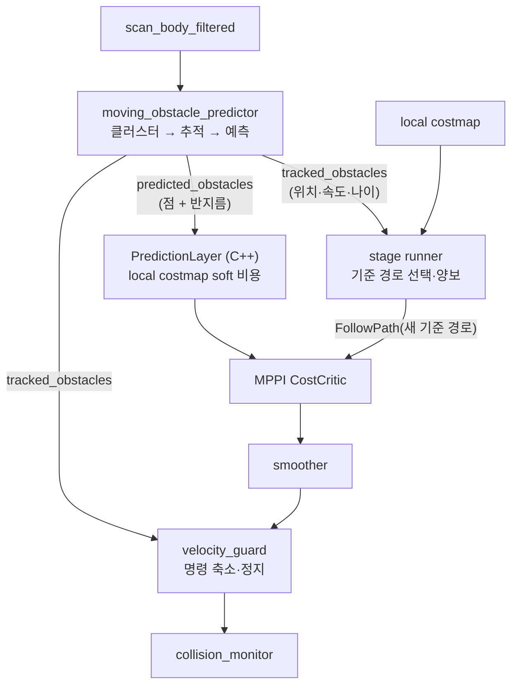
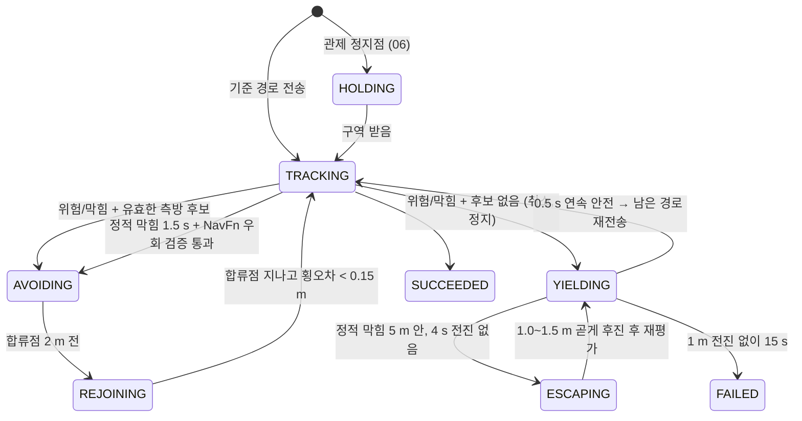

# 05. 사람 회피 · 정적 장애물 · 책상 도킹

04 문서의 Nav2 스택 위에 얹은 병원 전용 로직이다. **사람 정답 위치(시뮬레이터 포즈)는 쓰지 않는다** — 라이다 스캔만으로 추적한다 (`src/nova_carter/nav_to_goal/nav_to_goal/obstacle_tracking.py:1`).
경로 아래 `nav_to_goal/` 는 `src/nova_carter/nav_to_goal/nav_to_goal/` 이다.



사람 대응은 **네 겹**이다.

| 층 | 무엇을 | 언제 | 문서 |
|---|---|---|---|
| ① 예측 비용 | 사람의 1.8 s 미래 위치를 soft 비용으로 → MPPI 가 미리 비켜 감 | MPPI 구간 | 5.2 |
| ② 기준 경로 선택 | 3 s 롤아웃으로 간격을 재서 옆으로 비켜 가는 S자 경로를 MPPI 에 넘기거나 양보 | MPPI 구간 | 5.3 |
| ③ 출력 가드 | 실제 명령을 1.5 s 이상 롤아웃해 필요한 만큼만 줄이거나 정지 | 항상 | 5.5 |
| ④ Collision Monitor | 전방 감속 영역·footprint 충돌 시간 | 항상 | 04 문서 4.7 |

## 5.1 사람 추적 — 스캔 클러스터 + 최근접 연관 + 등속 예측

`nav_to_goal/moving_obstacle_predictor.py`, `nav_to_goal/obstacle_tracking.py`.

```text
스캔 빔 → odom 좌표 (스캔 시각의 TF) → 지도 벽·책상(+0.18 m) 위 점 제거
        → 연속 빔 클러스터 (간격 ≤ 0.3 m, 점 ≥ 3, 크기 ≤ 1.0 m) → 중심점
        → 트랙 연관 (예측 위치와 거리 < max(0.45, 2·dt), 가까운 쌍부터 탐욕 배정)
        → 속도 = 최근 0.45 s 변위 / 시간, 지수평활 0.65·new + 0.35·old  (> 2.2 m/s 면 0)
```

| 단계 | 설정 | 이유 (프로젝트 근거) | 근거 |
|---|---|---|---|
| 지도 구조물 제외 | 점유 셀 + 0.18 m 팽창 마스크 위 빔은 추적에서 뺀다. **제동에서는 빼지 않는다** | 벽·책상이 트랙이 되지 않게 | `static_scan_mask.py:1-22`, `moving_obstacle_predictor.py:48-91` |
| 클러스터 | 간격 0.3 m, 점 ≥ 3, 대각 ≤ 1.0 m, 360° 끝과 처음 이음 | — | `obstacle_tracking.py:142-164` |
| 연관 게이트 | `max(0.45, 2.0·dt)` m | — | `obstacle_tracking.py:49-63` |
| 속도 | 0.45 s 창, 지수평활 | 스캔 윤곽 떨림을 줄이면서 새 횡단을 몇 스캔 안에 잡는다 | `obstacle_tracking.py:65-77` |
| 사람 판정 | 3회 이상 관측 + 0.25 m/s 이상 움직인 적이 있음 | — | `obstacle_tracking.py:81-82` |
| **멈춘 물체 → 정적** | 0.2 m/s 미만으로 **8 s** 서 있으면 사람 트랙에서 빠진다(costmap·정적 우회가 맡음). 다시 0.25 m/s 로 움직이면 즉시 사람 | 차선 옆 콘이 영원히 "사람"이라 15 s 양보 예산을 다 쓰고 실패(2026-09-25), 차선 정면에 멈춘 보행자도 같음(2026-09-26) | `obstacle_tracking.py:6-18, 101-104` |
| 서 있는 사람 | 움직인 적 없는 물체도 5회 관측 + 지도 구조물에서 0.45 m 밖이면 처음 8 s 동안은 사람으로 본다 | 차선 옆에 서 있던 사람이 걸기 시작할 때까지 안 보여, 그땐 이미 지나친 뒤였다 | `obstacle_tracking.py:106-124`, `moving_obstacle_predictor.py:51-53, 101-105` |
| 트랙 수명 | 1.2 s 안 보이면 삭제 | Isaac GUI 라이다가 0.1~1.2 s 간격 | `obstacle_tracking.py:38`, `hospital_avoidance.py:31-32` |

출력 두 개 (`moving_obstacle_predictor.py:41-45, 94-112`):

- `hospital/predicted_obstacles` — 움직이는 트랙마다 **0.2 s 간격 1.8 s 앞까지**의 점, 반지름 `0.4 + min(0.2, 0.1·t)` m (시간이 갈수록 불확실성 증가) → C++ 레이어 (`obstacle_tracking.py:126-139`).
- `hospital/tracked_obstacles` — 현재 위치·속도·ID·관측 나이 → 감독 루프와 가드.

일반 근거: 보행자 예측에서 **등속 모델(Constant Velocity Model)** 은 단순하지만 강한 기준선으로 보고됐다 [S1].

## 5.2 예측 costmap 레이어 — `PredictionLayer` (C++)

`src/nova_carter/hospital_dynamic_layer/src/prediction_layer.cpp`.


- 예측점마다 반경 `r + 1.2 m` 안의 셀에 `cost = 240 · exp(−2 · max(0, d − r))` 를 **기존 값과 max** 로 쓴다 (`prediction_layer.cpp:73-100`).
- **240 < 치명(253)** — soft 비용이다. 프로젝트 근거: "미래 점유를 hard 로 두면 t = 0 에 로봇이 둘러싸여 MPPI 샘플이 전부 무효가 되고, 다가오는 사람 앞에 그대로 선다. 현재 스캔 장애물은 앞 레이어에서 치명으로 남는다" (`prediction_layer.cpp:79-82`).
- 메시지가 1.2 s 보다 오래되면 쓰지 않는다 (`params.yaml:414`, `prediction_layer.cpp:69-70`). 매 갱신 창 전체를 무효화해 이전 봉투를 지운다 (`prediction_layer.cpp:49-59`).
- 일반 근거: Nav2 costmap 은 플러그인 레이어를 차례로 합성하는 구조라 사용자 레이어를 끼워 넣을 수 있다 [S2].

## 5.3 구간 감독 루프 — `follow_stage` (0.1 s 주기)

`nav_to_goal/hospital_stage_runner.py:55-458`. 측방 회피·양보·우회·탈출은 **MPPI 복도 구간에서만** 켜진다 (`:71, 273-274, 311`).



### 위험 판정 — 롤아웃 간격 `path_clearance`

남은 기준 경로를 **순수 추종(pure pursuit)형 모델**로 3 s 동안 굴리고, 매 0.1 s 마다 로봇 **비대칭 직사각형**과 사람 원(등속 외삽, 반지름이 `0.1 m/s × (나이 + t)` 로 커짐) 사이 **부호 있는 거리**의 최솟값을 구한다 (`hospital_avoidance.py:56-74, 369-400`).

- 조향: 경로 16점(0.8 m) 앞 목표로 `ω = 2·v·sin α / L`, ±0.9 rad/s. 처음 0.2 s 는 현재 속도 유지(반응 시간), 이후 가감속 0.5/0.6 m/s² 램프 (`hospital_avoidance.py:382-398`).
- `위험 = 간격 < 1.0 m` (이미 우회 중이면 0.4 m) (`hospital_stage_runner.py:273-276`).
- 예외: 이미 간격 안에 들어와 있어도 경로가 **멀어지는 방향**이면 양보하지 않는다 — 서로 기다리는 교착 방지 (`hospital_stage_runner.py:277-281`, `hospital_avoidance.py:165-173`).
- 일반 근거: 순수 추종의 곡률 `2 sin α / L` [S3].
- 이것은 기준 경로 선택용 근사다. MPPI 내부 궤적이 아니며, 실제 명령은 출력 가드가 다시 검사한다 (`hospital_avoidance.py:369-374`).

### 측방 오프셋 후보 — 5차 다항식 S자 경로


차선 좌표계 `(s: 진행, d: 횡)` 에서 후보를 만든다 (`hospital_avoidance.py:176-196, 322-345`).

| 항목 | 값 | 이유 (프로젝트 근거) |
|---|---|---|
| 횡 오프셋 | 1.5 / 1.8 / 2.45 m, 좌우 | 2.45 m 는 차선 위 2.8 m 폭 장애물을 비킨다 |
| 옆으로 빠지는 길이 | 3 / 4 / 5 m | — |
| 옆에서 유지 | ≥ 2.5 m, 장애물 뒤 `뒤 차체 1.38 + (사람이면 1.0 + 0.5, 정적이면 0.5)` 까지 연장 | 사람 간격을 정적 장애물에도 쓰면 구간 끝 7 m 안의 장애물에 후보가 하나도 안 나왔다(2026-09-26) (`:279-288`) |
| 복귀 길이 | 4 m (오프셋 > 2 m 면 5 m) | 최소 회전반경 1.2 m |

- 각 전이는 **5차 다항식** `d(t) = d0 + m·t + a3 t³ + a4 t⁴ + a5 t⁵` — 시작 기울기 연속, 끝 곡률 0 (`hospital_avoidance.py:265-276`).
- 일반 근거: 차선 좌표(Frenet)에서 5차 다항식으로 횡 이동을 만드는 것은 저크를 최소화하는 표준 방법이다 [S4].
- **유효성 검사** `forward_path_valid`: 진행 s 단조 증가(뒤로 안 감), 차선과 각도 ≤ 65°, **차체 모서리**가 차선 반폭 3.3 m 안, 점 간격 ≤ 0.12 m, 접선–yaw ≤ 0.18 rad, 곡률 ≤ 1/1.2 m, 끝이 차선 위 (`hospital_avoidance.py:238-262`).
- **선택** `choose_candidate`: 0.6 m/s 와 **0.24 m/s(Collision Monitor 40% 감속)** 두 속도로 간격을 재서 0.4 m 미만은 버리고, `20·max(0, 1.0 − 간격) + 2·(쪽 바꿈) + 0.02·길이` 가 가장 작은 것 중 **costmap(정적 지도 + 로컬) 전체 footprint 검사**를 통과한 첫 후보 (`hospital_avoidance.py:403-420`, `hospital_safety.py:129-151`).
- 보내기 직전 새 관측으로 한 번 더 검사하고, **같은 컨트롤러로** 새 FollowPath 목표를 보내 멈춤 없이 기준 경로만 바꾼다 (`hospital_stage_runner.py:113-124, 331-345`).
- 합류 뒤 차선을 **앞쪽으로만** 잇는다 — 이전 인덱스로 돌아가지 않는다 (`hospital_stage_runner.py:327-330`).
- 복귀 허가 `rejoin_clear`: 실제 복귀 경로를 굴려 간격이 1.0 m(또는 지금 간격) 밑으로 줄지 않을 때만. 프로젝트 근거: 복도 폭 전체를 막는 구역 검사는 반대편이나 이미 지나친 사람 때문에 두 번째 우회를 만들었다(2026-09-26 rosbag) (`hospital_avoidance.py:348-366`).

## 5.4 정적 막힘 — 판별 · NavFn 우회 · 후진 탈출

1. **판별** (`AheadBlockageMonitor`): 로컬 raw costmap 에서 남은 기준 경로 **0.8~5.0 m 앞**의 첫 치명/내접(≥ 253, unknown 제외) 점을 찾는다. 그 점이 사람 예측점과 `0.8 m + r` 안이면 동적 (`hospital_mission.py:38-47, 112-230`).
   막힘 근처 트랙이 모두 0.2 m/s 미만으로 1.5 s 서 있으면 정적으로 본다 (`hospital_stage_runner.py:285-305`).
2. **측방 후보 먼저**: 막힘이 보이면 바로 5.3 의 후보를 시도한다 (`hospital_stage_runner.py:306-309`).
3. **NavFn 우회**: 후보가 없고 정적 막힘이 **같은 자리(±0.5 m)에서 1.5 s** 지속되면, 현재 위치 → 차선 `s + 10 m` 로 NavFn + SimpleSmoother 를 1회 요청. 같은 진행 위치 2 m 안에서는 다시 부르지 않는다 (`hospital_stage_runner.py:346-395`, `hospital_mission.py:391-436`).
   - 받은 경로는 5 cm 로 조밀화하고(`densify_planner_path`), 끝이 합류점에서 0.25 m 안이어야 하며, **기하(footprint·곡률) → costmap → 사람 간격** 세 검사를 모두 통과해야 보낸다 (`hospital_stage_runner.py:362-393`).
   - 이유 (프로젝트 근거): NavFn 격자 경로는 급한 모서리가 있고 원형 근사라, 긴 차체가 못 따라가는 경로를 걸러야 한다 (`hospital_avoidance.py:199-204`, `hospital_mission.py:423-425`).
4. **후진 탈출**: 양보 중 정적 막힘이 5 m 안이고 4 s 동안 전진이 없으면, **방금 지나온 차선을 따라 곧게** 1.5 m(안 되면 1.0 m) 후진 후 다시 평가. 구간당 2회 (`hospital_stage_runner.py:24-31, 406-420`, `hospital_avoidance.py:298-319`).
   - 프로젝트 근거: 콘 바로 앞에서 서면 S자 후보도 NavFn 우회도 안 나와 실패 → 같은 자리 재개 → 실패를 되풀이했다(2026-09-26 upper_reserve x=−7.1).
   - 조건: 차선과 20° 이내, 차선 띠 안, 사람 간격 1.0 m, costmap 통과. 꼬리 1.38 m 는 라이다 사각이라 **지나온 길만** 허용 (`hospital_avoidance.py:301-305`).
5. **양보 예산**: 연속 양보 시간이 아니라 **"1 m 전진 없이 지난 시간"** 15 s. 프로젝트 근거: 양보가 0.5 s 만 풀려도 예산을 0 으로 돌리던 탓에 콘 앞에서 5분 넘게 양보 ↔ 재개를 되풀이했다(2026-09-29) (`hospital_stage_runner.py:32-35, 444-448`). 초과하면 미션이 실패하고 에이전트가 이어 가기로 재시도한다 (01 문서).

## 5.5 출력 가드 — `hospital_velocity_guard` (20 Hz)

`nav_to_goal/hospital_velocity_guard.py`, `nav_to_goal/hospital_avoidance.py:82-162`.

```text
입력 명령 (v, ω) ← cmd_vel_smoothed (0.5 s 안에 온 것만)
for scale in (1.0, 0.75, 0.5, 0.0):
    간격 = 롤아웃(현재 속도 → 0.2 s 반응 → 램프 → scale·명령), horizon = max(1.5 s, v/0.6 + 0.2)
    scale 1.0 이면 간격 ≥ 0.4 m,  그 외에는 ≥ 1.0 m 이어야 채택
    scale 1.0 인데 간격 < 1.0 m 이고 v > 0.3 → v, ω 를 같은 비율로 0.3 m/s 까지 (PASSING_SLOW, 곡률 유지)
모두 실패 → 이미 0.4 m 안이면 "거리를 줄이지 않는" 0.3 m/s 명령만 허용 (ESCAPING), 아니면 정지
```

- **방향을 새로 만들지 않는다** — 줄이거나 멈추기만 한다. 회피 방향은 미션이 고른다 (`hospital_velocity_guard.py:1-5`, `hospital_avoidance.py:105-110`).
- 정지도 **유한 감속**으로 시뮬레이션한다 (순간 정지 아님) (`hospital_avoidance.py:82-102`).
- ESCAPING 의 이유 (프로젝트 근거): 모든 롤아웃이 이미 작은 현재 간격을 포함하므로 사람이 로봇 옆에 서 버리면 서로 영원히 기다린다(2026-09-25, 횡단 보행자가 0.4 m 옆·뒤에 2분). 거리를 줄이지 않는 느린 명령만 허용 (`hospital_avoidance.py:132-139`).
- 관측이 오래됐거나 명령이 0.5 s 넘게 끊기면 0 을 낸다 (`hospital_velocity_guard.py:37-55`).
- 가드가 없으면 Collision Monitor 입력이 끊겨 로봇이 움직이지 않는다 — 체인이 직렬이다 (`hospital_navigation.launch.py:138-139`).

## 5.6 책상 옆 도킹 — `TableDocking`

`nav_to_goal/hospital_docking.py`. 책상 긴 변을 **로봇 오른쪽**에 두고 옆 간격 **15 cm** 로 직진해 선다.


| 기하 | 값 | 근거 |
|---|---|---|
| 도킹 자세 | 모서리 중점에서 옆으로 `0.5 + 0.15`, 앞으로 0.45 m (base_link 가 차체 중심보다 0.45 m 앞) | `hospital_docking.py:21-47` |
| 정류장 | 도킹 자세 2.5 m 전 | `hospital_docking.py:25, 47` |
| 재접근 후진점 | 도킹 자세 4.0 m 전 (정류장 1.5 m 뒤) | `hospital_docking.py:33-34` |

### 책상 모서리 측정 — RANSAC 직선 맞춤

```text
3D 라이다 점 → base_link (스캔 시각 → 현재, odom 경유 움직임 보정)
→ 로봇 오른쪽 (y −1.2 ~ −0.3 m, x −1.6 ~ 4 m), 높이 0.15~0.85 m, 지도상 책상 모서리 ±1 m
→ 앞 윤곽: 2.5 cm 구간마다 로봇에 가장 가까운 점
→ 표본 20개에서 0.5 m 이상 떨어진 쌍으로 직선 가설 (기울기 ≤ 0.25)
→ 오차 < 2.5 cm 인 점이 가장 많은 가설 (≥ 6점, 폭 ≥ 0.5 m)
→ 그 점들로 최소제곱 재적합 → y = m·x + b, 보이는 먼 끝 x
```
(`hospital_docking.py:103-146, 187-232`)

- 움직임 보정 이유: 조향 중 cm 단위 간격을 맞추려면 스캔 시점의 자세로 되돌려야 한다 (`hospital_docking.py:201-206`).
- 지도는 **거칠게만** 거른다. 프로젝트 근거: Isaac 에서 AMCL 이 책상 옆 0.37 m 밀렸다 (`hospital_docking.py:217-219`).
- 일반 근거: RANSAC 은 최소 표본으로 모델 가설을 세우고 합의(inlier) 수로 고르는 강건 추정법이다 [S5]. 여기서는 무작위 대신 고르게 뽑은 20개 표본의 모든 쌍을 쓴다(결정적).

### 도킹 절차

| 단계 | 동작 | 이유 (프로젝트 근거) | 근거 |
|---|---|---|---|
| 1. 정류장 정렬 | 정류장 0.55 m 안에서만 제자리 회전해 모서리와 평행(≤ 1°). 명령 0.15~0.3 rad/s | 책상 옆에서 돌면 뒤 1.38 m 가 책상으로 돈다. DWB 의 0.03 rad/s 샘플은 감속 영역에서 정지 마찰을 못 넘는다 | `hospital_docking.py:444-479` |
| 2. 간격 사전 검사 | 정류장에서 잰 간격이 15 ± 6 cm 밖이면 직진하지 않는다 (`misaligned`) | AMCL 이 옆으로 0.15 m 틀린 채 출발 → 모서리 간격 −0.19 m 로 중단(2026-09-26). 직진 중에는 조향으로만 고칠 수 있다 | `hospital_docking.py:29-32, 303-308` |
| 3. 직진 제어 | `v = min(0.18, max(0.025, 0.65·abs(dx)))`, `ω = 1.8·heading − 2.0·gap_error`, 0.008 넘으면 0.15~0.25 로 올림 | 데드밴드를 넘기는 최소 회전 | `hospital_docking.py:149-159, 384-386` |
| 4. 모서리 간격 감시 | 차체 **앞뒤 두 모서리**의 책상까지 거리. 2.5 cm 미만이면 전진 멈추고 평행 쪽으로 회전, 0 이하가 0.5 s 지속되면 실패 | 중심선이 아니라 차체 모서리 | `hospital_docking.py:348-368` |
| 5. 튀는 측정 거부 | 0.5 s 안에 모서리 각도가 `3° + 0.3 rad/s·dt` 넘게 바뀌면 버림 | 한 번은 0.8 m 남기고 12° 튀었다(모서리 간격 −0.14) | `hospital_docking.py:291-325` |
| 6. 완료 | `abs(dx) ≤ 2 cm`, 각도 ≤ 1°, 간격 15 ± 2 cm, 정지 0.5 s | — | `hospital_docking.py:26-28, 373-381` |
| 7. AMCL 재설정 | 모서리 직선에서 역산한 **절대 자세**를 `/initialpose` 로(공분산 2 cm, 1°) | AMCL 이 책상 옆에서 0.39 m / 8° 밀려 costmap 이 차체를 책상 안에 뒀다 | `hospital_docking.py:76-88, 397-442` |

- 앞뒤 오차 `dx` 는 지도 대신 **보이는 책상 먼 끝**에서 잰다 (`hospital_docking.py:343-347`).
- **실패 복구** `dock_with_retries`: 라이다로 AMCL 재설정 → 도킹 직선을 따라 **회전 없이** 4.0 m 전까지 후진 → 도착 경로 마지막 직선을 DWB 로 다시 달려 재시도, 최대 2회 (`hospital_mission.py:622-667`, `hospital_docking.py:246-277`).
  프로젝트 근거: 옆 간격은 직진 중 조향으로 고치면 뒤 차체가 책상으로 돈다 — 물러나서 다시 접근해야 고쳐진다. 물러난 뒤(4 m 전)에는 모서리 끝이 검출 범위 밖이라 재설정하지 않는다 (`hospital_mission.py:627-628, 634-636`).
- 명령은 `cmd_vel_nav` 로 내보내 **smoother → 가드 → Collision Monitor 를 그대로 거친다** (`hospital_docking.py:1, 171`).
- **Nav2 `opennav_docking` 대신 자체 도킹을 쓴 이유**: 프로젝트 기록에 없다 — **근거 미확인**. (파라미터 파일에 `docking_server` 설정은 남아 있으나 미션은 호출하지 않는다.)

## 5.7 시뮬레이션 보행자 (Isaac)

| 항목 | 값 | 근거 |
|---|---|---|
| 확장 | `omni.anim.people` + navmesh | `isaacpjt/system/scene.py:23-33, 64-70` |
| 행동 | 명령 파일의 경로를 무한 반복 (`number_of_loop inf`) | `scene.py:67-68` |
| 사람끼리 회피 | 끔 (`dynamic_avoidance_enabled False`) — 이유 **근거 미확인** | `scene.py:70` |
| 보행 속도 | 애니메이션 `Walk` 변수를 0.75 이하로 제한, 끼면 빼내기(`unstick_goto`) | `scene.py:72-85`, `isaacpjt/system/run_fleet_sim.py:34, 76` |
| 인원 | 3명 (`--no-people` 로 끔) | `run_fleet_sim.py:1, 29`, `scene.py:24` |

## 한계

- 방·문 안(DWB 구간)에는 측방 후보가 없다. 사람이 오면 감속·정지만 한다 (`hospital_stage_runner.py:268-272`).
- 롤아웃은 기구학 근사다 — 동역학 모델이나 안전 인증이 아니다 (`hospital_avoidance.py:3`).
- MPPI 내부 가속 한계(30/20)와 출력단(0.5/−0.6/1.5)의 불일치가 남아 있다 (`params.yaml:304-308`).

## 출처

- [S1] C. Schöller, V. Aravantinos, F. Lay, A. Knoll, "What the Constant Velocity Model Can Teach Us About Pedestrian Motion Prediction," *IEEE Robotics and Automation Letters* 5(2), 2020.
- [S2] Nav2 — Writing a New Costmap2D Plugin. <https://github.com/ros-navigation/docs.nav2.org/blob/rolling/docs/tutorials/plugin_tutorials/writing_new_costmap2d_plugin/writing_new_costmap2d_plugin.md>
- [S3] R. C. Coulter, "Implementation of the Pure Pursuit Path Tracking Algorithm," CMU-RI-TR-92-01, 1992.
- [S4] M. Werling, J. Ziegler, S. Kammel, S. Thrun, "Optimal Trajectory Generation for Dynamic Street Scenarios in a Frenét Frame," ICRA 2010.
- [S5] M. A. Fischler, R. C. Bolles, "Random Sample Consensus: A Paradigm for Model Fitting with Applications to Image Analysis and Automated Cartography," *Communications of the ACM* 24(6), 1981.
