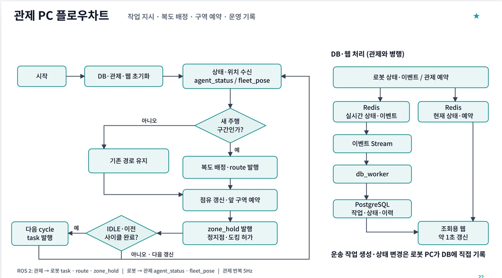
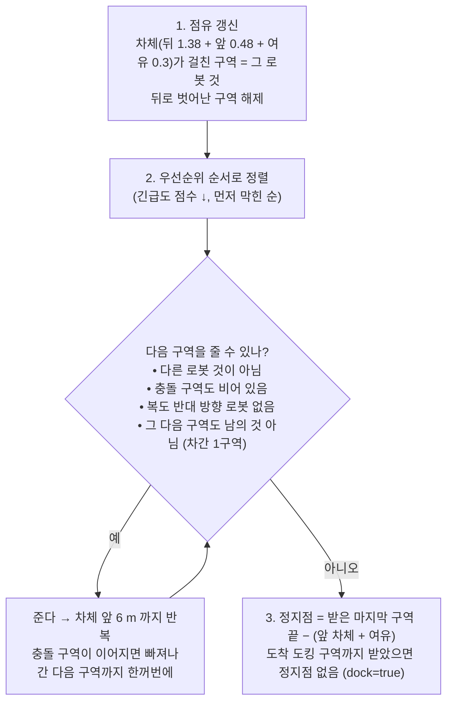

# 06. 다중 로봇 관제 — 차선 그래프 · 구역 예약 · 우선순위

로봇 3대가 같은 복도와 문을 쓴다. 로봇끼리는 서로를 센서로 거의 보지 못한다(각자 다른 Isaac 로봇 인스턴스·네임스페이스).
관제(`fleet_manager`, 5 Hz)가 **차선을 구역(zone)으로 쪼개 앞 구역만 예약**해 주고, 로봇은 받은 구역 끝을 넘지 않는다.
코드 주석은 이를 **철도 폐색(block signal) 방식**이라 부른다 (`src/hospital_system/hospital_system/lane_graph.py:1`).

코드: `src/hospital_system/hospital_system/{fleet_manager,lane_graph,priority,stations}.py`, 주행 쪽 `src/nova_carter/nav_to_goal/nav_to_goal/hospital_zone_hold.py`.



## 6.1 토픽

| 방향 | 토픽 (`/robotN/…`, String JSON) | 내용 | QoS |
|---|---|---|---|
| 로봇 → 관제 | `agent_status` | 단계, 구간 키 `leg`, 실은 트레이 `cargo`, 끝낸 작업 번호 | 기본 |
| 로봇 → 관제 | `fleet_pose` | TF map→base_link, 5 Hz | 기본 |
| 관제 → 로봇 | `task` | `{"seq": n, "cmd": "cycle"}` | latched |
| 관제 → 로봇 | `route` | `{"leg", "track", "version"}` — 이 구간에 쓸 복도 | latched |
| 관제 → 미션 | `zone_hold` | `{"leg": "<leg>#<version>", "stop": [x,y,yaw] 또는 null, "dock": bool}` | latched |

latched = RELIABLE + TRANSIENT_LOCAL — 주행 하위 프로세스가 새로 떠도 마지막 허가를 바로 받는다 (`fleet_manager.py:1-16, 61-69`, `hospital_zone_hold.py:3-7`).

## 6.2 차선 그래프

- **주행과 같은 기하를 import** 한다(`nav_to_goal.hospital_lanes`). 관제용 지도를 따로 두지 않는다 (`lane_graph.py:98-114`).
- 노드: 책상 도킹 자세·정류장, 문 밖 분기점 `east_junction`(10, 12.5) / `west_junction`(−34.8, 12.5).
- 간선: 방 6개(한 방향) + 복도 4개 × 방향 2 = 8개 (`lane_graph.py:103-114`).
- 원소(line/arc)를 0.25 m 로 샘플링해 누적 거리 `s` 를 만든다 (`lane_graph.py:38-63`).

### 구역 분할

| 규칙 | 값 | 이유 (프로젝트 근거) | 근거 |
|---|---|---|---|
| 구역 길이 | 간선을 **≤ 3.0 m** 로 고르게 | footprint 1.86 m + 제동 | `lane_graph.py:28, 134-144` |
| 물리 구역 | 양방향 복도는 방향별 간선 둘이 **같은 물리 구역**(`upper:k`)을 쓴다. 예약은 물리 구역 단위 | 같은 길 | `lane_graph.py:139-149` |
| **충돌 구역** | 다른 차선의 구역 중심선이 **1.6 m** 안이면 동시 점유 금지 (같은 복도 안, 경로상 6 m 안 앞뒤 구역은 제외) | 차폭 1.0 + 0.6. 실제로 걸리는 곳은 두 문 — 방 출입 두 방향이 같은 줄(y = 12.5)을 쓰고 분기점에서 복도 4개가 갈라진다 | `lane_graph.py:13-14, 29-30, 190-206` |

## 6.3 예약 — `Reservations.tick` (5 Hz)



근거: `lane_graph.py:306-429`.

| 규칙 | 이유 (프로젝트 근거) | 근거 |
|---|---|---|
| **위치가 먼저** — 차체가 걸친 구역은 무조건 그 로봇 것 | 제동하며 정지점을 넘어가도 그 구역이 점유로 잡혀 다른 로봇을 막고, 더 주지 않으니 그 자리에 선다. 남의 구역에 들어가면 `intrusions` 경고 | `lane_graph.py:377-393` |
| 차간 1구역 | 앞 로봇과 최소 한 구역 띄운다. 도착 도킹 구역의 "다음"은 나가는 간선 첫 구역(도킹 자세의 앞 차체가 튀어나온다) | `lane_graph.py:162-168, 409-413` |
| 충돌 구역은 묶어서 | **문 안에서 서지 않는다** | `lane_graph.py:20, 405-407` |
| 이미 준 구역은 뺏지 않는다 | 교착 방지 규칙이 우선순위보다 앞선다 | `lane_graph.py:22` |
| 같은 점수면 먼저 막힌 로봇부터 | 공정성 | `lane_graph.py:395-397, 420-423` |

- 일반 근거: **Zone control** 은 AGV 교통 제어에서 가장 널리 쓰이는 전략으로, 경로를 구역으로 나누고 한 구역에 한 대만 들어가게 해 차량 간 충돌을 막는다. 같은 논문은 구역 모델 위에 교착 회피를 더한 이산 사건 교통 제어를 제안한다 [S1].

### 위치 추적

- `fleet_pose` 를 지금 경로 구역열에 투영해 `s` 를 구한다. 직전 `s` 근처(−1.5 ~ +6 m)에서만, 진행 방향 90° 이내 점만 찾는다 — 동쪽 문처럼 두 차선이 겹치는 곳에서 반대 차선으로 튀지 않게 (`lane_graph.py:263-282`).
- 횡오차 3.0 m 까지 허용(사람을 피해 2.8 m 비켜 간다), `s = max(s_prev − 0.5, s)` 로 뒤로 튀지 않게 (`fleet_manager.py:151-161`).
- 위치가 3 s 끊기면 **경고만** 한다 — 어디 있는지 모르니 예약을 풀지 않는다 (`fleet_manager.py:33, 181-185`).

## 6.4 정지점 준수 — 주행 쪽 `ZoneHold`

- 미션은 **자기 구간(`leg#version`) 메시지만** 쓴다. 이전 구간 끝의 "다 받음(stop null)"을 새 구간이 쓰면 허가 없이 출발한다 (`hospital_zone_hold.py:3-7, 31-37`).
- 기준 경로에서 정지점을 찾아(0.35 m 이내, 방향 일치, 2 m 뒤까지 되짚기) 남은 경로 거리가 **0.8 m** 이하면 선다 — 0.6 m/s 제동 0.3 m + 반응 (`hospital_zone_hold.py:18-20, 44-70`).
- 관제 모드에서는 **첫 메시지 전에는 출발하지 않는다**. `dock: true` 여야 정류장에서 도킹을 시작한다 (`hospital_zone_hold.py:9, 39-48`, `hospital_mission.py:608-612`).
- 이 대기는 사람 양보 15 s 예산에 넣지 않는다 — 앞 로봇이 하역하는 동안 1분 넘게 설 수 있다 (`hospital_zone_hold.py:10`, `hospital_stage_runner.py:258-266`).

## 6.5 우선순위 — 긴급도 점수

```text
score = (긴급도 3 개수, 2 개수, 1 개수)   사전식 비교, 클수록 먼저
[3,1,1] > [2,2,2]   (높은 것이 있다)
[3,3,1] > [3,2,2]   (높은 것이 많다)
빈 로봇 = (0,0,0)   → 실은 로봇이 문·합류 구역을 먼저 지난다
```
(`src/hospital_system/hospital_system/priority.py:1-17`)

- 관제는 `agent_status.cargo` 에서 **실린 칸만** 센다 (`priority.py:15-17`, `fleet_manager.py:129-131`).
- 우선순위가 반영되는 곳은 ① 예약 확장 순서 ② 복도 배정(아래) 두 곳이다. 이미 준 구역은 뺏지 않는다 (`docs/FLEET_CONTROL_ALGORITHM.md` 10절 — 코드와 일치 확인).

## 6.6 복도 배정과 양보 — `choose_route` / `assign_route`

구간이 바뀌면(`leg` = `"<cycle>:<route_id>"`) 관제가 복도 4개 중 하나를 고른다 (`fleet_manager.py:133-149`).

```text
options = 가능한 모든 경로 (노드 재방문 없음), 짧은 순          ← 그래프가 작아 전수 열거
1차: for 경로 in options:
        복도를 아무도 안 잡았으면 → 선택
        잡은 로봇이 모두 (반대 방향 ∧ 긴급도 낮음 ∧ 아직 그 복도에 안 들어감)
            → 선택, 그 로봇들에게 다른 복도 재배정 (점수 (-1,) 로 — 또 뺏지 않게)
2차: 같은 방향 로봇만 있는 복도 → 뒤따르기
그래도 없으면 가장 짧은 길 입구에서 대기
```
(`lane_graph.py:224-237, 432-469`)

- **방향 잠금**: 같은 복도에 반대 방향 로봇이 동시에 있을 수 없다 — 복도 양방향 운용의 정면 교착을 막는다 (`lane_graph.py:8-9, 317-327, 370-371`).
- 빈 복도를 먼저 주는 이유 (프로젝트 근거): 앞차가 서면(사람 양보, 도킹 대기) 뒤차도 줄줄이 서니 조금 멀어도 빈 복도가 낫다 (`lane_graph.py:436-437`).
- 길이 순서: upper < upper_reserve(+4 m) < lower(+20 m) < lower_reserve(+24 m) (`docs/FLEET_CONTROL_ALGORITHM.md` 5절).
- 양보받은 로봇은 `route.version` 이 오르고, 주행 중이면 멈췄다가 **현재 위치에서** 새 복도로 이어 간다 (01 문서 1.3). 이미 받은 구역은 앞부분(지난 구간 + 출발 방)이 같아 유지된다 — `reroute` 의 assert 로 보장 (`lane_graph.py:336-344`).
- 구간이 바뀔 때 이전 경로에서 아직 차체가 걸친 구역(도킹 구역 등)은 새 경로 앞에 붙여 계속 잡는다 (`lane_graph.py:346-358`).

## 6.7 배차

- 조건: `fleet=true` ∧ `stage == IDLE` ∧ 앞 작업을 끝냈음 → `task {seq, cmd:"cycle"}`. `cycles` 만큼(0 = 계속) (`fleet_manager.py:164-174`).
- 로봇은 채취실 도킹 상태로 IDLE 이 되므로 사이클 = 적재 → 운송 → 하역 → 복귀.

## 한계 (코드 기준)

- 책상 앞 대기 칸이 없다 — 앞 로봇이 도킹·하역하는 동안 뒤 로봇은 차선의 정지점에 선다.
- 정적 장애물로 간선 비용을 올려 우회하는 기능은 없다 — 경로 선택은 길이 + 복도 방향 잠금만 본다 (`lane_graph.py:432-454`).
- 위치가 끊긴 로봇의 예약은 계속 잡혀 있다 (`fleet_manager.py:181-185`).
- 교착이 없다는 **형식 증명은 없다**. 위 규칙들(방 한 방향, 복도 방향 잠금, 문 구간 일괄 예약, 차간 1구역)과 시험 기록에 기댄다.

## 출처

- [S1] Q. Li, A. Pogromsky, T. Adriaansen, J. T. Udding, "A Control of Collision and Deadlock Avoidance for Automated Guided Vehicles with a Fault-Tolerance Capability," *International Journal of Advanced Robotic Systems*, 2016. doi:10.5772/62685
