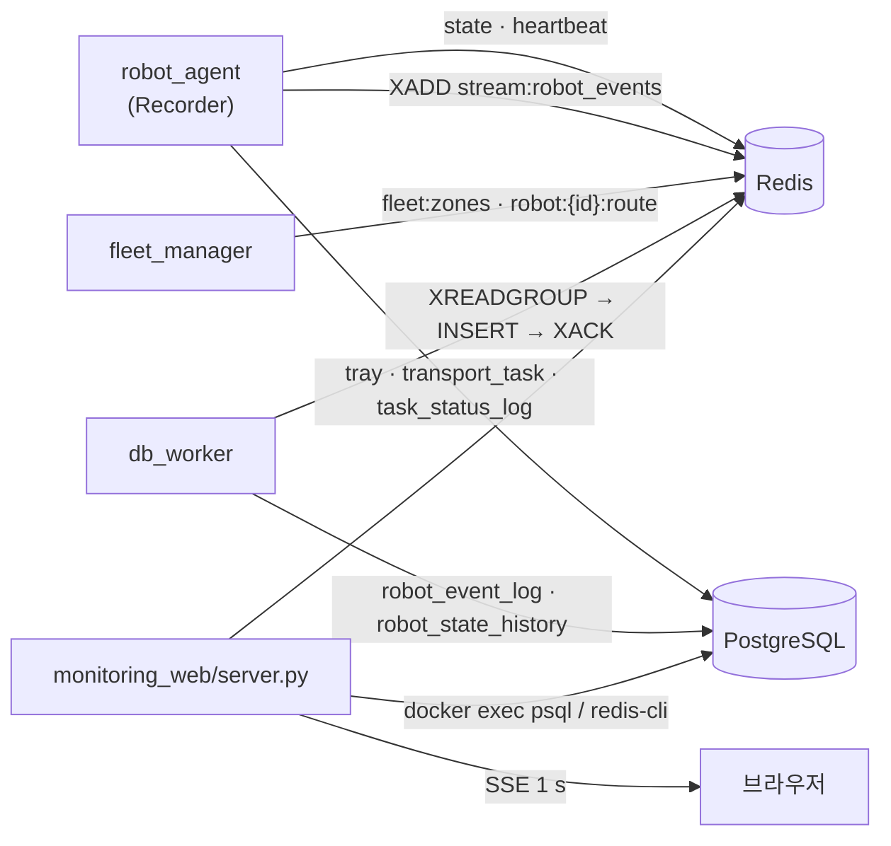

# 07. 기록 · 관제 웹

실시간 상태는 **Redis**, 작업·트레이·이력은 **PostgreSQL**. 두 DB 모두 관제 PC 의 Docker 컨테이너다.
코드: `src/hospital_system/hospital_system/{db,records,db_worker}.py`, `DB_container/hospital_amr_db_v5_schema.sql`, `monitoring_web/`, `scripts/replay_*`.



## 7.1 역할 분리

| 저장소 | 키 / 테이블 | 쓰는 곳 · 주기 | 근거 |
|---|---|---|---|
| Redis | `robot:{id}:state` (hash: 단계, x, y, θ, task_id) | 에이전트, 단계 변화 + 1 s 위치 | `records.py:3, 50-61`, `db.py:458-482` |
| Redis | `robot:{id}:heartbeat` (**TTL 3 s**) | 에이전트 1 s — 만료 = 통신 두절 | `db.py:60, 508-522` |
| Redis | `stream:robot_events` (최대 10만, 근사 트림) | 에이전트 이벤트(STAGE, TASK_CREATED, MISSION_RESUME, REROUTED, UNLOADED …) | `db.py:61-62, 551-558` |
| Redis | `fleet:zones` (hash 구역 → 로봇), `robot:{id}:route` (1 m 간격 점) | 관제, 바뀔 때만 파이프라인으로 교체 | `fleet_manager.py:221-256` |
| PostgreSQL | `robot_info`, `tray`, `transport_task`, `task_status_log` | 에이전트, 이벤트 시 | `records.py:6-8` |
| PostgreSQL | `robot_event_log`, `robot_state_history` | db_worker (스트림 적재, 5 s 위치 이력) | `db_worker.py:1-6` |

- 이렇게 나눈 설계 의도는 `db.py` 머리말의 "수행 로직 ↔ 함수" 표에 있다(짧은 주기 갱신·TTL = Redis, 이벤트·이력 = SQL) (`db.py:8-30`). 두 DB 제품을 고른 이유 자체는 기록에 없다 — **근거 미확인**.

## 7.2 작업 수명과 무결성

```text
적재 + 긴급도 판독 완료 → transport_task 생성 (트레이 1~3개, 칸 번호, 긴급도)
  IN_TRANSIT (departed_at) → ARRIVED (arrived_at) → COMPLETED | FAILED
  에이전트가 도중에 끝나면 CANCELLED, 재시작 시 열린 작업도 CANCELLED
```
(`robot_agent.py:374-401`, `records.py:35-38, 85-91`)

- **상태 변화마다 `task_status_log` 를 같은 트랜잭션에서** 남긴다 (`db.py:15-19, 250-290`).
- 스키마 제약 (`DB_container/hospital_amr_db_v5_schema.sql`):
  - `task_status` ENUM 8개 (`:33-42`), 긴급도 `priority BETWEEN 1 AND 3`(`:66`), 트레이 1~3개·칸 번호 1~3·개수 일치(`:95-98`), 배정 안 된 작업은 WAITING/CANCELLED 뿐(`:100`), 도착 ≥ 출발(`:102`).
  - `tray_ids` 는 배열이라 외래키를 걸 수 없어 **트리거**로 참조 무결성·칸 중복을 검사한다 (`:104-126`).
- 기록 실패는 경고만 남기고 로봇은 멈추지 않는다. 시작 때 연결 확인만 필수 (`records.py:10, 27-30, 42-47`).

## 7.3 이벤트 적재 — Redis Stream 컨슈머 그룹

```text
XGROUP CREATE stream:robot_events sql_worker 0 MKSTREAM   (이미 있으면 무시)
loop:
    XREADGROUP ... 0    → 이전에 읽고 ACK 못 한 항목 먼저 재처리
    XREADGROUP ... >    → 새 항목 (1 s 블록)
    INSERT robot_event_log (occurred_at = 스트림 ID 의 ms 타임스탬프)
    커밋 성공 후에만 XACK
```
(`db.py:561-599`, `db_worker.py:31-48`)

- 워커가 죽었다 살아나도 **빠짐없이** 옮긴다 (`db_worker.py:5`). DB 가 재시작되면 2 s 뒤 다시 연결한다 (`db_worker.py:45-48`).
- 일반 근거: 컨슈머 그룹은 전달한 메시지를 ACK 전까지 PEL(Pending Entries List)에 남겨 **최소 1회 전달**을 보장한다 [S1].

## 7.4 관제 웹 — `monitoring_web/server.py`

| 항목 | 방식 | 근거 |
|---|---|---|
| 서버 | **파이썬 표준 라이브러리만** (`ThreadingHTTPServer`). DB 드라이버 없이 컨테이너 안 `psql` / `redis-cli` 를 `docker exec` 로 호출 | `server.py:1-13, 179-230` |
| 갱신 | `/api/stream` — **Server-Sent Events**. 1 s 마다 조회해 **바뀌었을 때만**(또는 12 s 마다) `event: dashboard` 전송, DB 오류는 `event: db-error` | `server.py:265-291` |
| 지도 | Nav2 와 같은 `hospital_integration_human.yaml` — 원점·해상도를 YAML 에서 읽는다 | `server.py:32, 142-159` |
| 차선·구역 | ROS 를 source 했으면 `lane_graph` 를 import 해 **로봇이 따르는 같은 기하**를 그린다 | `server.py:10-11, 161-177` |

- 표준 라이브러리만 쓴 이유 (프로젝트 근거): "로컬 DB 드라이버나 패키지 설치가 필요 없다" (`server.py:4-6`).
- 일반 근거: SSE 는 서버 → 브라우저 한 방향 이벤트 스트림을 HTTP 한 연결로 보내는 웹 표준이다 [S2].

## 7.5 관제 화면 재생 — rosbag

- 로봇 PC rosbag(`agent_status`, `fleet_pose`, `arm/status`) + 관제 DB 덤프로 **관제 화면을 원래 시간 순서대로 다시 만든다** (화면 녹화용) (`scripts/replay_dashboard.sh:1-14`).
- 기록은 `robot_agent` 와 **같은 `Recorder` 함수·같은 순서**로 다시 하고(`scripts/replay_recorder.py:1-12`), 예약 구역은 실제 `fleet_manager` 가 같은 입력으로 다시 계산한다.
- 기존 DB·ROS 와 격리: 재생 DB 는 별도 컨테이너(5433/6380), `ROS_DOMAIN_ID=137` + localhost 전용 (`scripts/replay_dashboard.sh:10-12`).
- 한계: 화면 시각은 재생 시점 기준, 예약 구역은 재계산이라 수백 ms 어긋날 수 있다 (`scripts/replay_dashboard.sh:13`).

## 출처

- [S1] Redis 문서 — XREADGROUP / 컨슈머 그룹, Pending Entries List. <https://redis.io/commands/XREADGROUP>
- [S2] WHATWG HTML Living Standard — Server-sent events. <https://html.spec.whatwg.org/multipage/server-sent-events.html>
