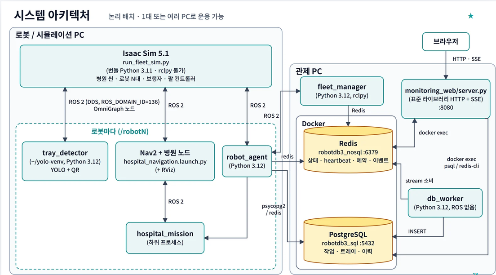
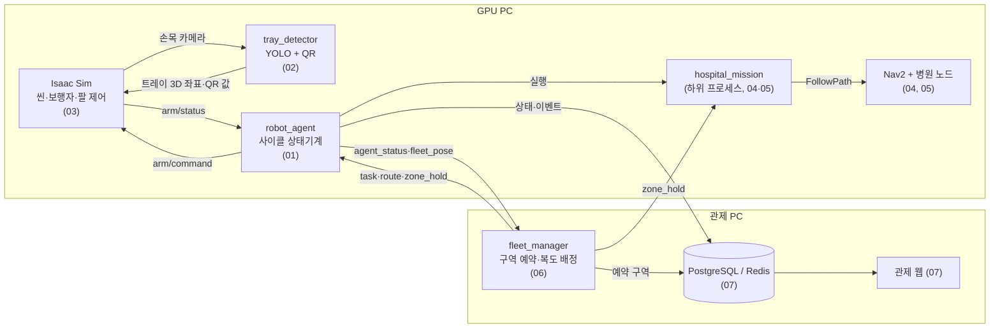
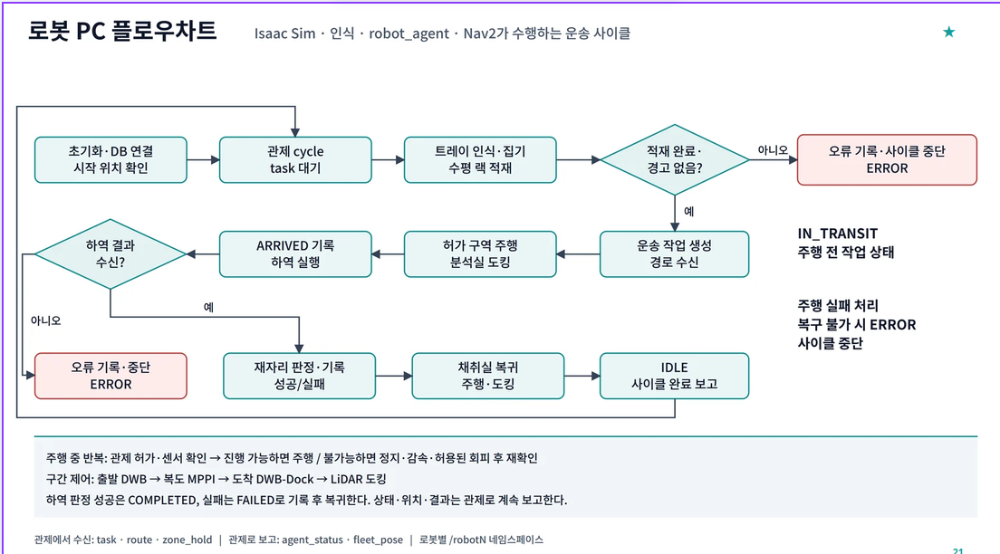

# 병원 검체 운송 미션 — 알고리즘 정리

발표 자료용 알고리즘 정리. **현재 코드(`main` 기준, 2026-09-30)를 근거로** 썼고, 기존 문서는 참고만 했다.

- 모든 설명에 `파일:라인` 근거를 붙였다. 경로는 저장소 루트 기준.
- "왜 이 기술을 썼는가"는 두 층으로 나눈다.
  - **프로젝트 근거** — 코드 주석·커밋·시험 기록에 남은 이유 (실측 수치 포함).
  - **일반 근거** — 공식 문서·논문. 각 파일 끝 **출처** 목록에 링크.
  - 둘 다 없으면 **근거 미확인**으로 적었다. 추측하지 않았다.

## 미션 한 줄

Isaac Sim 병원 씬에서 **로봇팔(Doosan M0609)을 얹은 Nova Carter 1~3대**가 채취실(East) 책상의 검체 트레이 3개를
카메라로 찾아 랙에 싣고, 랙의 **QR 코드로 긴급도**를 읽은 뒤, 관제가 예약해 준 차선으로 분석실(West)까지 가서
책상 옆에 도킹해 트레이를 내려놓고 돌아온다.

## 시스템 맵

## 목차

| 파일 | 시스템 | 핵심 기술 |
|---|---|---|
| [01_mission_flow.md](01_mission_flow.md) | 로봇 한 대의 운송 사이클 | 상태기계, 하위 프로세스 주행, 이어 가기(resume), 재경로(reroute) |
| [02_perception.md](02_perception.md) | 트레이 검출 · 긴급도 판독 | Isaac Replicator 합성 데이터, YOLO26s, 깊이 퍼센타일, 핀홀 역투영, QR 판독·다수결 |
| [03_manipulation.md](03_manipulation.md) | 팔 적재 · 하역 | Lula IK, 특이점 가드, 파지 yaw 스냅, S-커브 보간, 관절/데카르트 혼합 경로 |
| [04_navigation.md](04_navigation.md) | 주행 스택 | AMCL, 고정 차선(직선+원호), **FollowPath 컨트롤러 DWB / MPPI**, goal·progress checker, costmap, 속도 명령 안전 체인 |
| [05_avoidance_docking.md](05_avoidance_docking.md) | 사람 회피 · 책상 도킹 | 스캔 클러스터 추적, 등속 예측, 예측 costmap 레이어, 측방 오프셋 후보(5차 다항식), NavFn 우회, 출력 가드, 라이다 책상 모서리 RANSAC 도킹 |
| [06_fleet_control.md](06_fleet_control.md) | 다중 로봇 관제 | 차선 그래프, 구역 예약(zone control, 철도 폐색 방식), 충돌 구역, 방향 잠금, 긴급도 우선순위, 복도 배정·양보 |
| [07_data_monitoring.md](07_data_monitoring.md) | 기록 · 관제 웹 | Redis(상태·heartbeat·Stream) / PostgreSQL(이력), 컨슈머 그룹 ACK, SSE 대시보드, rosbag 재생 |

## 사이클 한눈에

| 단계 (`robot_state_history.status`) | 누가 | 무엇을 | 문서 |
|---|---|---|---|
| `PICKING` | Isaac 팔 + 검출기 | 트레이 3개 검출·적재 → 랙 QR 긴급도 판독 | 02, 03 |
| `DELIVERING` | hospital_mission + Nav2 | 출발(DWB) → 복도(MPPI) → 도착(DWB) | 04, 05 |
| `PLACE_DOCKING` | hospital_docking | 라이다 책상 모서리 기준 직진 도킹 | 05 |
| `PLACING` | Isaac 팔 | 랙 3→1번 순서로 책상에 하역 | 03 |
| `RETURNING` / `PICK_DOCKING` | 주행 | 채취실로 복귀·도킹 | 04, 05 |
| 전 구간 | fleet_manager | 구역 예약 정지점, 복도 배정 | 06 |

## 기존 문서와 코드가 다른 곳 (코드가 맞다)

| 문서 | 문서 내용 | 현재 코드 |
|---|---|---|
| `ALGORITHM.md` 1·2절 | 적재 완료를 `/mission_state`, 도착을 `/nav_done` 토픽 핸드셰이크로 주고받고 주행은 `through_pose_human_test.py`(goThroughPoses) | `robot_agent`가 `arm/command`·`arm/status`로 팔을, `hospital_mission` 하위 프로세스로 주행을 돌린다 (`src/hospital_system/hospital_system/robot_agent.py:1-35`). `isaacpjt/system/arm/controller.py:9-11` 에 "핸드셰이크가 없다"고 명시 |
| `ALGORITHM.md` 5절 | YOLO `conf ≥ 0.85` | `CONF_THRESHOLD = 0.75` (`admin_ws/src/tray_detector/tray_detector/detect_node.py:45`) |
| `README.md` 구성 | "FollowPath 고정 차선 + MPPI" | 컨트롤러 슬롯이 **3개**: `FollowPath`(DWB), `FollowPathDock`(DWB), `FollowPathMPPI`(MPPI) (`src/nova_carter/carter_navigation/params/hospital_navigation_params.yaml:173`) |
| `hospital_navigation_params.yaml:563-564` 주석 | "격자 A* 인 NavFn" | `use_astar: false` (같은 파일 `:567`) → **Dijkstra** 확장. Nav2 문서: NavFn은 "wavefront Dijkstra or A*" |
| `hospital_navigation_params.yaml:90-142` | `docking_server`(opennav_docking) 설정이 있다 | 미션은 쓰지 않는다. 도킹은 자체 `TableDocking`이 `cmd_vel_nav`로 직접 제어 (`src/nova_carter/nav_to_goal/nav_to_goal/hospital_docking.py:162-171`) |
| `carter_navigation/maps/make_lane_mask.py` | KeepoutFilter용 차선 마스크 | 병원 launch는 마스크 서버·필터를 띄우지 않는다 (`src/nova_carter/carter_navigation/launch/hospital_navigation.launch.py:76-78`) |
| `behavior_trees/*.xml` | ControllerSelector BT | 미션은 BT navigator를 거치지 않고 `BasicNavigator.followPath()`로 **controller_server의 FollowPath 액션을 직접** 호출한다 (`src/nova_carter/nav_to_goal/nav_to_goal/hospital_stage_runner.py:121`) |

## 로봇 제원 (코드에 쓰인 값)

| 항목 | 값 | 근거 |
|---|---|---|
| 차체 footprint | base_link 기준 앞 0.48 m, 뒤 1.38 m, 좌우 ±0.5 m (길이 1.86 m) | `hospital_navigation_params.yaml:399`, `hospital_avoidance.py:11-14` |
| 뒤가 긴 이유 | 랙·팔이 뒤쪽에 실려 있다 | `src/hospital_system/hospital_system/lane_graph.py:32` |
| 최고 속도 | DWB 출발 0.8, DWB 도착 0.5, MPPI 0.6 m/s | `hospital_navigation_params.yaml:213, 257, 318` |
| 각속도 상한 | 0.9 rad/s (Dock 0.6) | 같은 파일 `:151, 215, 259, 321` |
| 가감속 (출력단) | 0.5 / −0.6 m/s², 각 1.5 rad/s² | 같은 파일 `:155-156` |
