# 병원 AMR 검체 운송 시스템 — 아키텍처와 흐름도

작성 2026-09-29, `feature/system-integration` 브랜치 코드 기준.

관련 문서:

- 실행 방법: [`docs/SYSTEM_RUN_GUIDE.md`](SYSTEM_RUN_GUIDE.md)
- 설계 배경과 단계별 기록: [`docs/SYSTEM_INTEGRATION_PLAN.md`](SYSTEM_INTEGRATION_PLAN.md)
- 주행 알고리즘 세부: [`docs/병원 AMR 주행 알고리즘.md`](병원%20AMR%20주행%20알고리즘.md)
- 관제(구역 예약) 세부: [`docs/FLEET_CONTROL_ALGORITHM.md`](FLEET_CONTROL_ALGORITHM.md)

---

## 0. 한 줄 요약

> 모바일 매니퓰레이터(Nova Carter + Doosan M0609 + RG2) **1~3대**가 **채취실(East)** 책상에서 검체 트레이 3개를
> 랙에 싣고, 트레이의 QR로 **긴급도**를 읽은 뒤 **분석실(West)** 책상까지 운송·하역하고 돌아온다.
> 관제는 **긴급도 높은 로봇부터** 문·복도를 먼저 쓰게 하고, 모든 작업·상태는 PostgreSQL / Redis에 남아 관제 웹에 보인다.

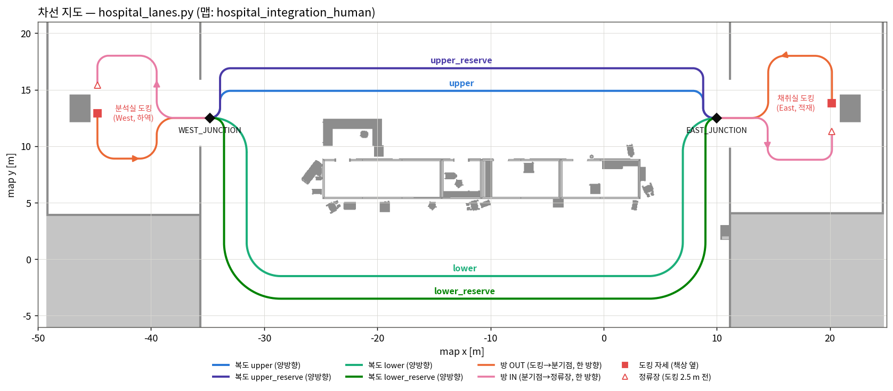

| 이름 (시스템) | 책상 | 역할 | 주행 코드 이름 |
|---|---|---|---|
| `collection` 채취실 | East_DockDesk (x ≈ 20.8) | 트레이 적재 + 긴급도 판독 | `lab` |
| `analysis` 분석실 | West_DockDesk (x ≈ −45.4) | 트레이 하역 | `specimen` |

---

## 1. 배치도 (프로세스와 런타임)

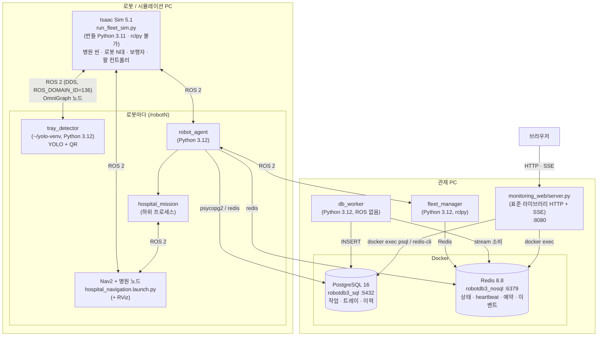

| 런타임 | 쓰는 프로세스 | 이유 |
|---|---|---|
| Isaac 번들 Python 3.11 | `run_fleet_sim.py` | Isaac Sim 5.1이 강제. 시스템 ROS 2 Jazzy의 rclpy(3.12)를 쓸 수 없어 **ROS 입출력은 전부 OmniGraph 노드** |
| `~/yolo-venv` (3.12) | `tray_detector` | ultralytics를 시스템 파이썬에 섞지 않는다. ROS는 `PYTHONPATH`로 시스템 site-packages를 붙인다 |
| 시스템 Python 3.12 | Nav2, `robot_agent`, `hospital_mission`, `fleet_manager`, `db_worker` | psycopg2 / redis는 apt(`python3-psycopg2`, `python3-redis`) |
| Docker | PostgreSQL, Redis | 볼륨에 데이터 유지 |

- 여러 PC로 나눌 때: DB·관제·웹은 관제 PC 한 대, 로봇 스택(검출기·Nav2·에이전트)은 **그 로봇의 Isaac과 같은 PC**
  (라이다·카메라가 PC 사이로 흐르지 않게). DB 주소는 `HOSPITAL_PG_DSN` / `HOSPITAL_REDIS_URL`.
- 모든 ROS 프로세스는 `ROS_DOMAIN_ID=136`, 로봇 토픽은 `/robot1..3` 네임스페이스, TF도 로봇마다 `/robotN/tf`.

---

## 2. 계층 아키텍처

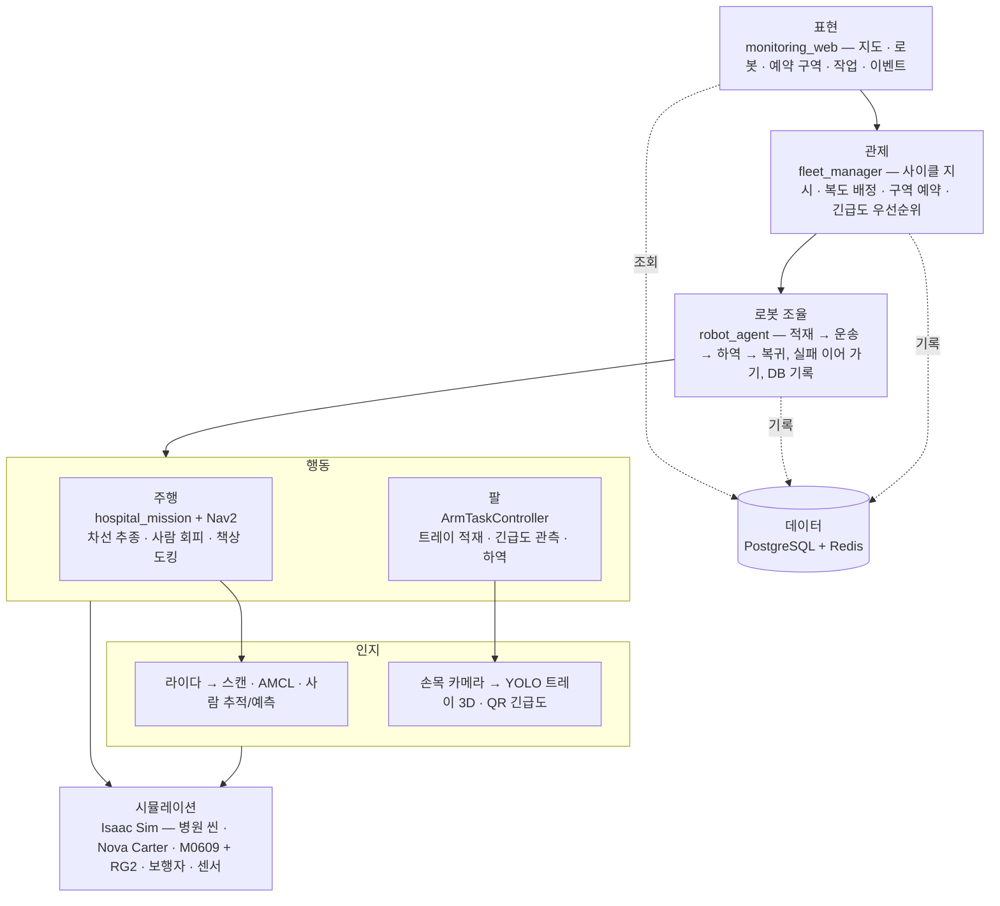

책임 분리 원칙:

- **관제는 "언제·어디로"만** 정한다(작업 지시, 복도, 어디까지 가도 되는지). 어떻게 달릴지는 모른다.
- **에이전트는 순서만** 조율한다. 팔과 주행은 각자의 프로세스가 결과(`arm/status`, 종료 코드)로 알려 준다.
- **주행 코드는 관제·DB를 모른다.** `hospital_mission`은 파라미터와 `zone_hold` 토픽만 받는 독립 실행 파일이라 단독 시험이 된다.

---

## 3. 컴포넌트와 토픽 연결 (로봇 한 대, `/robotN`)

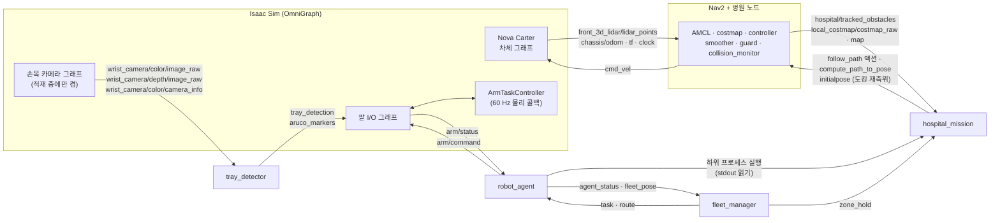

### 3.1 시스템 인터페이스 (전부 `std_msgs/String` JSON, 네임스페이스 `/robotN`)

| 토픽 | 방향 | QoS | 내용 |
|---|---|---|---|
| `arm/command` | agent → Isaac | reliable | `"load:<ms>"`, `"unload:<ms>"`, `"stop:<ms>"` — **문자열이 바뀔 때만** 새 명령 (OmniGraph 구독은 마지막 값을 계속 들고 있다) |
| `arm/status` | Isaac → agent | | `{robot, cmd, cmd_text, result: idle/running/done/failed/stopped, state, slot, loaded[3], aruco[3], urgency[3], unloaded[3], warnings[], detail}` — 바뀔 때 + 0.5 s마다 |
| `tray_detection` | detector → Isaac | `Float32MultiArray` | `[seq, n, x,y,z,conf, …]` 카메라 광학 프레임, 가까운 순 |
| `aruco_markers` | detector → Isaac | `Float32MultiArray` | `[seq, n, id,slot, …]` id 0/1/2 = 하/중/상, slot = 랙 ROI 3등분 |
| `task` | fleet → agent | latched | `{seq, cmd: "cycle"}` |
| `route` | fleet → agent | latched | `{leg, track, version}` — 복도 배정, version↑ = 경로 변경 |
| `zone_hold` | fleet → mission | latched | `{leg#version, stop: [x,y,yaw] \| null, dock, zones}` |
| `agent_status` | agent → fleet | 1 Hz + 변화 시 | `{robot, stage, cycle, leg, cargo{loaded, urgency}, task_seq, fleet, history, …}` |
| `fleet_pose` | agent → fleet | 5 Hz | `PoseStamped` (TF `map → base_link`) |

latched = RELIABLE + TRANSIENT_LOCAL. 주행 하위 프로세스가 새로 떠도 마지막 허가를 바로 받는다.

---

## 4. 데이터 흐름과 저장

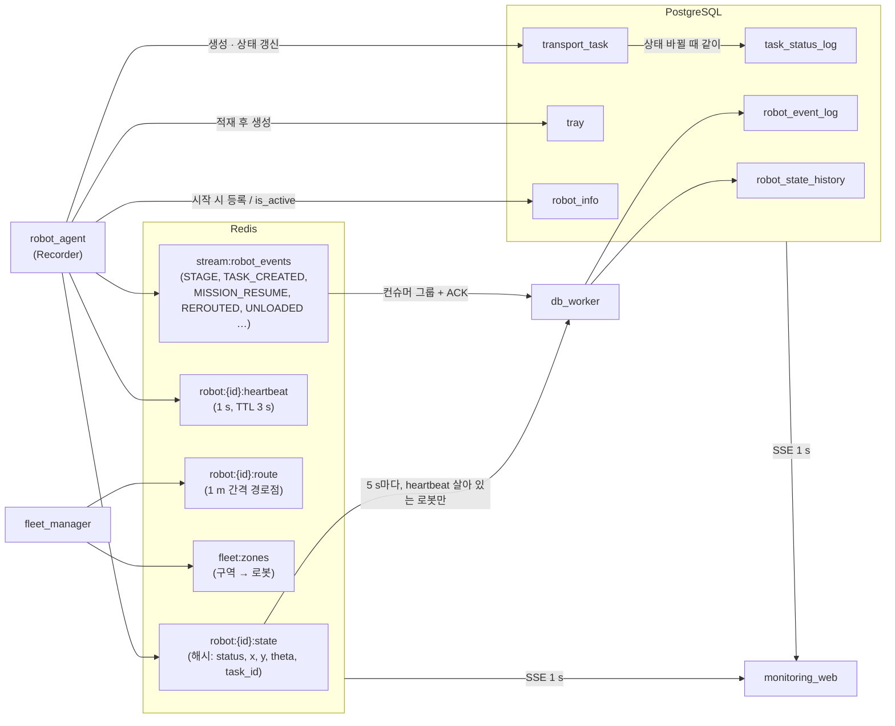

- **실시간은 Redis, 기록은 PostgreSQL.** 에이전트는 자주 바뀌는 것(단계·위치·heartbeat)을 Redis에만 쓰고,
  이벤트는 스트림에 올린다. `db_worker`가 스트림을 `robot_event_log`로, 상태를 `robot_state_history`로 옮긴다.
- 스트림은 **컨슈머 그룹 + ACK**라 워커가 죽었다 살아도 이벤트가 빠지지 않는다.
- **DB 기록 실패는 경고만** 한다 — 기록 때문에 로봇이 멈추지 않는다. 시작할 때 연결 확인은 실패하면 종료한다(`use_db:=false`로 끌 수 있다).

### 4.1 스키마 (`DB_container/hospital_amr_db_v5_schema.sql`)

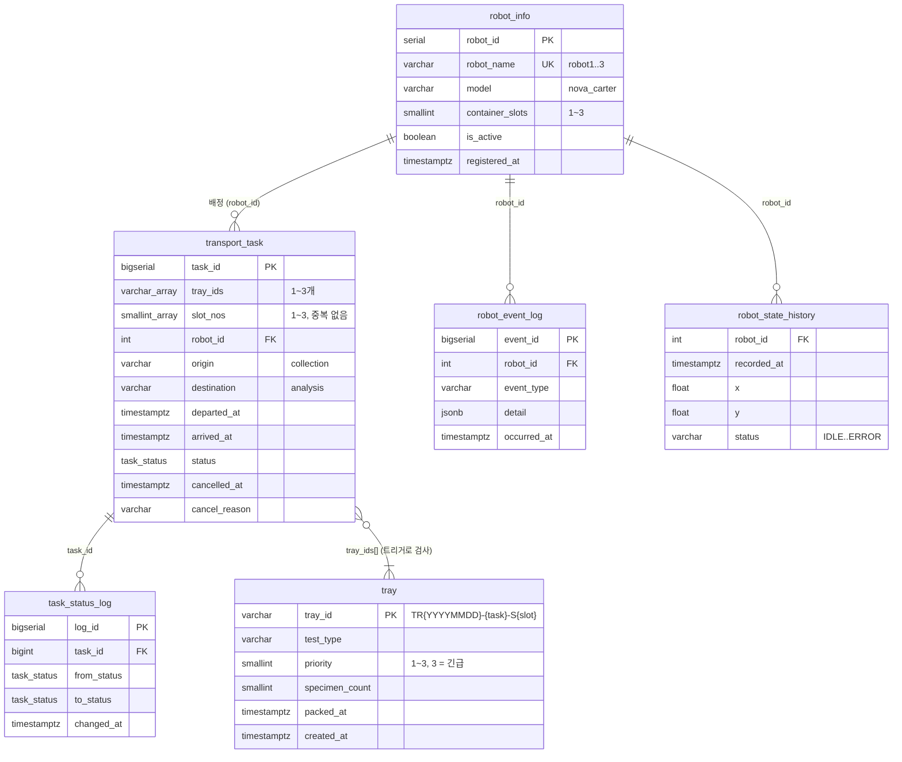

---

## 5. 기동과 종료 (`scripts/run_system.sh`)

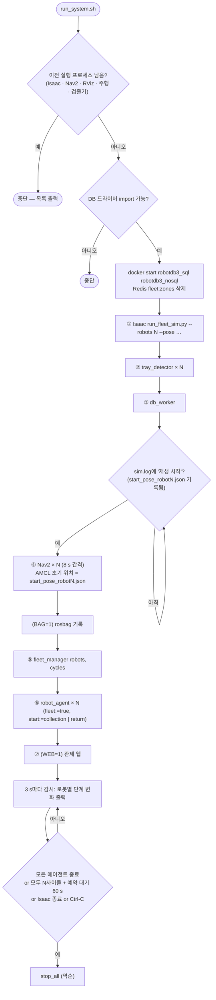

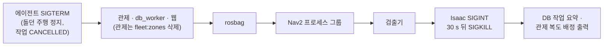

순서가 중요한 이유:

- **Isaac 재생 → Nav2**: Isaac이 재생을 시작하며 로봇별 시작 자세 파일을 쓰고, Nav2의 AMCL이 그걸 초기 위치로 읽는다.
- **Nav2 8 s 간격**: RViz 두 개를 같은 순간에 띄우면 하나가 세그폴트했다.
- **이전 실행 검사**: 다른 도메인에 남은 Nav2가 지도 전달을 막은 적이 있다.

---

## 6. 한 사이클 전체 흐름 (end-to-end)

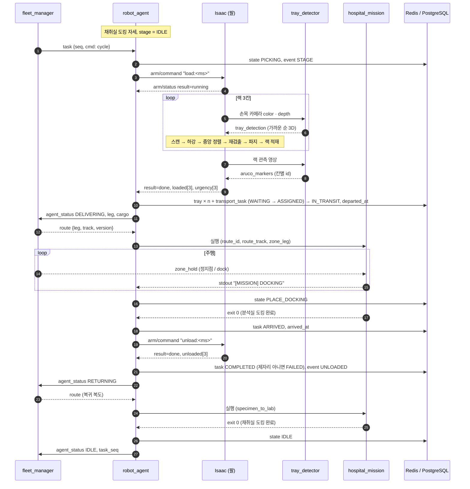

---

## 7. `robot_agent` 단계 상태도

단계 이름은 DB `robot_state_history.status`와 같다.

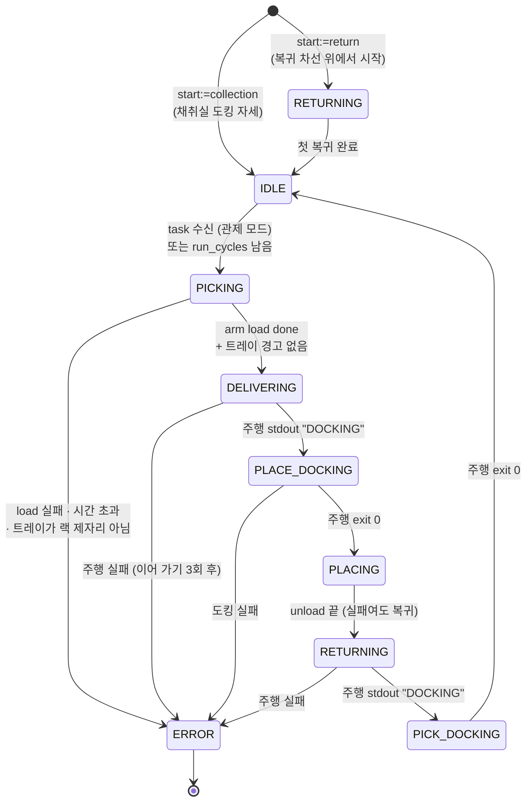

주행 호출 안쪽 (`drive` / `_drive`):

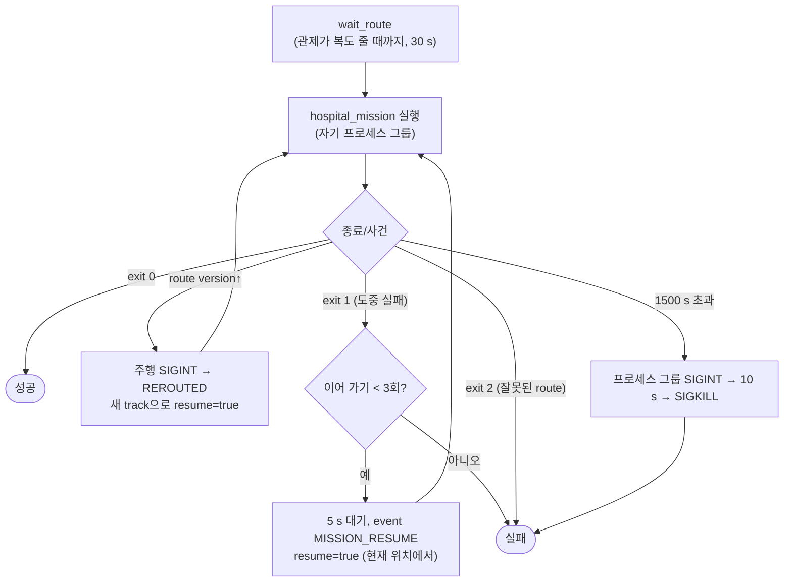

- 경로 변경(REROUTED)은 실패 횟수로 세지 않는다.
- 에이전트가 끝나면(Ctrl-C, 시간 초과) **주행 하위 프로세스도 같이 멈춘다** — 에이전트만 죽고 로봇이 계속 달린 적이 있다.

---

## 8. 팔 작업 상태기계 (`isaacpjt/system/arm/controller.py`)

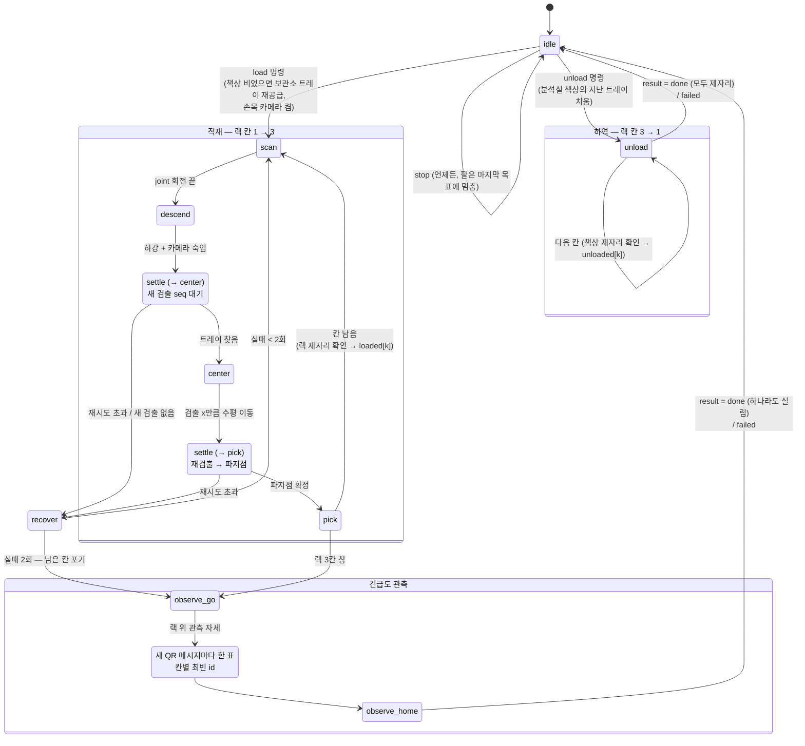

- 스텝 실행(`PickPlaceSequence`)은 코사인 S-커브 보간 + Lula IK. 스텝 도달에 실패하면 **손목을 특이점에서 풀고 재시도**,
  그래도 안 되면 그 스텝을 건너뛴다(그리퍼 상태 유지).
- `tick()`은 **60 Hz 물리 콜백**에서 돈다. 손목 카메라는 렌더 30 Hz의 4프레임에 한 번, 적재 중에만 켠다(3대 동시 발행 부하).
- 적재/하역 뒤 **트레이 실제 위치로 제자리 여부를 확인**한다. 시퀀스가 끝났다고 트레이가 제자리에 있는 건 아니다(랙 테두리 걸림).
  이 결과가 `loaded[]` / `unloaded[]` / `warnings[]`로 에이전트에 간다.

---

## 9. 검출기 프레임 처리 (`admin_ws/src/tray_detector/detect_node.py`)

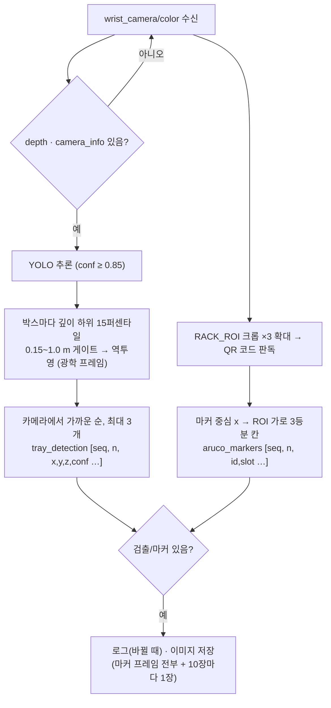

- 메시지에 타임스탬프가 없어서 `seq`(발행 카운터)로 **"관측 자세로 옮긴 뒤 새로 찍은 값인지"** 를 구분한다.
- 가까운 순으로 보내는 이유: 왼쪽부터 집던 때 앞의 트레이를 건드렸다.
- 긴급도 변환 (D2): QR id 2(상) → 3, 1(중) → 2, 0(하) → 1, 미검출 → 1.

---

## 10. 작업(`transport_task`) 상태와 기록 시점

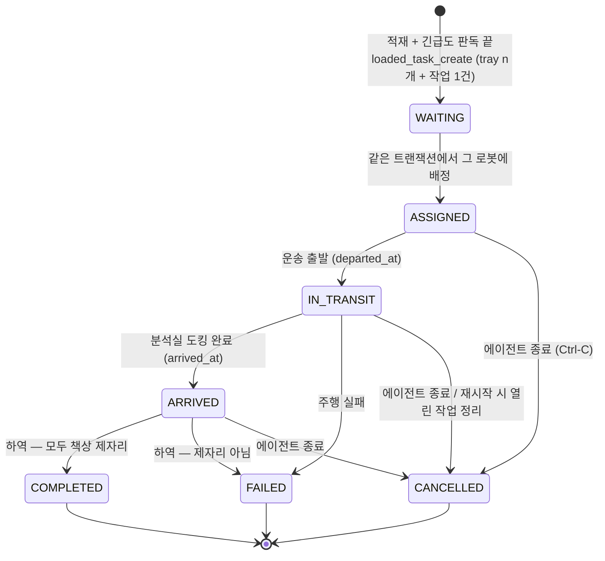

- 상태가 바뀔 때마다 `task_status_log`에 한 줄(`from → to`).
- 트레이 ID는 QR이 긴급도 3종뿐이라 개체 식별이 안 되므로 `TR{YYYYMMDD}-{task_id}-S{slot}`로 만든다 (D3).
- 작업은 **적재가 끝난 뒤 그 로봇의 작업으로 만든다**(D4). 생성과 배정(`WAITING → ASSIGNED`)이 한 트랜잭션이라 대기 상태로 남지 않는다. 스키마의 `PICKING_UP`은 쓰지 않는다.

---

## 11. 관제 tick과 주행 요약

### 11.1 관제 (`fleet_manager`, 5 Hz) — 세부는 [관제 문서](FLEET_CONTROL_ALGORITHM.md)

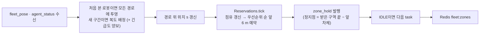

- 긴급도 점수 = 실린 트레이의 `(3 개수, 2 개수, 1 개수)` 사전식 비교. 빈 로봇 = `(0,0,0)`.
- 로봇끼리 서로 센서로 못 봐도(다른 PC의 Isaac) **구역 예약만으로** 충돌하지 않는다(철도 폐색 방식).

### 11.2 주행 (`hospital_mission`) — 세부는 [주행 알고리즘 문서](병원%20AMR%20주행%20알고리즘.md)

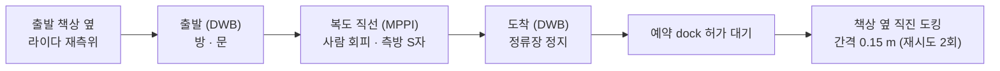

명령 체인: `controller → velocity_smoother → hospital_velocity_guard(사람 예측) → collision_monitor → cmd_vel`.

---

## 12. 실패와 복구 경로

| 어디서 | 무엇이 | 어떻게 복구 | 끝내 안 되면 |
|---|---|---|---|
| 팔 — 검출 | 트레이를 못 찾음 / 새 검출이 안 옴 | 칸당 3번 재시도 → `recover`(들고 있으면 제자리에 두고 홈) | 2번 실패하면 남은 칸 포기, 실린 것만 들고 간다 |
| 팔 — 스텝 | IK 미수렴 · 도달 실패 | 손목 풀고 같은 스텝 1번 재시도 → 그래도 안 되면 건너뜀 | — |
| 팔 — 결과 | 트레이가 랙 제자리 아님 | — | 에이전트가 **주행하지 않고** ERROR (걸린 채 달리면 떨어진다) |
| 팔 — 명령 | Isaac이 명령을 못 받음 (DDS 발견 지연) | 구독자 붙을 때까지 60 s, 받을 때까지 1 s마다 재발행 | 에이전트 ERROR |
| 주행 — 사람 | 15 s 전진 못 함 | 에이전트가 5 s 뒤 **현재 위치에서 이어 가기** (3회) | ERROR |
| 주행 — 정적 장애물 | 차선 막힘 | 측방 S자 → NavFn 우회 → 1~1.5 m 후진 후 재평가 | 이어 가기 |
| 주행 — 도킹 | 간격 어긋남 · 모서리 간격 · 시간 초과 | 라이다 재측위 → 4 m 곧게 후진 → 재접근 (2회) | ERROR |
| 주행 — 관측 | 라이다 · odom · TF 1.2 s 끊김 | 정지(가드 · Collision Monitor), 2 s 넘으면 스테이지 실패 | 이어 가기 |
| 관제 — 경로 | 긴급도 높은 로봇에 복도 양보 | route version↑ → 현재 위치에서 새 복도로 | — |
| 관제 — 위치 끊김 | `fleet_pose` 3 s 없음 | 경고만, 예약은 유지(위치를 모르므로) | 사람이 정리 |
| DB | 기록 실패 | 경고만, 로봇은 계속 | — |
| DB 워커 | 워커 재시작 | 컨슈머 그룹 ACK로 빠짐없이 이어 받음 | — |
| 재시작 | 지난 실행이 작업 도중 죽음 | 에이전트 시작 시 그 로봇의 열린 작업을 CANCELLED | — |

---

## 13. 코드 위치

| 구성 요소 | 경로 |
|---|---|
| 전체 실행 스크립트 | `scripts/run_system.sh` |
| Isaac 진입점 / 씬 | `isaacpjt/system/run_fleet_sim.py`, `scene.py` |
| 팔 | `isaacpjt/system/arm/` — `controller.py`(상태기계), `motion.py`(스텝·IK), `rosio.py`(OmniGraph I/O), `trays.py`(트레이 보관·재공급), `config.py`, `geometry.py` |
| 트레이 검출기 | `admin_ws/src/tray_detector/tray_detector/detect_node.py` (가중치 `runs/detect/isaacpjt/sdg/runs/tray-2/weights/best.pt`) |
| 로봇 에이전트 / DB 기록 | `src/hospital_system/hospital_system/robot_agent.py`, `records.py`, `stations.py` |
| 관제 | `src/hospital_system/hospital_system/fleet_manager.py`, `lane_graph.py`, `priority.py` |
| DB 모듈 / 워커 | `src/hospital_system/hospital_system/db.py`, `db_worker.py` |
| DB 스키마 / 컨테이너 | `DB_container/hospital_amr_db_v5_schema.sql`, `DB_container/*.txt` |
| 주행 | `src/nova_carter/nav_to_goal/nav_to_goal/hospital_*.py` |
| Nav2 설정 · 런치 · 맵 | `src/nova_carter/carter_navigation/{params,launch,maps}/` |
| 예측 코스트맵 레이어 | `src/nova_carter/hospital_dynamic_layer/` |
| 관제 웹 | `monitoring_web/server.py`, `monitoring_web/static/` |
