# 병원 AMR 주행 알고리즘 — 전체 구조

작성 2026-09-29. 대상 코드는 `feature/system-integration` 브랜치 기준이다.

| 영역 | 코드 |
|---|---|
| 미션 / 스테이지 감독 | `src/nova_carter/nav_to_goal/nav_to_goal/hospital_mission.py`, `hospital_stage_runner.py` |
| 차선 기하 | `hospital_lanes.py` |
| 회피 기하 / 안전 판정 (ROS 없음) | `hospital_avoidance.py`, `hospital_costmap.py`, `hospital_safety.py` |
| 출력 가드 | `hospital_velocity_guard.py` |
| 사람 추적 / 예측 | `obstacle_tracking.py`, `moving_obstacle_predictor.py`, `scan_self_filter.py`, `static_scan_mask.py` |
| 예측 코스트맵 레이어 (C++) | `src/nova_carter/hospital_dynamic_layer/src/prediction_layer.cpp` |
| 책상 도킹 | `hospital_docking.py` |
| 관제 정지점 준수 | `hospital_zone_hold.py` |
| Nav2 설정 / 런치 | `carter_navigation/params/hospital_navigation_params.yaml`, `launch/hospital_navigation.launch.py` |
| 사이클 조율 | `src/hospital_system/hospital_system/robot_agent.py` |

관제(구역 예약·복도 배정·우선순위)는 [`docs/FLEET_CONTROL_ALGORITHM.md`](FLEET_CONTROL_ALGORITHM.md)에 따로 정리돼 있다.
이 문서는 **로봇 한 대가 어떻게 달리는가**를 다룬다.

---

## 0. 한 줄 요약

> **정해진 차선(직선+원호)을 `FollowPath`로 따라가고, 복도에서만 MPPI가 사람을 피한다.**
> 미션 감독 루프가 사람·장애물을 예측해 **옆으로 비켜 가는 S자 경로**를 골라 주고,
> 명령은 **예측 가드 → Collision Monitor** 두 겹을 더 거쳐 나간다. 목적지에서는 라이다로 책상 모서리를 재며 **15 cm 옆에 직진 도킹**한다.

설계 원칙:

- **경로는 계획하지 않고 정해 둔다.** 전역 플래너(NavFn)는 정적 장애물로 오래 막혔을 때 한 번만 쓰는 비상 수단이다.
- **후진하지 않는다.** 꼬리 1.38 m가 라이다 사각이라 후진은 정해진 두 경우(도킹 재접근, 정적 막힘 탈출)에만, 검사 후 천천히 한다.
- **판정은 ROS 없는 순수 파이썬 함수**(`hospital_avoidance`)에 두고 테스트한다. ROS 노드는 관측을 모아 넘길 뿐이다.

### 로봇 제원 (Nova Carter, `SafetySettings`)

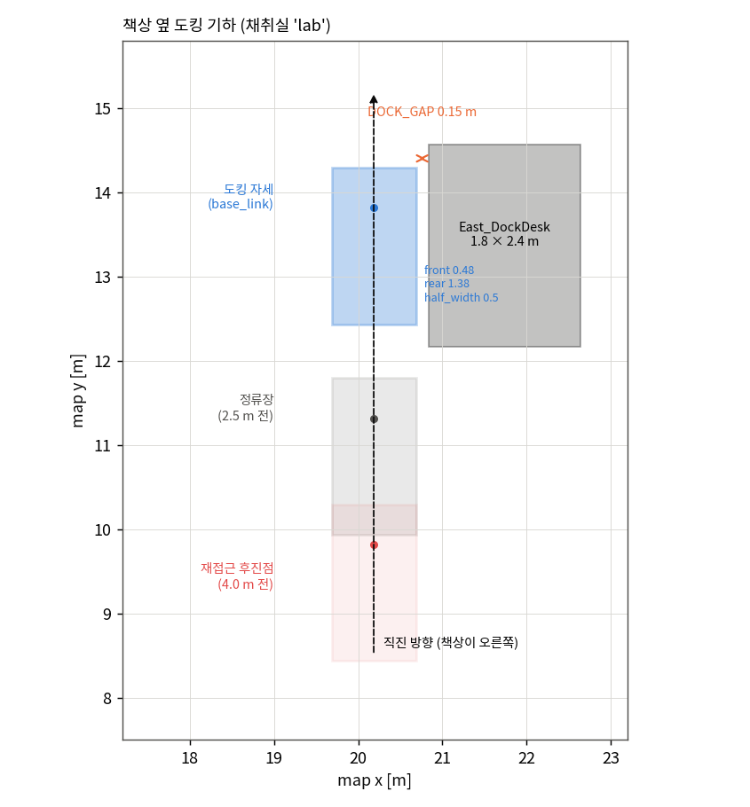

| 항목 | 값 | 비고 |
|---|---|---|
| footprint | 앞 0.48 m / 뒤 1.38 m / 반폭 0.5 m | `base_link`가 차체 중심보다 0.45 m 앞 |
| 최대 속도 | 0.6 m/s (MPPI), 0.8 (DWB 출발), 0.5 (DWB 도착) | |
| 가속 / 감속 | 0.5 / 0.6 m/s² | velocity_smoother와 같은 값 |
| 최대 각속도 | 0.9 rad/s | |
| 최소 회전 반경 | 1.2 m | 회피 경로 검증 기준 |

---

## 1. 시스템 구성

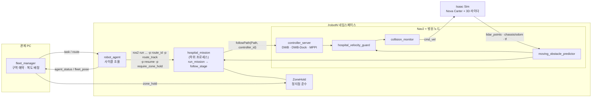

- `hospital_mission`은 **구간 하나(출발 책상 → 도착 책상)** 를 끝까지 달리고 종료 코드로 결과를 알린다
  (0 성공 / 1 실패 / 2 잘못된 route). 에이전트는 실패하면 `resume=true`로 **현재 위치에서 이어** 다시 띄운다.
- 관제가 없어도 돈다: `route_track`을 비우면 기본 경로(운송 = `lower`, 복귀 = `upper`), `require_zone_hold=false`면 예약을 기다리지 않는다.

---

## 2. 센서 데이터 흐름

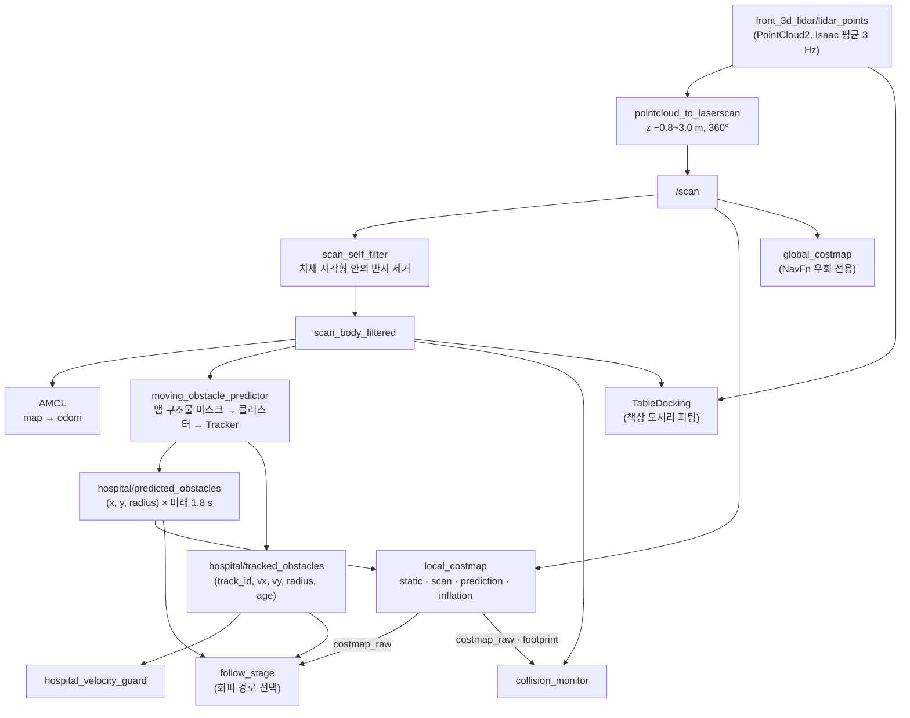

포인트:

- **두 개의 스캔.** 코스트맵은 원본 `/scan`(footprint clearing이 차체를 지운다), 나머지는 차체 반사를 뺀 `scan_body_filtered`를 쓴다.
- **두 개의 추적 출력.** `predicted_obstacles`는 반경만 가진 미래 점 구름(코스트맵용), `tracked_obstacles`는 속도·나이를 가진 현재 상태(판정용).
- **맵 구조물 마스크**: 맵에 이미 있는 벽·책상에 맞은 점은 추적에서 뺀다. 가만히 선 물체는 맵 구조물에서 0.45 m 넘게 떨어져 있어야 사람 후보가 된다.
- 관측 신선도: 트랙·odom·TF가 **1.2 s** 넘게 끊기면 `snapshot()`이 `None` → 감독 루프는 멈추고(`WAITING_DATA`) 2 s 넘으면 실패, 가드는 0 명령.

---

## 3. 명령 체인과 안전 계층

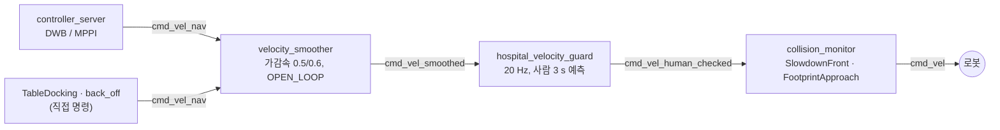

직접 명령(도킹, 후진 탈출)도 `cmd_vel_nav`로 내보내 **같은 가드와 Collision Monitor를 거친다**.

| 계층 | 무엇을 보나 | 행동 | 위치 |
|---|---|---|---|
| ① 경로 선택 | 트랙 예측 3 s + 코스트맵 | 옆으로 비켜 가는 S자 경로 / 양보 / 우회 | `follow_stage` (§8) |
| ② 컨트롤러 | local costmap (예측 레이어 포함) | MPPI가 비용 낮은 쪽으로, DWB는 footprint critic | Nav2 |
| ③ 예측 가드 | 트랙 + 현재 속도 롤아웃 | 명령을 1.0/0.75/0.5/0 배로 줄이거나 정지 | `hospital_velocity_guard` (§11) |
| ④ Collision Monitor | 스캔 점 | 전방 3.5 m×1.2 m에 4점 → 0.4배, 1.5 s 안 충돌 → 감속 | Nav2 |
| ⑤ 관측 타임아웃 | 스캔·트랙·TF 나이 | 1.2 s 넘으면 정지 | ③, ④ 공통 |

---

## 4. 차선 지도

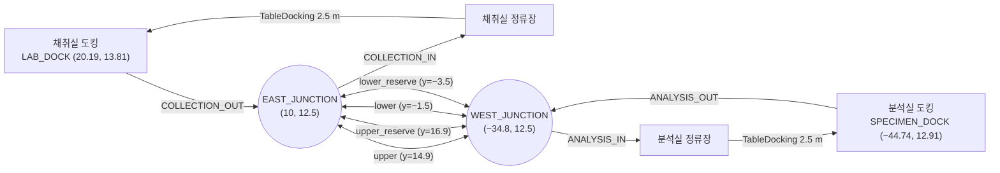

- **방 구간은 한 방향**: 도킹에서 나와 사각형 반 바퀴로 문 밖 분기점까지(OUT), 분기점에서 반대 반 바퀴로 정류장까지(IN).
  두 방은 180° 돌린 같은 모양이고, 두 방향이 문(y = 12.5)을 한 줄로 지난다.
- **복도 4개는 양방향**. 기하는 서→동으로 적고, 동→서는 `reverse()`로 뒤집는다(직선은 끝점, 원호는 시작/끝 각).
- 원소는 `('line', a, b)`와 `('arc', 중심, 반지름, 시작각, 끝각)` 두 종류다. 원호끼리 바로 잇지 않고(원호-직선-원호) 한 원호는 90° 이하.
- 관제가 없으면 운송 = `lower`, 복귀 = `upper` (`DEFAULT_TRACK`).

---

## 5. 경로 조립과 스테이지 분할 (`compose` → `split_route`)

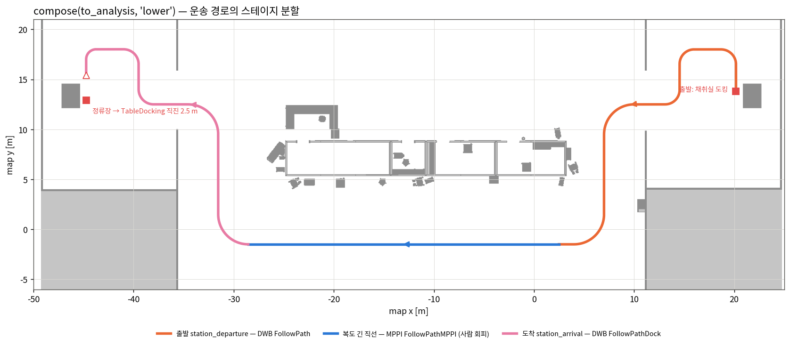

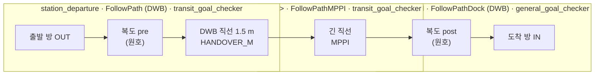

| 스테이지 | 컨트롤러 | 이유 |
|---|---|---|
| `station_departure` | DWB `FollowPath` (0.8 m/s) | 원호가 많은 방·문 구간. 마지막 1.5 m 직선에서 방향을 맞춘 뒤 MPPI에 넘긴다 (원호 끝에서 넘기면 22° 제자리 회전이 생겼다) |
| 복도 긴 직선 | MPPI `FollowPathMPPI` (0.6 m/s, 4.5 s 앞) | 사람 회피가 필요한 유일한 개방 구간. 측방 이탈 허용 |
| `station_arrival` | DWB `FollowPathDock` (0.5 m/s, 회전 0.6) | 정류장에 5 cm / 5.7° 안으로 서야 도킹 직진을 시작할 수 있다. 마지막 1.6 m는 직진이라 제자리 정렬이 없다 |

경로는 `sample_route()`가 **5 cm 간격 (x, y, yaw)** 로 샘플링해 `nav_msgs/Path`로 만든다.

---

## 6. 한 사이클 (적재 → 운송 → 하역 → 복귀)

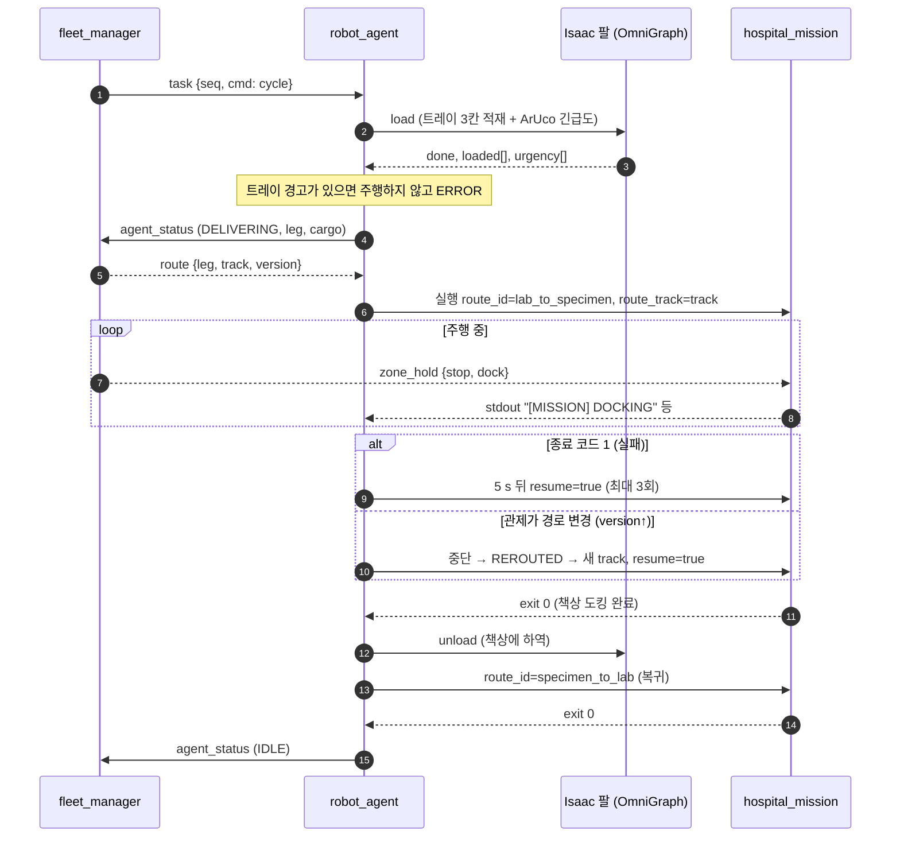

이름 대응 (`stations.py`): 시스템 이름 `collection`(East, 적재) = 주행 코드 `lab`, `analysis`(West, 하역) = `specimen`.
그래서 운송은 `lab_to_specimen`, 복귀는 `specimen_to_lab`이다.

---

## 7. 미션 실행 순서 (`run_mission`)

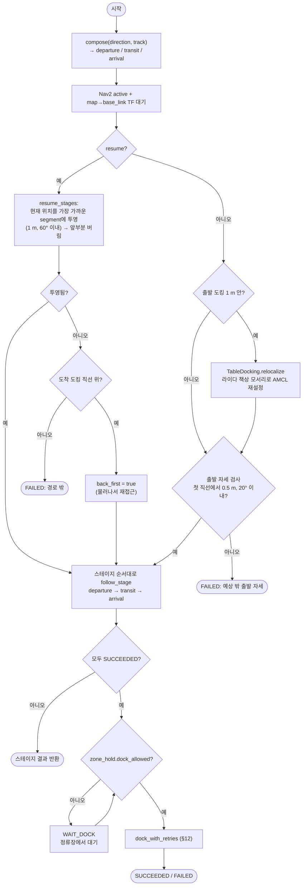

- **AMCL 재설정이 출발 전에 들어가는 이유**: 책상 옆에서 AMCL이 수십 cm 밀리면 로컬 코스트맵이 차체를 책상 안에 둬서 출발부터 막혔다.
- **출발 자세 검사**: Isaac에서 정지 로봇이 분당 ~6 cm 미끄러지므로 도킹 자세 한 점이 아니라 첫 직선 위 가장 가까운 점과 비교한다.

---

## 8. 스테이지 감독 루프 (`follow_stage`) — 핵심

스테이지 하나를 `FollowPath` 액션으로 보내 놓고, **10 Hz로 관측을 보며 경로를 갈아 끼우거나 멈춘다**.
측방 회피·양보·우회·탈출은 **MPPI 복도 스테이지에서만** 켜진다. 방 안(DWB)은 DWB footprint critic과 Collision Monitor가 맡는다.

### 8.1 상태도

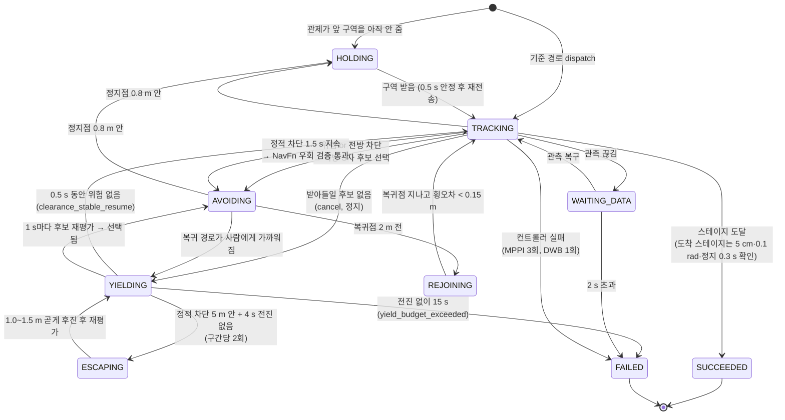

상태 변화는 `hospital/mission_state` 토픽과 로그로 나간다 (`stage=... state=... reason=...`).

### 8.2 한 tick (0.1 s)

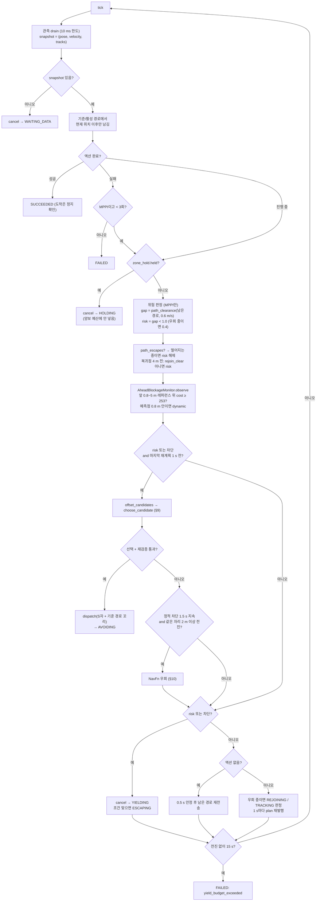

**양보 예산**은 "연속 양보 시간"이 아니라 **"차선을 1 m 전진하지 못한 시간"** 으로 센다 (`YIELD_PROGRESS_M`).
양보 ↔ 재개가 1~3 s 간격으로 반복되며 예산이 계속 0으로 돌아가 5분 넘게 콘 앞에 서 있던 문제(2026-09-29)를 막는다.

### 8.3 정적 차단 vs 사람

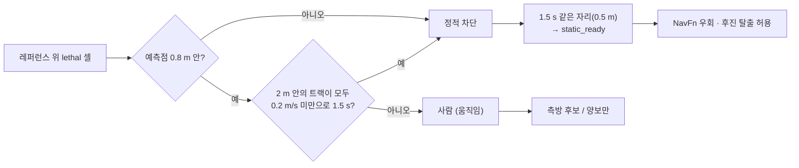

---

## 9. 측방 회피 후보 (`offset_candidates` → `choose_candidate`)

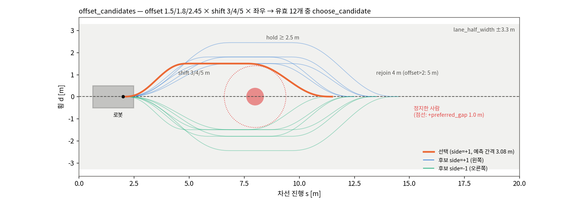

차선 좌표계(`LaneFrame`: 진행 s, 횡 d)에서 **앞으로만 가는** S자 경로를 만든다.

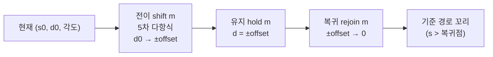

1. **생성** — side(±1) × offset {1.5, 1.8, 2.45} m × shift {3, 4, 5} m = 최대 18개.
   - 전이는 5차 다항식이라 기울기 연속, 양 끝 곡률 0.
   - hold = max(2.5, 막힌 점 뒤 차체가 다 지나갈 거리): `blocked_s + rear 1.38 + (사람이면 1.5, 정적이면 0.5)`.
   - rejoin = 4 m (offset 2.45면 5 m — 반경 1.2 m 제한).
   - 끝이 스테이지 끝 0.3 m 전을 넘으면 버린다.
2. **기하 검증 `forward_path_valid`** — 뒤로 가지 않음, 차선 방향과 65° 이내, 차체 모서리가 차선 띠 ±3.3 m 안, 점 간격 ≤ 12 cm, 곡률 ≤ 1/1.2 m, 끝은 차선 중심 2 cm 안.
3. **채점 `choose_candidate`** — 0.6 m/s와 0.24 m/s(Collision Monitor 0.4배 감속 가정) 두 속도로 pursuit 롤아웃해 최소 예측 간격 `gap`.
   - `gap < 0.4 m`(minimum_gap) → 탈락.
   - 벌점 = `max(0, 1.0 − gap)·20` + (고정된 쪽과 반대면 2) + 길이·0.02.
   - 벌점 순으로 **코스트맵 검사**(static map + local costmap, 차체 전체)를 통과한 첫 후보.
4. **재검증 후 전송** — 후보 평가에 한 센서 주기가 걸릴 수 있어, 새 관측으로 위치(0.2 m 이내)·코스트맵·간격을 한 번 더 보고 `dispatch`.
   같은 컨트롤러에 새 goal을 보내면 cancel 없이 경로만 바뀐다.

### 예측 간격 계산 (`predicted_gap`, `path_clearance`)

- 사람 = 원(반경 0.4 m) + 등속 외삽. 불확실성으로 반경을 `0.10 m/s × (관측 나이 + 예측 시간)`만큼 키운다.
- 로봇 = 비대칭 사각형(앞 0.48 / 뒤 1.38 / 반폭 0.5). 원–사각형 **부호 있는 거리**(음수 = 겹침).
- 롤아웃: 0.1 s 간격 3 s. 반응 지연 0.2 s 동안은 현재 속도 유지, 그 뒤 가감속 한계로 램프.

---

## 10. 정적 막힘: NavFn 우회와 후진 탈출

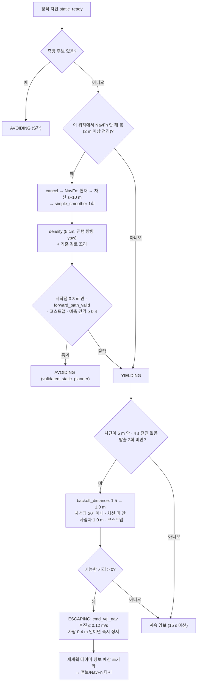

후진이 필요한 이유: 콘 바로 앞에 서면 S자 후보(3~5 m 전이)도, NavFn 경로(급회전)도 검증을 못 넘겨 예산만 쓰고 실패 → 같은 자리에서 재개 → 또 실패를 반복했다.
**후진은 방금 지나온 차선을 따라서만** 한다 — 꼬리 1.38 m가 라이다 사각이기 때문.

---

## 11. 사람 추적·예측과 출력 가드

### 11.1 트랙 수명 (`obstacle_tracking.Tracker`)

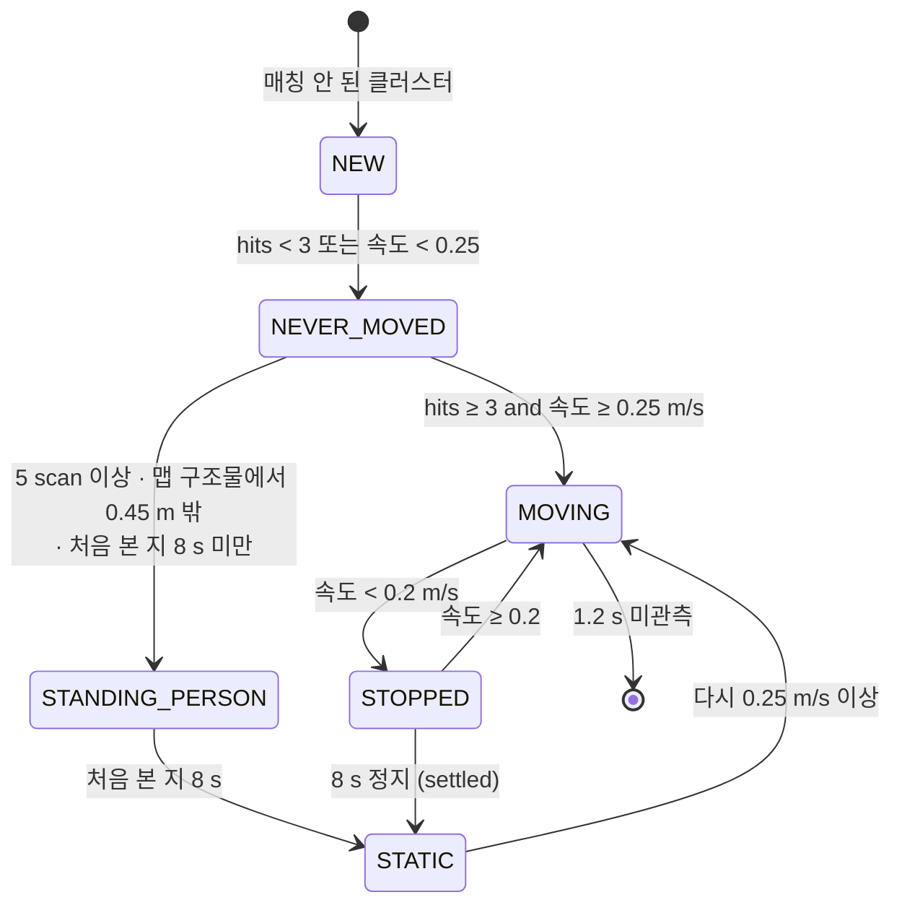

- **매칭**: 트랙 예측 위치와 검출의 거리 < max(0.45 m, 2·dt), 가까운 쌍부터 탐욕 매칭.
- **속도**: 최근 0.45 s 이력의 처음–끝 차분, 이전 값과 0.65:0.35 지수 평균. 2.2 m/s 초과는 노이즈로 0.
- **STATIC은 사람 목록에서 빠진다** → 1 m 사람 간격 대신 코스트맵 간격으로 지나간다(콘, 오래 서 있는 사람).
  이게 없으면 맵에 없는 콘이 영원히 "사람"이라 15 s 양보 후 실패했다.

| 출력 | 포함 | 쓰는 곳 |
|---|---|---|
| `tracked_obstacles` | MOVING, STOPPED(8 s 전), STANDING_PERSON | 가드, 감독 루프 |
| `predicted_obstacles` | 움직였던 트랙: 0.2 s 간격 1.8 s 미래 점, 반경 0.4 + min(0.2, 0.1·dt) | 코스트맵 예측 레이어, 차단 분류 |

### 11.2 예측 코스트맵 레이어 (`PredictionLayer`, C++)

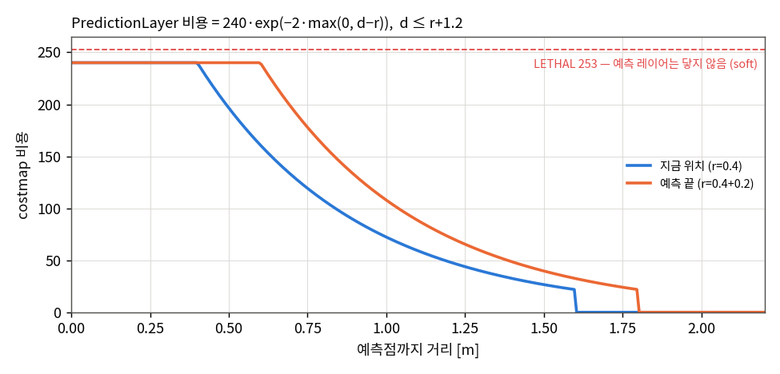

- 예측점마다 반경 + 1.2 m까지 `240·exp(−2·max(0, d − r))` 비용, 기존 값과 max.
- **lethal(253)에 닿지 않는 soft 비용**이다. 미래 점유를 hard로 두면 t=0에 로봇이 둘러싸여 MPPI 샘플이 전부 무효가 되고, 다가오는 사람 앞에 그대로 서 버렸다.
  현재 실제 장애물은 앞 scan 레이어가 lethal로 찍는다.
- 1.2 s 넘은 구름은 무시(비용 없음).

### 11.3 출력 가드 (`limited_command`)

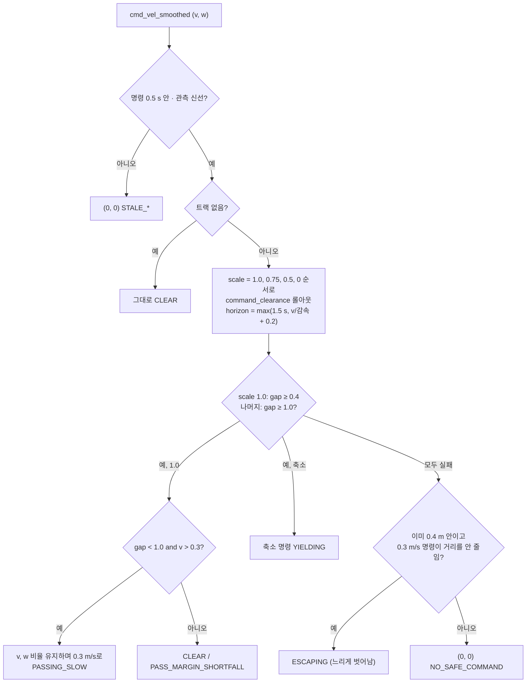

- 가드는 **명령을 줄이거나 멈출 뿐 방향을 만들지 않는다.** 피할 방향은 §9 경로 선택의 몫이다.
- ESCAPING이 있는 이유: 사람이 로봇 옆 0.4 m 안에 서 버리면 모든 롤아웃이 현재 간격에서 이미 실패해, 서로 2분 동안 기다렸다(2026-09-25).
  "거리를 줄이지 않는" 느린 명령은 허용한다(불확실성 증가를 빼고 순수 기하로 판정).

---

## 12. 책상 옆 도킹 (`TableDocking`, `dock_with_retries`)

목표: 책상 긴 변을 **로봇 오른쪽**에 두고 옆 간격 **0.15 m**, 앞뒤 ±2 cm, 평행 ±1°.

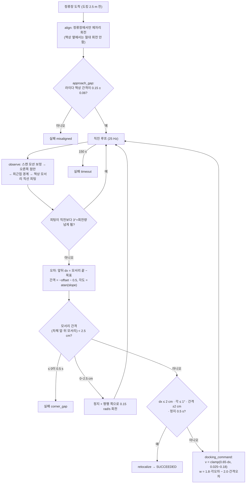

재시도 (`dock_with_retries`, 최대 2회):

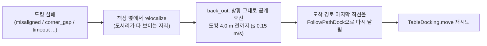

- **옆 간격은 직진 중 조향으로만 고친다.** 책상에서 멀어지려고 틀면 꼬리 1.38 m가 책상 쪽으로 돌아 들어간다.
  그래서 정류장 간격이 6 cm 넘게 틀리면 아예 출발하지 않고, **물러났다가 다시 접근**한다.
- **relocalize**: 정지 상태에서 책상 모서리로 계산한 map 자세를 `initialpose`로 보낸다(σ 2 cm / 1°). 3 cm·1° 안으로 들어올 때까지.
  도킹 성공 후, 출발 전, 재시도 전에 한다. AMCL이 책상 옆에서 0.39 m / 8° 밀려 코스트맵이 차체를 책상 안에 둔 적이 있다.

---

## 13. 관제 정지점 준수 (`ZoneHold`)

관제는 차선을 3 m 구역으로 나눠 앞 6 m까지만 예약해 준다([관제 문서](FLEET_CONTROL_ALGORITHM.md)). 주행 쪽은 그 끝에서 선다.

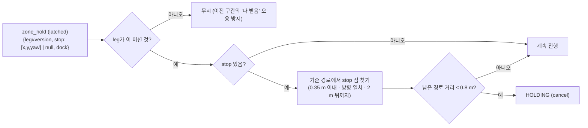

- `require_zone_hold=true`면 **첫 메시지를 받기 전에는 출발하지 않는다.**
- `dock=true`여야 정류장에서 도킹을 시작한다(`WAIT_DOCK`).
- HOLDING은 사람 양보가 아니므로 **15 s 양보 예산에 넣지 않는다** — 앞 로봇이 하역하는 동안 1분 넘게 설 수 있다.
- 0.8 m = 0.6 m/s 제동 거리 0.3 m + 반응 여유.

---

## 14. 주요 파라미터

### 회피 / 안전 (`hospital_avoidance.SafetySettings`)

| 이름 | 값 | 뜻 |
|---|---|---|
| `minimum_gap` | 0.4 m | 이보다 가까우면 탈락 / 정지 |
| `preferred_gap` | 1.0 m | 이보다 가까울 예정이면 옆으로 비켜 가는 경로를 찾음 |
| `yield_gap` | 1.0 m | 축소 명령이 받아들여지는 간격 |
| `passing_gap` / `passing_speed` | 1.0 m / 0.3 m/s | 가까이 지날 때 속도 상한 |
| `horizon` / `guard_horizon` | 3.0 s / 1.5 s | 경로 선택 / 가드 롤아웃 길이 |
| `reaction_time` | 0.2 s | 롤아웃 반응 지연 |
| `uncertainty_rate` | 0.10 m/s | 예측 반경 증가율 |
| `track_timeout` | 1.2 s | 관측 신선도 한계 (Isaac 라이다 간격 최대 ~1.2 s) |
| `lane_half_width` | 3.3 m | 회피 경로의 차체가 머물 차선 띠 |
| `minimum_radius` | 1.2 m | 회피 경로 최소 회전 반경 |

### 감독 루프 (`hospital_stage_runner`, `hospital_mission`)

| 이름 | 값 | 뜻 |
|---|---|---|
| 양보 예산 | 15 s | 1 m 전진 없이 이만큼이면 FAILED |
| `YIELD_PROGRESS_M` | 1.0 m | 양보 예산 초기화에 필요한 전진 |
| `STATIC_BLOCK_LOOKAHEAD_M` / `MIN_AHEAD_M` | 5.0 / 0.8 m | 전방 차단 검사 범위 |
| `STATIC_BLOCK_PERSISTENCE_S` | 1.5 s | NavFn 우회 전 정적 차단 지속 시간 |
| `MOVING_PREDICTION_CLEARANCE_M` | 0.8 m | 차단 셀이 예측점과 이만큼 가까우면 사람 |
| `ESCAPE_AFTER_S` / `NEAR_M` / `LIMIT` / `SPEED` | 4 s / 5 m / 2회 / 0.12 m/s | 후진 탈출 |
| `DOCK_RETRIES` | 2 | 도킹 재시도 |
| `STANDING_STATIC_S` | 8 s | 서 있는 물체를 정적으로 보는 시간 |

### Nav2 (`hospital_navigation_params.yaml`)

| 항목 | 값 |
|---|---|
| MPPI | 90 step × 0.05 s = 4.5 s, batch 1000, vx 0~0.6, wz ±0.9, 후진 금지 |
| MPPI critics | Constraint, Cost(25, footprint), Goal, GoalAngle, PathAlign, PathFollow, PathAngle, PreferForward |
| DWB FollowPath / FollowPathDock | vx ≤ 0.8 / 0.5, vθ ≤ 0.9 / 0.6, sim_time 1.7 s |
| goal checker | general 5 cm / 0.1 rad (정지 확인), transit 0.3 m / 0.8 rad |
| local costmap | 12×12 m, 5 cm, static + scan(6 m) + prediction + inflation(1.6 m) |
| global costmap | inflation 1.0 m (NavFn 우회 전용) |
| Collision Monitor | SlowdownFront 3.5 m × ±0.6 m → 0.4배, FootprintApproach 1.5 s |
| velocity_smoother | 20 Hz, OPEN_LOOP, 가속 0.5 / 감속 0.6 / 각 1.5 |

---

## 15. 알려진 한계

- 경로 선택은 **복도 MPPI 구간에서만** 한다. 방·문 안에서는 옆으로 비킬 수 없고, 사람이 오면 DWB + Collision Monitor + 가드로 **감속/정지**만 한다.
- 선택 차선이 완전히 막혀도 **다른 복도로 바꾸지 않는다** (복도 변경은 관제만 한다). `BLOCKED` 상태는 아직 판정하지 않는다(`path_is_blocked` 자리만 있음).
- 사람 모델은 등속 원 외삽이다. 급방향 전환은 불확실성 반경과 0.1 s마다 재평가로만 다룬다.
- 8 s 넘게 가만히 선 사람은 정적 장애물로 보고 1 m가 아닌 코스트맵 간격으로 지나간다(의도한 절충, 2026-09-25).
